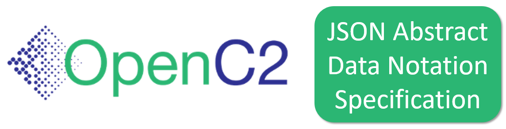
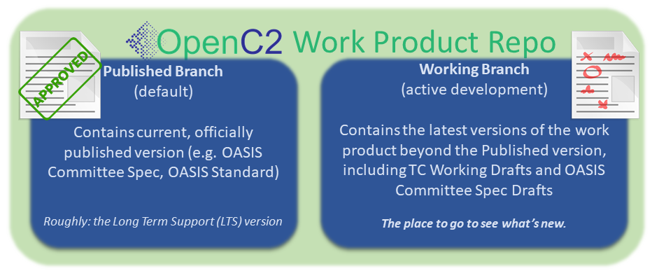

## README

##  An OASIS [Work Product](https://www.oasis-open.org/policies-guidelines/oasis-defined-terms-2018-05-22/#dWorkProduct) Repository  

Members of the OASIS [Open Command and Control (OpenC2) Technical
Committee](https://www.oasis-open.org/committees/tc_home.php?wg_abbrev=openc2)
use this GitHub repository as part of the [TC's chartered
work](https://www.oasis-open.org/committees/openc2/charter.php).
Contributors must be Members of the TC. Work is governed by the
OASIS policies and is not done under typical open source
licensing. For more details, see the
[Contributions](#contributions) and [Licensing](#licensing)
sections below. 

## :blue_book: _JSON Abstract Data Notation (JADN)_ :blue_book:

The JSON Abstract Data Notation (JADN) specification defines an
information modeling (IM) language by specifying a vocabulary to
describe the meaning of structured data, to provide hints for
user interfaces working with structured data, and to make
assertions about what a valid instance must look like.

### :twisted_rightwards_arrows: Repository Organization :twisted_rightwards_arrows:

OpenC2 work product repositories are organized a bit differently
than typical open source software project repositories:

* The **Published** (default) branch represents the current,
  stable, approved version of the work product. If the product
  hasn't progressed past an [OASIS Committee Specification Draft
  (CSD)](https://www.oasis-open.org/policies-guidelines/tc-process-2017-05-26/#committeeDraft),
  this branch is essentially empty
* The **Working** branch is where all work-in-progress content is
  captured, and is the place to go for the [current working
  version](https://github.com/oasis-tcs/openc2-jadn/blob/working/jadn-v1.0-wd02.md)
  of this work product

More information about the TC's repository organizing conventions
and branching strategy can be found in our [Documentation
Norms](https://github.com/oasis-tcs/openc2-tc-ops/blob/main/Documentation-Norms.md#433-configure-repository).

### :left_speech_bubble: Description :left_speech_bubble:

JSON Abstract Data Notation (JADN) has several purposes,
including definition of data structures and validation of data
instances. This document specifies a vocabulary to describe the
meaning of structured data, to provide hints for user  interfaces
working with structured data, and to make assertions about what a
valid instance must look like. JADN structure definitions are
format-neutral. Serialization rules define how JADN instances are
represented in specific data formats such as JSON, XML, and CBOR.

### :writing_hand: Contributions :writing_hand:

As stated in this repository's <a href="https://github.com/oasis-tcs/openc2-jadn/blob/master/CONTRIBUTING.md">CONTRIBUTING file</a>, contributors to this repository are expected to be Members of the OASIS OpenC2 TC, for any substantive change requests.  Anyone wishing to contribute to this GitHub project and <a href="https://www.oasis-open.org/join/participation-instructions">participate</a> in the TC's technical activity is invited to join as an OASIS TC Member.  Public feedback is also accepted, subject to the terms of the <a href="https://www.oasis-open.org/policies-guidelines/ipr#appendixa">OASIS Feedback License</a>.

### :scroll: Licensing :scroll:

Please see the <a href="https://github.com/oasis-tcs/openc2-jadn/blob/master/LICENSE.md">LICENSE</a> file for description of the license terms and OASIS policies applicable to the TC's work in this GitHub project. Content in this repository is intended to be part of the OpenC2 TC's permanent record of activity, visible and freely available for all to use, subject to applicable OASIS policies, as presented in the repository <a href="https://github.com/oasis-tcs/openc2-jadn/blob/master/LICENSE.md">LICENSE</a> file.

### :left_speech_bubble:   Further Description of this Repository :left_speech_bubble: 

This repository is designed to support TC members' work on a
formal specification that describes JADN. This GitHub repository
supports development of the content and change tracking for the
JADN specification as new working draft level revisions are
created and the associated CSDs mature.

Members of the <a href="https://www.oasis-open.org/committees/openc2/">OASIS Open Command and Control (OpenC2) TC</a> create and manage technical content in this TC GitHub repository ( <a href="https://github.com/oasis-tcs/openc2-jadn">https://github.com/oasis-tcs/openc2-jadn</a> ) as part of the TC's chartered work (<i>i.e.</i>, the program of work and deliverables described in its <a href="https://www.oasis-open.org/committees/openc2/charter.php">charter</a>).

OASIS TC GitHub repositories, as described in <a href="https://www.oasis-open.org/resources/tcadmin/github-repositories-for-oasis-tc-members-chartered-work">GitHub Repositories for OASIS TC Members' Chartered Work</a>, are governed by the OASIS <a href="https://www.oasis-open.org/policies-guidelines/tc-process">TC Process</a>, <a href="https://www.oasis-open.org/policies-guidelines/ipr">IPR Policy</a>, and other policies, similar to TC Wikis, TC JIRA issues tracking instances, TC SVN/Subversion repositories, etc.  While they make use of public GitHub repositories, these TC GitHub repositories are distinct from <a href="https://www.oasis-open.org/resources/open-repositories">OASIS Open Repositories</a>, which are used for development of open source <a href="https://www.oasis-open.org/resources/open-repositories/licenses">licensed</a> content.

###  :envelope_with_arrow: Contact :envelope_with_arrow:

Please send questions or comments about <a href="https://www.oasis-open.org/resources/tcadmin/github-repositories-for-oasis-tc-members-chartered-work">OASIS TC GitHub repositories</a> to the <a href="mailto:tc-admin@oasis-open.org">OASIS TC Administrator</a>.  For questions about content in this repository, please contact the TC Chair or Co-Chairs as listed on the the <tc short name> TC's <a href="https://www.oasis-open.org/committees/tc_home.php?wg_abbrev=openc2">home page</a>.

