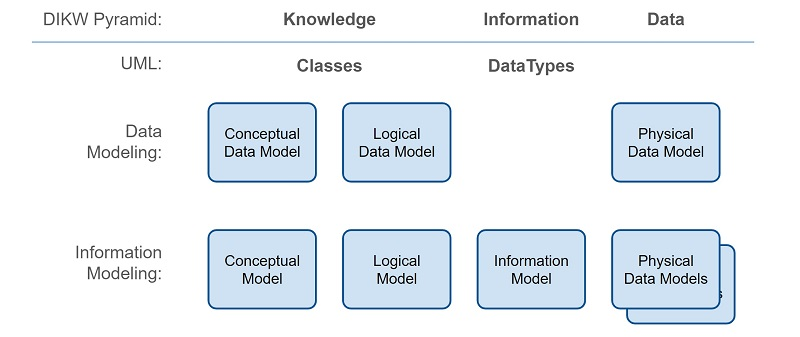
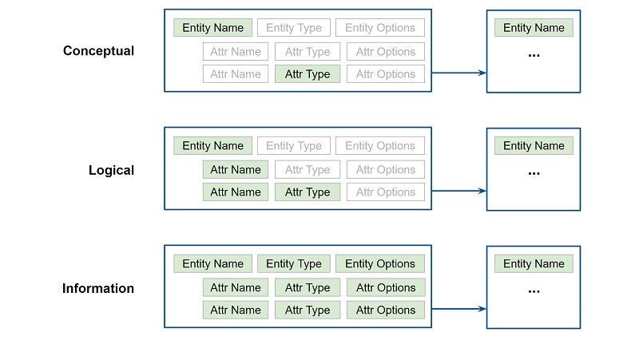

-------

# Specification for JSON Abstract Data Notation (JADN) Version 1.0

## Working Draft 02
<!-- ## Committee Specification 01 -->

## 16 June 2021

<!-- URI list start (commented out except during publication by OASIS TC Admin)

#### This version:
https://docs.oasis-open.org/openc2/jadn/v1.0/cs01/jadn-v1.0-cs01.md (Authoritative) \
https://docs.oasis-open.org/openc2/jadn/v1.0/cs01/jadn-v1.0-cs01.html \
https://docs.oasis-open.org/openc2/jadn/v1.0/cs01/jadn-v1.0-cs01.pdf

#### Previous version:
https://docs.oasis-open.org/openc2/jadn/v1.0/csd01/jadn-v1.0-csd01.md (Authoritative) \
https://docs.oasis-open.org/openc2/jadn/v1.0/csd01/jadn-v1.0-csd01.html \
https://docs.oasis-open.org/openc2/jadn/v1.0/csd01/jadn-v1.0-csd01.pdf

#### Latest version:
https://docs.oasis-open.org/openc2/jadn/v1.0/jadn-v1.0.md (Authoritative) \
https://docs.oasis-open.org/openc2/jadn/v1.0/jadn-v1.0.html \
https://docs.oasis-open.org/openc2/jadn/v1.0/jadn-v1.0.pdf

URI list end (commented out except during publication by OASIS TC Admin) -->

#### Technical Committee:
[OASIS Open Command and Control (OpenC2) TC](https://www.oasis-open.org/committees/openc2/)

#### Chairs:
Joe Brule (jmbrule@nsa.gov), [National Security Agency](https://www.nsa.gov/) \
Duncan Sparrell (duncan@sfractal.com), [sFractal Consulting LLC](http://www.sfractal.com/)

#### Editor:
David Kemp (d.kemp@cyber.nsa.gov), [National Security Agency](https://www.nsa.gov/)

#### Additional artifacts:
This prose specification is one component of a Work Product that also includes:
* JSON schema for JADN documents: jadn-v1.0.json
* JADN schema for JADN documents: jadn-v1.0.jadn

#### Abstract:
JSON Abstract Data Notation (JADN) is a UML-based information modeling language that defines data structure
independently of data format. Information models are used to define and generate physical data models,
validate information instances, and enable lossless translation across data formats.
A JADN specification consists of two parts: type definitions that comprise the information model,
and serialization rules that define how information instances are represented as data.
The information model is itself an information instance that can be serialized and transferred between applications.
The model is documented using a compact and expressive interface definition language, property tables, or
entity relationship diagrams, easing integration with existing design processes and architecture tools.

#### Status:
This document was last revised or approved by the OASIS Open Command and Control (OpenC2) TC on the above date.
The level of approval is also listed above. Check the "Latest version" location noted above for possible later
revisions of this document. Any other numbered Versions and other technical work produced by the Technical Committee
(TC) are listed at https://www.oasis-open.org/committees/tc_home.php?wg_abbrev=openc2#technical.

TC members should send comments on this specification to the TC's email list. Others should send comments to the
TC's public comment list, after subscribing to it by following the instructions at the "Send A Comment" button
on the TC's web page at https://www.oasis-open.org/committees/openc2/.

This specification is provided under the [Non-Assertion](https://www.oasis-open.org/policies-guidelines/ipr#Non-Assertion-Mode)
Mode of the OASIS IPR Policy, the mode chosen when the Technical Committee was established.
For information on whether any patents have been disclosed that may be essential to implementing this specification,
and any offers of patent licensing terms, please refer to the Intellectual Property Rights section of the TC's web page
(https://www.oasis-open.org/committees/openc2/ipr.php).

Note that any machine-readable content 
([Computer Language Definitions](https://www.oasis-open.org/policies-guidelines/tc-process#wpComponentsCompLang))
declared Normative for this Work Product is provided in separate plain text files. In the event of a discrepancy
between any such plain text file and display content in the Work Product's prose narrative document(s), the content
in the separate plain text file prevails.

#### Key words:
The key words "MUST", "MUST NOT", "REQUIRED", "SHALL", "SHALL NOT", "SHOULD", "SHOULD NOT", "RECOMMENDED",
"NOT RECOMMENDED", "MAY", and "OPTIONAL" in this document are to be interpreted as described in BCP 14
[[RFC2119](#rfc2119)] and [[RFC8174](#rfc8174)] when, and only when, they appear in all capitals, as shown here.

#### Citation format:
When referencing this specification the following citation format should be used:

**[JADN-v1.0]**

JSON Abstract Data Notation Version 1.0. Edited by David Kemp. 16 June 2021.

OASIS Committee Specification Draft 01. https://docs.oasis-open.org/openc2/jadn/v1.0/csd01/jadn-v1.0-csd01.html.
Latest version: https://docs.oasis-open.org/openc2/jadn/v1.0/jadn-v1.0.html.

-------

## Notices
Copyright © OASIS Open 2021. All Rights Reserved.

Distributed under the terms of the OASIS [IPR Policy](https://www.oasis-open.org/policies-guidelines/ipr).

The name "OASIS" is a trademark of [OASIS](https://www.oasis-open.org/), the owner and developer of this specification,
and should be used only to refer to the organization and its official outputs.

For complete copyright information please see the Notices section in the Appendix.

-------

# Table of Contents
- [1 Introduction](#1-introduction)
  - [1.1 Changes from earlier versions](#11-changes-from-earlier-versions)
  - [1.2 Glossary](#12-glossary)
    - [1.2.1 Definitions of terms](#121-definitions-of-terms)
    - [1.2.2 Acronyms and abbreviations](#122-acronyms-and-abbreviations)
- [2 Information vs. Data](#2-information-vs-data)
  - [2.1 Graph Modeling](#21-graph-modeling)
  - [2.2 Information Modeling](#22-information-modeling)
  - [2.3 Information Definition Formats](#23-information-definition-formats)
  - [2.4 Implementation](#24-implementation)
- [3 JADN Types](#3-jadn-types)
  - [3.1 Type Definitions](#31-type-definitions)
    - [3.1.1 Requirements](#311-requirements)
    - [3.1.2 Name Formats](#312-name-formats)
    - [3.1.3 Upper Bounds](#313-upper-bounds)
    - [3.1.4 Descriptions](#314-descriptions)
  - [3.2 Options](#32-options)
    - [3.2.1 Type Options](#321-type-options)
    - [3.2.2 Field Options](#322-field-options)
  - [3.3 JADN Extensions](#33-jadn-extensions)
    - [3.3.1 Type Definition Within Fields](#331-type-definition-within-fields)
    - [3.3.2 Field Multiplicity](#332-field-multiplicity)
    - [3.3.3 Derived Enumerations](#333-derived-enumerations)
    - [3.3.4 MapOf With Enumerated Key](#334-mapof-with-enumerated-key)
    - [3.3.5 Pointers](#335-pointers)
    - [3.3.6 Links](#336-links)
- [4 Serialization](#4-serialization)
  - [4.1 Verbose JSON Serialization](#41-verbose-json-serialization)
  - [4.2 Compact JSON Serialization:](#42-compact-json-serialization)
  - [4.3 Concise JSON Serialization:](#43-concise-json-serialization)
  - [4.4 CBOR Serialization](#44-cbor-serialization)
- [5 Definition Formats](#5-definition-formats)
  - [5.1 JADN-IDL Format](#51-jadn-idl-format)
  - [5.2 Table Style](#52-table-style)
  - [5.3 Entity Relationship Diagrams](#53-entity-relationship-diagrams)
- [6 Schema Packages](#6-schema-packages)
- [7 Conformance](#7-conformance)
- [Appendix A. References](#appendix-a-references)
  - [A.1 Normative References](#a1-normative-references)
  - [A.2 Informative References](#a2-informative-references)
- [Appendix B. Safety, Security and Privacy Considerations](#appendix-b-safety-security-and-privacy-considerations)
- [Appendix C. Acknowledgments](#appendix-c-acknowledgments)
  - [C.1 Special Thanks](#c1-special-thanks)
  - [C.2 Participants](#c2-participants)
- [Appendix D. Revision History](#appendix-d-revision-history)
- [Appendix E. JSON Schema for JADN Documents](#appendix-e-json-schema-for-jadn-documents)
- [Appendix F. JADN Meta-schema for JADN Documents](#appendix-f-jadn-meta-schema-for-jadn-documents)
  - [F.1 Package](#f1-package)
  - [F.2 Type Definitions](#f2-type-definitions)
- [Appendix G. JADN Type Definitions From This Document](#appendix-g-jadn-type-definitions-from-this-document)
- [Appendix H. Notices](#appendix-h-notices)

-------

# 1 Introduction
[RFC 3444](#rfc3444), "Information Models and Data Models", notes that the main purpose of
an information model is to model objects at a conceptual level, independent of specific implementations
or protocols used to transport the data.
[RFC 8477](#rfc8477), "IoT Semantic Interoperability Workshop 2016", describes a lack of consistency across
Standards Developing Organizations in defining application layer data, attributing it to the lack of an
encoding-independent standardization of the information represented by that data.
This document defines an information modeling language intended to address that gap. JADN is a
[formal description technique](#fdt) that combines type constraints from the Unified Modeling Language
[UML](#uml) with data abstraction based on information theory and structural organization using results
from graph theory.

As shown in Figure 1, industry has multiple, often conflicting definitions of data modeling terms,
including the term "[Information Engineering](#ie)", which at one time referred to
[data modeling](#datamod) but is now more closely aligned with information theory and machine learning.

* Ackoff's [Knowlege Hierarchy](#diek) defines data as "symbols that are properties of observables"
  and informally calls information "descriptions inferred from data".
* UML defines DataTypes (simple classifiers where instances are distinguished only by value) and
  Classes (structured classifiers where instances have behavior, inheritance, roles, and other
  complex characteristics).
* Traditional data modeling defines conceptual, logical and physical data models without considering
  information at all.
* Information modeling formalizes the relationship between information and data, defining a
  technology-agnostic information layer that lies between the logical data model and
  multiple technology-specific physical data models.



###### Figure 1: Information Engineering Terminology

UML class models and diagrams are commonly referred to as "Data Models", but they model knowledge
of real-world entities using classes. In contrast, information models model data itself using datatypes.
A practical distinction is that class models are undirected graphs with an unlimited variety of
classes and semantic relationships, while information models are directed graphs with a small predefined
set of base datatypes and only two kinds of relationship: "contain" and "reference".
Designing an information model from a class/logical model is largely a matter of assigning the kind and
direction of each relationship, establishing identifiers for all referenceable datatypes, and
selecting the kind of each datatype from among the base types defined by an information modeling
language. Converting an information model to a data model means applying serialization rules
for each base type that produce physical data in the desired format.

## 1.1 Changes from CSD 01

1. The Null base type was removed from [Table 3.1](#table-3-1-jadn-base-types).
2. Default values for omitted definition elements were added to [Section 3.1.1](#311-requirements)
3. The default maximum length for type and field names was raised from 32 to 64 characters
   ([Section 3.1.2](#312-name-formats)).

## 1.2 Glossary

### 1.2.1 Definitions of terms
* **Information**:
    A measure of the entropy (novelty, or "news value") of a message. Information is the minimum data needed
    to represent the essential meaning of a message, excluding data that is known *a priori* and data that does
    not affect meaning.

* **Information Model**:
    An abstract schema that defines the structure and value constraints of information used within and across
    applications, irrespective of data format.

* **Data Model**:
    A concrete schema that defines the structure and value constraints of serialized data.
    A single information model corresponds to multiple equivalent data models; two data models are equivalent if
    they represent the same information.

* **Graph**:
    A mathematical structure used to model pairwise relationships between objects.
    An information model is a graph where nodes are information type definitions and edges are
    relationships between types.

* **Package**:
    A container that defines a namespace for the set of types it contains. A type can reference types from another
    package using the referenced namespace.

* **Document**:
    A series of octets described by a data format applied to an information model, or equivalently, by a data model.

* **Well-formed**:
    A well-formed document follows the syntactic structure of the document's media type.

* **Valid**:
    An instance is valid if it satisfies the constraints defined in an information model.
    A document is valid if it is well-formed and also corresponds to a valid instance.

* **Data Format**:
    A data format, defined by serialization rules, specifies the media type (XML, JSON, Protobuf, ...),
    design goals (human readability, efficiency), and style preferences for documents in that format.

* **Instance**:
    An instance, or API value, is an item of information that satisfies the structure and value constraints
    defined by a type.  Types are defined by an information modeling language; JADN built-in types are:
    * **Primitive:** Boolean, Binary, Integer, Number, String
    * **Enumeration:** Enumerated
    * **Specialization:** Choice
    * **Structured:** Array, ArrayOf, Map, MapOf, Record

* **Instance Equality**:
    Two instances are equal if and only if they are of the same type and have the same information value.
    Formatting differences, including a document's data format, are insignificant.
    An IPv4 address serialized as a JSON dotted-quad is equal to an IPv4 address serialized as a CBOR
    byte string if and only if they have the same 32 bit value.
    A Record instance serialized as an array is equal to a Record instance serialized as a map
    if and only if they have the same keys and the same value for each key.

* **Serialization**:
    Serialization, or encoding, converts application information into a document.
    De-serialization, or decoding, converts a document into information instances usable by applications.

* **Description**:
    Description elements are reserved for comments from schema authors to readers or maintainers of the schema,
    and are ignored by applications using the schema.

### 1.2.2 Acronyms and abbreviations

* **DAG**: Directed Acyclic Graph
* **DM**: Data Model
* **IM**: Information Model
* **UML**: Unified Modeling Language

<!--
### 1.2.3 Document conventions

- Naming conventions
- Font colors and styles
- Typographic conventions
-->

# 2 Information vs. Data

Information is *what* needs to be communicated between applications, and data is *how* that information
is represented when communicating.  More formally, information is the unexpected data, or entropy,
contained in a document.  When information is serialized for transmission in a canonical format, the additional
data used for purposes such as text conversion, delimiting, and framing contains no information because it is known
*a priori*. If the serialization is non-canonical, any additional entropy introduced during serialization
(e.g., whitespace, leading zeroes, field reordering, case-insensitive capitalization)
is discarded on deserialization.

A variable that can take on 2^N different values conveys at most N bits of information.
For example, an IPv4 address that can specify 2^32 different addresses is, by definition,
a 32 bit value*.  But different data may be used to represent that information:
* IPv4 dotted-quad contained in a JSON string: "192.168.141.240" (17 bytes / 136 bits).
* IPv4 dotted-quad contained in a CBOR string: 0x6F3139322E3136382E3134312E323430 (16 bytes / 128 bits)
* Hex value contained in a JSON string: "C0A88DF0" (10 bytes / 80 bits)
* CBOR byte string: 0x44c0a88df0 (5 bytes / 40 bits).
* IPv4 packet (unadorned RFC791-style serialization): 0xc0a88df0 (4 bytes / 32 bits).

The 13 extra bytes used to format a 4 byte IP address as a dotted quad are useful for display purposes,
but provide no information to the receiving application.  Field names and enumerated strings selected
from a dozen possibliities convey less than four *bits* of information, while the strings themselves
may be half a dozen to hundreds of *bytes* of data.
By distinguishing information from data, information modeling is key to effectively using both
binary data formats such as Protobuf and CBOR and text formats such as XML and JSON.

\* *Note: all references to information assume independent uniformly-distributed values.
Non-uniform or correlated data contains less than one byte of information per data byte,
but source coding is beyond the scope of this specification.*

## 2.1 Graph Modeling

A JADN information model is a set of type definitions ([Section 3.1](#31-type-definitions)).
Each field in a structured type may be associated with another model-defined type, and the set of
associations between types forms a directed graph.  Each association is either a container or a
reference, and the direction of each edge is toward the contained or referenced type.

The container edges of an information model must be acyclic in order to ensure that:
1) every model has one or more roots,
2) every path from a root to any leaf has finite length, and equivalently
3) every instance has finite nesting depth.

There is no restriction on reference edges, so any container cycles in a model can be
broken by converting one or more containers to references.

Logical models are undirected graphs, and a few results from graph theory are useful when
constructing information models from logical models:
* A tree is a connected acyclic undirected graph, where any pair of nodes is connected by exactly one path.
* A directed (or rooted) tree is a hierarchy. A directed tree is constructed from an (undirected) tree by
  selecting one node as root and assigning all edge directions either toward or away from the root.
* A directed acyclic graph (DAG) is a directed graph with no directed cycles, or equivalently a directed graph with
  a topological ordering, a sequence of nodes such that every edge is directed from earlier to later in the sequence.
* A DAG differs from a directed tree in that nodes may have more than one parent.

A DAG can be refactored into another DAG having the same underlying undirected graph,
and two information models with the same underlying graph correspond to the same logical model.

A DAG can be converted to a directed
tree by denormalizing (copying subtrees below multi-parent nodes), and a directed tree can be converted
to a DAG by normalizing (combining identical subtrees).
Reuse of common types is an important goal in both design of information models and analysis of data.
However, it is sometimes useful to have a [tree-structured representation](#graph) of a document's structure.
Converting a DAG into a directed tree supports applications such as model queries that are
otherwise difficult to implement, tree-structured content statistics, content transformations, and documentation.

## 2.2 Information Modeling
Data modeling in the conceptual/logical/physical sense is a top-down process starting with goals and ending
with a physical data model. But in practice "data modeling" is often a bottom-up exercise that begins with
a collection of desired data instances and ends with a concrete schema.
That process could be called data-centric design, in contrast with information-centric design which
begins with a set of types that reflect purpose rather than syntax.
Because an information model is a graph, information-centric design integrates easily with 
conceptual and logical models, allowing bottom-up and top-down approaches to meet in the middle.

| Data-centric | Information-centric |
| --- | --- |
| A data definition language defines a specific data storage and exchange format. | An information modeling language expresses application needs in terms of desired effects. |
| Serialization-specific details are built into applications. | Serialization is a communication function like compression and encryption, provided to applications. |
| JSON Schema defines integer as a value constraint on the JSON number type. | Distinct Integer and Number types reflect mathematical properties regardless of data representation. |
| CDDL types: "While arrays and maps are only two representation formats, they are used to specify four loosely-distinguishable styles of composition". | The five structured types are defined unambiguously in terms of composition characteristics.  Each type can be represented in multiple data formats. |
| No table composition style exists. | Tables are a fundamental way of organizing information. The Record type holds tabular information that can be represented as either arrays or maps in multiple data formats. |
| Instance equality is defined at the data level. | Instance equality is defined in ways meaningful to applications. For example "Optional" and "Nullable" are different at the data level but applications make no logical distinction between "not present" and "present with null value". Record data values in array and map formats are different at the data level but their information instances can be compared for equality. |
| Data-centric design is often Anglocentric, embedding English-language identifiers in protocol data. | Information-centric design encourages definition of natural-language-agnostic protocols while supporting localized text identifiers within applications. |

Information-centric design promotes consensus when faced with conflicting developer preferences.
Because information is the "substance" of a message, separating substance (information) from style (data format)
may make it easier to agree on an information model first, deferring debate on data formats.
JADN defines three kinds of information that have alternate representations:
1. Primitive types such as dates and IP addresses: text representation or numeric value (formats)
2. Enumerations: string value or numeric id (Enumerated vocabularies and field identifiers)
3. Table rows: column name or position (Records)

These alternatives can be grouped into distinct serialization styles:

| Style:       | Verbose<br>repeated name-value pairs | Compact<br>element / property names-values | Concise<br>machine-to-machine optimized |
| ------------ | ------------------- | ------------------- | ------------------------- |
| Primitives   | Text Representation | Text Representation | Integer / Binary / Base64 |
| Enumerations | String              | String              | Integer                   |
| Table Rows   | Column Name         | Column Position     | Column Position           |

A data format is a serialization style applied to a data language: "Compact JSON",
"Concise JSON", "Compact XML", "Verbose CBOR", etc.  [JSON and XML Transformations](#transform) uses the terms
"Friendly" for XML and JSON encodings that associate data types directly with variables and "Unfriendly"
for encodings that use repeated variable names in name-value pairs. JADN uses Compact and Verbose respectively
to refer to those styles. The name "Verbose" is intended to be descriptive rather than pejorative,
as opposed to "Unfriendly".
An information model allows designers to compare Verbose and Compact styles for usability, and allows
data to be validated and successfully round tripped between a readable JSON style and an actually concise
CBOR style.

Reverse-engineering an information model from existing data models allows commonalities and incompatibilities
to be identified, facilitating convergence across multiple specifications with similar goals.

## 2.3 Information Definition Formats

Google Protocol Buffers ([Protobuf](#proto)) is a typical data definition language. A Protobuf definition looks like:
```
message Person {
  required string name = 1;
  required int32 id = 2;
  optional string email = 3;
}
```
The corresponding JADN definiton in IDL format ([Section 5](#5-definition-formats)) is structurally similar:
```
Person = Record
   1 name     String
   2 id       Integer
   3 email    String optional
```
Property tables (also [Section 5](#5-definition-formats)) include the same content:

**_Type: Person (Record)_**

| ID | Name | Type | # | Description |
| ---: | :--- | :--- | ---: | :--- |
| 1 | **name** | String | 1 |  |
| 2 | **id** | Integer | 1 |  |
| 3 | **email** | String | 0..1 |  |

The normative form of a JADN type definition ([Section 3](#3-jadn-types)) is JSON data:
```
["Person", "Record", [], "", [
    [1, "name", "String", [], ""],
    [2, "id", "Integer", [], ""],
    [3, "email", "String", ["[0"], ""]
]]
```
IDL or property tables are preferred for use in documentation, but conformance is based on normative JSON data.

## 2.4 Implementation

Two general approaches can be used to implement IM-based protocol specifications:
1) Translate the IM to a data-format-specific schema language such [Relax-NG](#relaxng),
[JSON Schema](#jsonschema), [Protobuf](#proto), or [CDDL](#rfc8610),
then use format-specific serialization and validation libraries to process data in the selected format.
Applications use data objects specific to each serialization format.
2) Use the IM directly as a format-independent schema language, using IM serialization and validation libraries
to process data without a separate schema generation step. Applications use the same IM instances regardless of
serialization format, making it easy to bridge from one format to another.
 
Implementations based on serialization-specific code interoperate with those using an IM serialization library,
allowing developers to use either approach. 

-------

# 3 JADN Types
An information modeling language's types are defined in terms of the characteristics they provide to applications.
JADN's base types are:

###### Table 3-1. JADN Base Types

|      Type          |       Definition                                                |
| :----------------- | :-------------------------------------------------------------- |
|  **Primitive**     |                                                                 |
| Binary             | A sequence of octets.  Length is the number of octets.          |
| Boolean            | An element with one of two values: true or false.               |
| Integer            | A positive or negative whole number.                            |
| Number             | A real number.                                                  |
| String             | A sequence of characters, each of which has a Unicode codepoint.  Length is the number of characters. |
| **Enumeration**    |                                                                 |
| Enumerated         | A vocabulary of items where each item has an id and a string value |
| **Specialization** |                                                                 |
| Choice             | A [discriminated union](#union): one type selected from a set of named or labeled types. |
| **Structured**     |                                                               |
| Array              | An ordered list of labeled fields with positionally-defined semantics. Each field has a position, label, and type. |
| ArrayOf(*vtype*)   | A collection of fields with the same semantics. Each field has type *vtype*. Ordering and uniqueness are specified by a collection option. |
| Map                | An unordered map from a set of specified keys to values with semantics bound to each key. Each key has an id and name or label, and is mapped to a value type. |
| MapOf(*ktype*, *vtype*) | An unordered map from a set of keys of the same type to values with the same semantics. Each key has key type *ktype*, and is mapped to value type *vtype*. |
| Record             | An ordered map from a list of keys with positions to values with positionally-defined semantics. Each key has a position and name, and is mapped to a value type. Represents a row in a spreadsheet or database table. |

* An application that uses JADN types MUST exhibit the behavior specified in Table 3-1.
Applications MAY use any programming language data types or mechanisms that exhibit the required behavior.
* An instance of a Map, MapOf, or Record type MUST NOT have more than one occurrence of each key.
* An instance of a Map, MapOf, or Record type MUST NOT have a key of the null type.
* An instance of a Map, MapOf, or Record type with a key mapped to a null value MUST compare as equal to an
otherwise identical instance without that key.
* The length of an Array, ArrayOf or Record instance MUST not include null values after the last non-null value.
* Two Array, ArrayOf or Record instances that differ only in the number of trailing nulls MUST compare as equal.

As described in Table 3-1, JADN structured types define if their members are *Ordered* and/or *Unique*.
They also distinguish between homogeneous collections where all members have the same type
and heterogeneous collections where each member has a specified type.
For homogeneous collections JADN uses the single "ArrayOf" type with a *set*, *unique* or *unordered*
option ([Section 3.2.1](#321-type-options)) rather than defining separate names for each collection type.

| Ordered | Unique | Traditional<br>Name | JADN<br>Same Type | JADN<br>Specified Type |
| ------- | ------ | ---------- | ------------------ | -------- |
| false   | true   | Set        | ArrayOf+set, MapOf | Map      |
| true    | false  | Sequence   | ArrayOf            | Array    |
| true    | true   | OrderedSet | ArrayOf+unique     | Record   |
| false   | false  | Bag        | ArrayOf+unordered  | none     |

Accessing an element of a collection whose values are neither ordered nor unique
returns an arbitrarily-chosen element. Elements of other collections are
deterministically accessed by position, value, or for the Record type either position or value.

## 3.1 Type Definitions
JADN type definitions have a fixed structure designed to be easily describable, easily processed, stable, and extensible.

* Every definition has five elements:
    1. **TypeName:** the name of the type being defined
    2. **BaseType:** the JADN predefined type ([Table 3-1](#table-3-1-jadn-base-types)) of the type being defined
    3. **TypeOptions:** an array of zero or more **TypeOption** ([Section 3.2.1](#321-type-options)) applicable to **BaseType**
    4. **TypeDescription:** a non-normative comment
    5. **Fields:** an array of **Item** or **Field** definitions


* If BaseType is a Primitive type, ArrayOf, or MapOf, the **Fields** array MUST be empty:


* If BaseType is Enumerated, each item definition in the **Fields** array MUST have three elements:

    1. **ItemID:** the integer identifier of the item
    2. **ItemValue:** the string value of the item
    3. **ItemDescription:** a non-normative comment


* If BaseType is Array, Choice, Map, or Record, each field definition in the **Fields** array MUST have five elements:
    1. **FieldID:** the integer identifier of the field
    2. **FieldName:** the name or label of the field
    3. **FieldType:** the type of the field, a predefined type or a TypeName with optional Namespace ID prefix **NSID:TypeName**
    4. **FieldOptions:** an array of zero or more **FieldOption** ([Section 3.2.2](#322-field-options)) or **TypeOption** ([Section 3.2.1](#321-type-options)) applicable to the field
    5. **FieldDescription:** a non-normative comment


The elements are serialized in JSON format as:
```
[TypeName, BaseType, [TypeOption, ...], TypeDescription, []]                            (primitive)

[TypeName, BaseType, [TypeOption, ...], TypeDescription, [                              (enumerated)
    [ItemId, ItemValue, ItemDescription],
    ...
]]

[TypeName, BaseType, [TypeOption, ...], TypeDescription, [                              (structured)
    [FieldID, FieldName, FieldType, [FieldOption, TypeOption, ...], FieldDescription],
    ...
]]
```
The same type definition structure can be populated with various levels of detail.
At the conceptual level, only TypeName is present, along with FieldType for attributes
that reference other model-defined types. At the logical level FieldName is populated for both
base and reference attribute types. In a full information model, all Type and Options elements are defined: 



### 3.1.1 Requirements
* TypeName MUST NOT be a JADN predefined type  
* BaseType MUST be a JADN predefined type
* FieldID and FieldName values MUST be unique within a type definition.
* If BaseType is Array or Record, FieldID MUST be the ordinal position of the field within the type, numbered consecutively starting at 1.
* If BaseType is Enumerated, Choice, or Map, FieldID MAY be any nonconflicting integer tag.
* FieldType MUST be a Primitive type, ArrayOf, MapOf, or a model-defined type.
* If FieldType is a model-defined type, FieldOptions MUST NOT contain any TypeOption.
* ItemValue MAY be any string or MAY be constrained to hold a valid FieldName.
* If the [Derived Enumerations](#333-derived-enumerations) or [Pointers](#335-pointers) extensions are present
in type options, the Fields array MUST be empty.
* The default value of TypeOptions, Fields, and FieldOptions is the empty Array.
  The default value of TypeDescription and FieldDescription is the empty String.
  When serializing, default values MAY be included or omitted in the serialized document.
  When deserializing, default values MUST be available from the API instance if not present in the document.

Including TypeOption values within FieldOptions is an extension ([Section 3.3.1](#331-type-definition-within-fields)).

### 3.1.2 Name Formats
JADN does not restrict the syntax of TypeName and FieldName, but naming conventions can aid readability of specifications.

* JADN specifications MAY override the default name formats by defining one or more of:
    * The permitted format for TypeName
    * The permitted format for FieldName
    * The permitted format for the Namespace Identifier (NSID) used in type references
    * A "System" character used in tool-generated or specially-processed type names
* Schema authors MUST NOT create FieldNames containing the [JSON Pointer](#rfc6901) field separator "/", which is reserved for use in the [Pointers](#335-pointers) extension
* Schema authors SHOULD NOT create TypeNames containing the System character, but schema processing tools MAY do so
* Specifications that do not define alternate name formats MUST use the definitions in Figure 3-1 expressed as [ABNF](#rfc5234) and [Regular Expression](#es9):
```
ABNF:
TypeName   = UC *63("-" / Sys / UC / LC / DIGIT)    ; PascalCase / Train-Case, 1-32 characters
FieldName  = LC *63("_" / UC / LC / DIGIT)          ; camelCase / snake_case, 1-32 characters
NSID       = (UC / LC) *7(UC / LC / DIGIT)          ; Namespace ID, length = 1-8 characters
TypeRef    = [NSID ":"] TypeName                    ; Reference to a defined type with optional namespace prefix

Sys        = "$"      ; 'DOLLAR SIGN', Used in tool-generated type names, e.g., Color$values.
UC         = %x41-5A  ; A-Z
LC         = %x61-7A  ; a-z
DIGIT      = %x30-39  ; 0-9

Regular Expression:
TypeName:  ^[A-Z][-$A-Za-z0-9]{0,63}$
FieldName: ^[a-z][_A-Za-z0-9]{0,63}$
NSID:      ^[A-Za-z][A-Za-z0-9]{0,7}$
```
###### Figure 3-1: JADN Default Name Syntax in ABNF and Regular Expression Formats

Specifications MAY use the same syntax for TypeName and FieldName. Using distinct formats may aid understanding but
does not affect the meaning of type definitions.

### 3.1.3 Upper Bounds
Type definitions for variable-length types may include maximum size limits using the *maxv* option defined
in [Section 3.2.1](#321-type-options).
If an individual type does not define an explicit limit, it uses the limit shown in the package's
$MaxBinary, $MaxString, or $MaxElements configuration variable ([Section 6](#6-schema-packages)).
If the specification does not define a limit, the definition defaults to the values shown here, which are
deliberately conservative to encourage specification authors to define limits based on application requirements.
* JADN specifications SHOULD define size limits on the variable-length types shown in Figure 3-2.
* Specifications that do not define alternate size limits SHOULD use the limits shown in Figure 3-2.

```
Type                Name           Limit   Description
-----               -----          -----   -----------
Binary              $MaxBinary     255     Maximum number of octets
String              $MaxString     255     Maximum number of characters
Array, ArrayOf,     $MaxElements   100     Maximum number of items/properties
Map, MapOf, Record
```
###### Figure 3-2: JADN Default Size Limits

### 3.1.4 Descriptions
Description elements (TypeDescription, ItemDescription and FieldDescription) are reserved for comments from
schema authors to readers or maintainers of the schema.
* The description value MUST be a string, which MAY be empty.
* Implementations MUST NOT present this string to end users.
* Tools for editing schemas SHOULD support displaying and editing descriptions.
* Implementations MUST NOT take any other action based on the presence, absence, or content of description values.

Description values MAY be used in debug or error output which is intended for developers making use of schemas.
Tools that translate other media types or programming languages to and from a JADN schema MAY choose to convert
that media type or programming language's native comments to or from description values. Implementations MAY strip
description values at any point during processing.

## 3.2 Options
This section defines the mechanism used to support a varied set of information needs within the strictly regular
structure of [Section 3.1](#31-type-definitions). New requirements can be accommodated by defining new options
without modifying that structure. Type and Field options are classifiers that, along with the base type,
determine whether data values are instances of the defined type.

Each option is a text string that may be included in TypeOptions or FieldOptions, encoded as follows:
* The first character is the option ID. Its Unicode codepoint is the numeric value (FieldID) shown in
[Section 3.2.1](#321-type-options) and [Section 3.2.2](#322-field-options).
* The remaining characters are the option value. Boolean options have no additional characters;
if the option ID is present the value of that option is True.

### 3.2.1 Type Options
Type options apply to the type definition as a whole. The *id*, *vtype*, *ktype*, *enum*, and *pointer* options
are intrinsic components of the types to which they apply. 
Other options specify value constraints on the type.
```
TypeOption = Choice
   61 id        Boolean    // '=' Items and Fields are denoted by FieldID rather than FieldName (Section 3.2.1.1)
   42 vtype     String     // '*' Value type for ArrayOf and MapOf (Section 3.2.1.2)
   43 ktype     String     // '+' Key type for MapOf (Section 3.2.1.3)
   35 enum      String     // '#' Extension: Enumerated type derived from a specified type (Section 3.3.3)
   62 pointer   String     // '>' Extension: Enumerated type pointers derived from a specified type (Section 3.3.5)
   47 format    String     // '/' Semantic validation keyword (Section 3.2.1.5)
   37 pattern   String     // '%' Regular expression used to validate a String type (Section 3.2.1.6)
  121 minf      Number     // 'y' Minimum real number value (Section 3.2.1.7)
  122 maxf      Number     // 'z' Maximum real number value
  123 minv      Integer    // '{' Minimum integer value, octet or character count, or element count (Section 3.2.1.7)
  125 maxv      Integer    // '}' Maximum integer value, octet or character count, or element count
  113 unique    Boolean    // 'q' ArrayOf instance must not contain duplicate values (Section 3.2.1.8)
  115 set       Boolean    // 's' ArrayOf instance is unordered and unique (Section 3.2.1.9)
   98 unordered Boolean    // 'b' ArrayOf instance is unordered (Section 3.2.1.10)
   88 extend    Boolean    // 'X' Type is extensible; new Items or Fields may be appended (Section 3.2.1.11)
   33 default   String     // '!' Default value (Section 3.2.1.12)
```

* TypeOptions MUST contain zero or one instance of each TypeOption.
* TypeOptions MUST contain only TypeOption instances allowed for BaseType as shown in Table 3-3, plus a default value.
* If BaseType is ArrayOf, TypeOptions MUST include the *vtype* option and MUST NOT include more than one collection option (*set*, *unique*, or *unordered*).
* If BaseType is MapOf, TypeOptions MUST include *ktype* and *vtype* options.

###### Table 3-3. Allowed Options

| BaseType | Allowed Options |
| :--- | :--- |
| Binary | minv, maxv, format |
| Boolean | |
| Integer | minv, maxv, format |
| Number | minf, maxf, format |
| String | minv, maxv, format, pattern |
| Enumerated | id, enum, pointer, extend |
| Choice | id, extend |
| Array | extend, format, minv, maxv |
| ArrayOf | vtype, minv, maxv, unique, set, unordered |
| Map | id, extend, minv, maxv |
| MapOf | vtype, ktype, minv, maxv |
| Record | extend, minv, maxv |

#### 3.2.1.1 Field Identifiers

The *id* option used with Enumerated, Choice, and Map types determines how fields are specified in API instances of these types.
If the *id* option is absent, API instances use the FieldName string and the type is referred to as "named".
If the *id* option is present, API instances use the FieldID tag and the type is referred to as "labeled".
The Record type is always named and has no *id* option; the Array type is its labeled equivalent.
* In named types, FieldName is a defined name that is included in the semantics of the type, must be
populated in the type definition, and may appear in serialized data depending on serialization format.
* In labeled types, FieldName is a suggested label that is not included in the semantics of the type,
may be empty in the type definition, and never appears in serialized data regardless of data format.

For example an Enumerated list of HTTP status codes could include the field [403, "Forbidden"].
If the type definition does not include an *id* option, the API value is "Forbidden" and serialization rules determine
whether FieldID or FieldName is used in serialized data. With the *id* option the API and serialized values are always
the FieldID 403. The label "Forbidden" may be displayed in messages or user interfaces, as could customized labels
such as "NotAllowed", "Verboten", or "Interdit".

#### 3.2.1.2 Value Type
The *vtype* option specifies the type of each field in an ArrayOf or MapOf type. It may be any JADN type or Defined type.
* An ArrayOf or MapOf instance MUST be considered invalid if any of its elements is not an instance of *vtype*.

#### 3.2.1.3 Key Type
The *ktype* option specifies the type of each key in a MapOf type. 
* *ktype* SHOULD be a Defined type, either an enumeration or a type with constraints such as a pattern or semantic valuation keyword that specify a fixed subset of values that belong to a category.
* A MapOf instance MUST be considered invalid if any of its keys is not an instance of *ktype*.

#### 3.2.1.4 Derived Enumeration
The *enum* ([Section 3.3.3](#333-derived-enumerations)) and *pointer* ([Section 3.3.5](#335-pointers)) options
are extensions that create an Enumerated type derived from a referenced Array, Choice, Map or Record type.

#### 3.2.1.5 Semantic Validation
The *format* option value is a semantic validation keyword. Each keyword specifies validation requirements for
a fixed subset of values that are accurately described by authoritative resources.  The *format* option may also
affect how values are serialized, see [Section 4](#4-serialization).

###### Table 3-4. Semantic Validation Keywords
| Keyword      | Type   | Requirement |
| ------------ | ------ | ------------|
| JSON Schema formats | String | All semantic validation keywords defined in Section 7.3 of [JSON Schema](#jsonschema). |
| eui          | Binary | IEEE Extended Unique Identifier (MAC Address), EUI-48 or EUI-64 as specified in [EUI](#eui) |
| ipv4-addr    | Binary | IPv4 address as specified in [RFC 791](#rfc791) Section 3.1 |
| ipv6-addr    | Binary | IPv6 address as specified in [RFC 8200](#rfc8200)  Section 3 |
| ipv4-net     | Array  | Binary IPv4 address and Integer prefix length as specified in [RFC 4632](#rfc4632) Section 3.1 |
| ipv6-net     | Array  | Binary IPv6 address and Integer prefix length as specified in [RFC 4291](#rfc4291) Section 2.3 |
| i8           | Integer | Signed 8 bit integer, value must be between -128 and 127.
| i16          | Integer | Signed 16 bit integer, value must be between -32768 and 32767.
| i32          | Integer | Signed 32 bit integer, value must be between -2147483648 and 2147483647.
| u\<*n*\>     | Integer | Unsigned integer or bit field of \<*n*\> bits, value must be between 0 and 2^\<*n*\> - 1.

#### 3.2.1.6 Pattern
The *pattern* option specifies a regular expression used to validate a String instance.
* The *pattern* value SHOULD conform to the Pattern grammar of [ECMAScript](#es9) Section 21.2.
* A String instance MUST be considered invalid if it does not match the regular expression specified by *pattern*.

#### 3.2.1.7 Size and Value Constraints
The *minv* and *maxv* options specify size or integer value limits.
The *minf* and *maxf* options specify real number value limits.

* For Binary, String, Array, ArrayOf, Map, MapOf, and Record types:
    * if *minv* is not present, it defaults to zero.
    * if *maxv* is not present or is zero, it defaults to the upper bound specified in [Section 3.1.3](#313-upper-bounds).
    * a Binary instance MUST be considered invalid if its number of bytes is less than *minv* or greater than *maxv*.
    * a String instance MUST be considered invalid if its number of characters is less than *minv* or greater than *maxv*.
    * an Array, ArrayOf, Map, MapOf, or Record instance MUST be considered invalid if its number of elements is less than *minv* or greater than *maxv*.
* For Integer types:
    * if *minv* is present, an instance MUST be considered invalid if its value is less than *minv*.
    * if *maxv* is present, an instance MUST be considered invalid if its value is greater than *maxv*.
* For Number types:
    * if *minf* is present, an instance MUST be considered invalid if its value is less than *minf*.
    * if *maxf* is present, an instance MUST be considered invalid if its value is greater than *maxf*.

#### 3.2.1.8 Unique Values
The *unique* option specifies that values in an array must not be repeated.

* For the ArrayOf type, if *unique* is present an instance MUST be considered invalid if it contains duplicate values.

#### 3.2.1.9 Set
The *set* option specifies that an ArrayOf type is unordered and unique.

* For the ArrayOf type, if *set* is present an instance MUST be considered invalid if it contains duplicate values.

#### 3.2.1.10 Unordered
The *unordered* option specifies that an ArrayOf type may contain duplicate values and that its values have no
defined order.  Because values cannot be selected by value or position, it has the semantics of a "bag" or "urn"
from which elements are picked at random.

#### 3.2.1.11 Extension Point
The *extend* option is an assertion that an Enumerated, Choice, Array, Map or Record type MAY be incomplete and that
future versions MAY add new fields that do not change the definitions of existing fields.  This option does not affect
the validity of data with respect to a specific schema, it is an indicator that applications may be able to obtain
a newer version of the same package for which the data is valid. Types without this option assert that
the package identifier will be changed if any field is added, modified, or deleted.

#### 3.2.1.12 Default Value
The *default* option specifies the initial or default value of a field. Applications deserializing
a document MUST initialize an unspecified type with its default value.
Serialization behavior is not defined; applications MAY omit or populate fields whose values equal the default.

### 3.2.2 Field Options
Field options may be specified for each field within a structured type definition.

```
FieldOption = Choice
   91 minc      Integer    // '[' Minimum cardinality, default = 1, 0 = optional (Section 3.2.2.1)
   93 maxc      Integer    // ']' Maximum cardinality, default = 1, 0 = default max, >1 = array
   38 tagid     Enumerated // '&' Field containing an explicit tag for this Choice type (Section 3.2.2.2)
   60 dir       Boolean    // '<' Pointer enumeration treats field as a group of items (Extension: Section 3.3.5)
   75 key       Boolean    // 'K' Field is a primary key for this type (Extension: Section 3.3.6)
   76 link      Boolean    // 'L' Field is a foreign key reference to a type instance (Extension: Section 3.3.6)
```

* FieldOptions MUST NOT include more than one of each option.
* All TypeOption values ([Section 3.2.1](#321-type-options)) included in FieldOptions are extensions. Each TypeOption
MUST apply to FieldType as defined in [Table 3-3](#table-3-3-allowed-options). 

#### 3.2.2.1 Multiplicity
Cardinality is the number of elements in a group, and multiplicity is the range of allowed cardinalities
for that group. The *minc* and *maxc* options specify the minimum and maximum cardinality in a field
of an Array, Choice, Map, or Record type:

| minc | maxc | Multiplicity | Description | Keywords |
| ---: | ---: | -----------: | :---------- | :------- |
|    0 |    1 | 0..1 | No instances or one instance | optional |
|    1 |    1 |    1 | Exactly one instance | required |
|    0 |    0 | 0..* | Zero or more instances | optional, repeated |
|    1 |    0 | 1..* | At least one instance | required, repeated |
|    m |    n | m..n | At least m but no more than n instances | required, repeated |

* if *minc* is not present, it defaults to 1.
* if *maxc* is not present, it defaults to the greater of 1 or *minc*.
* if *maxc* is 0, it defaults to the MaxElements upper bound specified in [Section 3.1.3](#313-upper-bounds).
* if *maxc* is less than *minc*, the field definition MUST be considered invalid.

If *minc* is 0, the field is optional, otherwise it is required.  
If *maxc* is 1 the field is a single element, otherwise it is an array of elements
as described in [Section 3.3.2](#332-field-multiplicity).  

Within a Choice type *minc* values of 0 and 1 are equivalent because all fields are optional and exactly
one must be present. Values greater than 1 specify an array of elements.

#### 3.2.2.2 Discriminated Union with Explicit Tag
The Choice type represents a [Discriminated Union](#union), a data structure that could take on several different, but fixed, types.
By default a Choice is a Map with exactly one key-value pair, where the key determines the value type.
But if the *tagid* option is present on a Choice field in an Array or Record container,
it indicates that a separate Tag field within that container determines the value type.

* The Tag field MUST be an Enumerated type derived from the Choice.  It MAY contain a subset of fields from the Choice.

**Example:**

    Product = Choice                        // Discriminated union
       1 furniture    Furniture
       2 appliance    Appliance
       3 software     Software
    
    Dept = Enumerated                       // Explicit Tag values derived from the Choice
       1 furniture
       2 appliance
       3 software
    
    Software = String /uri
    
    Stock1 = Record                         // Discriminated union with intrinsic tag
       1 quantity     Integer
       2 product      Product               // Value = Map with one key/value
    
    Stock2 = Record                         // Container with explicitly-tagged discriminated union
       1 dept         Dept                  // Tag = one key from Choice
       2 quantity     Integer
       3 product      Product(TagId[dept])  // Choice specifying an explicit tag field

Example JSON serializations of these types are:

Stock1 - Choice with intrinsic tag:

    {
        "quantity": 395,
        "product": {"software": "http://www.example.com/B902D1P0W37"}
    }

Stock2 - Choice with explicit tag:

    {
        "dept": "software",
        "quantity": 395,
        "product": "http://www.example.com/B902D1P0W37"
    }

**Intrinsic tags:**

When discriminated unions are grouped the distinction between intrinsic and explicit tags becomes
more apparent. A collection with intrinsic tags is simply a Map, which results in what the
[W3C JSON and XML Transformations Workshop](#transform) called "Friendly" encodings.

```
    Hashes = Map{1..*}            // Multiple discriminated unions with intrinsic tag is a Map
       1 md5          Binary{16..16} /x optional
       2 sha1         Binary{20..20} /x optional
       3 sha256       Binary{32..32} /x optional
```

Hashes Example:

```json
{
    "sha256": "C9004978CF5ADA526622ACD4EFED005A980058B7B9972B12F9B3A5D0DA46B7D9",
    "md5": "B64CF5EAF07E86D1697D4EEE96A670B6"
}
```

**Explicit tags:**

A collection with explicit tags is an array of tag-value pairs.  It is more complex to specify, and it
results in "UnFriendly" encodings with repeated tag and value keys. Yet because some specifications are
written in this style, the *tagid* option exists to designate an explicit field to be used to specify
the value type.

```
    Hashes2 = ArrayOf(HashVal)    // Multiple discriminated unions with explicit tags is an Array
    
    HashVal = Record
       1 algorithm    Enumerated(Enum[HashAlg])  // Tag - one key from Choice
       2 value        HashAlg(TagId[algorithm])  // Value selected from Choice by 'algorithm' field
    
    HashAlg = Choice
       1 md5          Binary{16..16} /x
       2 sha1         Binary{20..20} /x
       3 sha256       Binary{32..32} /x
```
Hashes2 Example:
```json
[
  {
    "algorithm": "md5",
    "value": "B64CF5EAF07E86D1697D4EEE96A670B6"
  },{
    "algorithm": "sha256",
    "value": "C9004978CF5ADA526622ACD4EFED005A980058B7B9972B12F9B3A5D0DA46B7D9"
  }
]
```

## 3.3 JADN Extensions
JADN consists of a set of core definition elements, plus several extensions that make type definitions
more compact or support the [DRY](#dry) software design principle.
Extensions are syntactic sugar that can be replaced by core definitions without changing their meaning.
Unfolding definitions into core format simplifies the code needed to serialize and validate data
and may clarify their meaning, but creates additional definitions that must be kept in sync.

The following extensions can be converted to core definitions:
* Anonymous type definition within a field
* Field multiplicity other than required/optional
* Derived enumeration
* MapOf type with Enumerated key type
* Pointers
* Links

### 3.3.1 Type Definition Within Fields
A type without fields (Primitive types, ArrayOf, MapOf) may be defined anonymously within a field of a structure definition.
Unfolding converts all anonymous type definitions to explicit named types and excludes all TypeOption values
([Section 3.2.1](#321-type-options)) from FieldOptions.

Example:

    Member = Record
       1 name         String
       2 email        String /email

Unfolding replaces this with:

    Member = Record
       1 name         String
       2 email        Member$email
    
    Member$email = String /email           // Tool-generated type definition.

### 3.3.2 Field Multiplicity
Fields may be defined to have multiple values of the same type. Unfolding converts each field that can
have more than one value to a separate ArrayOf type. The minimum and maximum cardinality (*minc* and *maxc*)
FieldOptions ([Section 3.2.2](#322-field-options)) are moved from FieldOptions to the minimum and maximum
size (*minv* and *maxv*) TypeOptions of the new ArrayOf type, except that if *minc* is 0
(field is optional), it remains in FieldOptions and the new ArrayOf type defaults to a minimum
size of 1.

Example:

    Roster = Record
       1 org_name     String
       2 members      Member [0..*]         // Optional and repeated: minc=0, maxc=0

Unfolding replaces this with:

    Roster = Record
       1 org_name     String
       2 members      Roster$members optional// Optional: minc=0, maxc=1
    
    Roster$members = ArrayOf(Member){1..*} // Tool-generated array: minv=1, maxv=0

If a list with no elements should be represented as an empty array rather than omitted,
its type definition must include an explicit ArrayOf type rather than using the
field multiplicity extension:

    Roster = Record
       1 org_name     String
       2 members      Members       // members field is required: default minc = 1, maxc = 1
    
    Members = ArrayOf(Member)       // Explicitly-defined array: default minv = 0, maxv = 0

### 3.3.3 Derived Enumerations
An Enumerated type defined with the *enum* option has fields copied from the type referenced
in the option rather than being listed individually in the definition.
Unfolding removes *enum* from Type Options and adds fields containing
FieldID, FieldName, and FieldDescription from each field of the referenced type.

In JADN-IDL ([Section 5.1](#51-jadn-idl-format)) the *enum* option is represented
as a function string: "Enum(\<referenced-type\>)".
Within ArrayOf and MapOf types, the *ktype* and *vtype* options may contain an enum option.  As an
example the IDL value "ArrayOf(Enum(Pixel))" corresponds to the JADN vtype option "*#Pixel".

Unfolding references an explicit Enumerated type if it exists, otherwise it creates an explicit
Enumerated type. It then replaces the type reference with the name of the explicit Enumerated type.

Example:

    Pixel = Map
       1 red          Integer
       2 green        Integer
       3 blue         Integer
    
    Channel = Enumerated(Enum[Pixel])       // Derived Enumerated type
    
    ChannelMask = ArrayOf(Enum[Pixel])      // ArrayOf(derived enumeration)

Unfolding replaces the Channel and ChannelMask definitions with:

    Channel2 = Enumerated
       1 red
       2 green
       3 blue
    
    ChannelMask2 = ArrayOf(Channel)

### 3.3.4 MapOf With Enumerated Key
A MapOf type where *ktype* is Enumerated is equivalent to a Map.  Unfolding replaces the MapOf type definition
with a Map type with keys from the Enumerated *ktype*. This is the complementary operation to derived
enumeration. In order to use this extension, each ItemValue of the Enumerated type must be a valid FieldName.

Example:

    Channel3 = Enumerated
       1 red
       2 green
       3 blue
    
    Pixel3 = MapOf(Channel3, Integer)
    
Unfolding replaces the Pixel MapOf with the explicit Pixel Map shown under [Derived Enumerations](#333-derived-enumerations).

### 3.3.5 Pointers
Applications may need to model both individual types and collections of types, similar to the way filesystems
have files and directories.
The "dir" option ([Section 3.2.2](#322-field-options)) marks a field as a collection of types.
The dir option has no effect on the structure or serialization of information;
its sole purpose is to support pathname generation using the Pointer extension.

A recursive filesystem listing contains pathnames of all files in and under the current directory.  The Pointer extension
([Section 3.2.1](#321-type-options)) generates a list of all type definitions in and under the specified type.  Unfolding
replaces the Pointer extension with an Enumerated type containing a [JSON Pointer](#rfc6901) pathname for each
type. If no fields in the specified type are marked with the "dir" option, the Pointer extension has the same fields
as the [Derived Enumeration](#333-derived-enumerations) extension except that IDs are sequential rather than copied
from the referenced type.

Example:

    Catalog = Record
       1 a            TypeA
       2 b/           TypeB
    
    TypeA = Record
       1 x            Number
       2 y            Number
    
    TypeB = Record
       1 foo          String
       2 bar          Integer
    
    Paths = Enumerated(Pointer[Catalog])

In this example, Catalog field "a" is a single type and field "b" is designated as a collection by the "dir" option (shown
as "b/").
Unfolding replaces Paths with an Enumerated type containing JSON Pointers to all leaf types in and under Catalog:

    Paths2 = Enumerated
       1 a                                  // Item 1
       2 b/foo                              // Item 2
       3 b/bar                              // Item 3

This is useful when an application 1) needs a category of types, e.g., "Items", 2) defines these types
in multiple locations in a hierarchy, and 3) needs identifiers for each type in the category.

It also allows referencing type definitions across specifications. If TypeB is defined in Specification B,
its subtypes can be referenced from Specification A under field name "b".  This facilitates distributed
development of packages regardless of whether the underlying data format has native namespace support.

The structure of a "Catalog" instance is not affected by this extension. Although "a/x" is a valid JSON Pointer
to a specific value (57.9), "Catalog" does not define "a" as a dir so "a/x" is not listed in Paths and its
value is not considered an "Item":

    {
      "a": {"x": 57.9, "y": 4.841},     <-- "a" is Item 1 (TypeA)
      "b": {                            <-- "b" is a dir or namespace mount point, not an Item.
        "foo": "Elephant",              <-- "b/foo" is Item 2 (String)
        "bar": 762                      <-- "b/bar" is Item 3 (TypeC)
      }
    }

Note that the *enum* and *pointer* extensions create shallow dependencies: the referenced
types are needed in order to unfold them but types below the direct references are not.

### 3.3.6 Links
The container graph of an information model cannot have cycles, meaning that an instance of a type
cannot recursively contain other instances of that type either directly or indirectly through other types.
But a type can contain references to itself or to other types without restriction, as long as the
referenced type contains a primary key that identifies instances of that type.

The link extension supports references: the *key* option designates a field as a primary key,
and the *link* option designates a field as a foreign key that references an instance of the specified type.
The *key* and *link* options do not affect serialization or validation of data, but they MAY
be used by applications to perform relationship-aware operations such as checking referential integrity.

As an example, a Person type might include family, friend, and employment relationships:

    Person = Record
        1 id        Key(Integer)
        2 name      String
        3 mother    Link(Person)
        4 father    Link(Person)
        5 siblings  Link(Person) [0..*]
        6 friends   Link(Person) [0..*]
        7 employer  Link(Organization) optional

    Organization = Record
        1 name      String
        2 ein       Key(String{10..10})

Unfolding creates an explicit type for each key and replaces links with that type. Unfolded types support
syntactic validation of individual instances but do not include an explicit indication of identifier uniqueness
or relationships between instances:

    Person = Record
        1 id        Person$id
        2 name      String
        3 mother    Person$id
        4 father    Person$id
        5 siblings  Person$id [0..*]
        6 friends   Person$id [0..*]
        7 employer  Organization$ein optional

    Organization = Record
        1 name      String
        2 ein       Organization$ein
 
    Person$id = Integer
    Organization$ein = String{10..10}

-------

# 4 Serialization
Applications may use any internal information representation that exhibits the characteristics defined in
[Table 3-1](#table-3-1-jadn-base-types). Serialization rules define how to represent instances of each type using
a specific format. Several serialization formats are defined in this section. In order to be usable with JADN,
serialization formats defined elsewhere must:
* Specify an unambiguous serialized representation for each JADN type
* Specify how each option applicable to a type affects serialized values
* Specify any validation requirements defined for that format

## 4.1 Verbose JSON Serialization
The following serialization rules represent JADN data types in a human-readable JSON format using
name-value encoding for tabular data.

* When using JSON serialization, instances of JADN types without a format option listed in this section MUST be serialized as:

| JADN Type | JSON Serialization Requirement |
| :--- | :--- |
| **Binary** | JSON **string** containing Base64url encoding of the binary value as defined in Section 5 of [RFC 4648](#rfc4648). |
| **Boolean** | JSON **true** or **false** |
| **Integer** | JSON **number** |
| **Number** | JSON **number** |
| **String** | JSON **string** |
| **Enumerated** | JSON **string** ItemValue |
| **Enumerated** with "id" | JSON **integer** ItemID |
| **Choice** | JSON **object** with one property.  Property key is FieldName. |
| **Choice** with "id" | JSON **object** with one property. Property key is FieldID converted to string. |
| **Array** | JSON **array** of values with types specified by FieldType. Omitted optional values are **null** if before the last specified value, otherwise omitted. |
| **ArrayOf** | JSON **array** of values with type *vtype*, or JSON **null** if *vtype* is null. |
| **Map** | JSON **object**. Property keys are FieldNames. |
| **Map** with "id" | JSON **object**. Property keys are FieldIDs converted to strings. |
| **MapOf** | JSON **object** if *ktype* is a String type, JSON **array** if *ktype* is not a String type, or JSON **null** if *vtype* is null. Properties have key type *ktype* and value type *vtype*. MapOf types with non-string keys are serialized as in CBOR: a JSON **array** of keys and cooresponding values [key1, value1, key2, value2, ...]. |
| **Record** | JSON **object**. Property keys are FieldNames. |

**Format options that affect JSON serialization**
* When using JSON serialization, instances of JADN types with one of the following format options MUST be serialized as:

| Option | JADN Type | JSON Serialization Requirement |
| :--- | :--- | :--- |
| **x** | Binary | JSON **string** containing Base16 (hex) encoding of a binary value as defined in [RFC 4648](#rfc4648) Section 8. Note that the Base16 alphabet does not include lower-case letters. |
| **ipv4-addr** | Binary | JSON **string** containing a "dotted-quad" as specified in [RFC 2673](#rfc2673) Section 3.2. |
| **ipv6-addr** | Binary | JSON **string** containing the text representation of an IPv6 address as specified in [RFC 4291](#rfc4291) Section 2.2. |
| **ipv4-net** | Array | JSON **string** containing the text representation of an IPv4 address range as specified in [RFC 4632](#rfc4632) Section 3.1. |
| **ipv6-net** | Array | JSON **string** containing the text representation of an IPv6 address range as specified in [RFC 4291](#rfc4291) Section 2.3. |

Specifications MAY define additional format options for textual representation of Binary, Integer, Number or Array data.

## 4.2 Compact JSON Serialization:
The following serialization rules represent JADN types in a human-readable JSON format using
positional encoding for tabular data.

* When using Compact JSON serialization, instances of JADN types MUST be serialized as in section 4.1 except:

| JADN Type | Concise JSON Serialization Requirement |
| :--- | :--- |
| **Record** | JSON **array** of values with types specified by FieldType. Omitted optional values are **null** if before the last specified value, otherwise omitted. |

## 4.3 Concise JSON Serialization:
Concise JSON serialization rules represent JADN data types in a format optimized for minimum size.
JSON data in this format may be used directly for communication or to visualize the content of CBOR-serialized
data.

* When using Concise JSON serialization, instances of JADN types MUST be serialized as in section 4.1 except:

| JADN Type | Concise JSON Serialization Requirement |
| :--- | :--- |
| **Enumerated** | JSON **integer** ItemID |
| **Choice** | JSON **object** with one property. Property key is the FieldID converted to string. |
| **Map** | JSON **object**. Property keys are FieldIDs converted to strings. |
| **MapOf** | JSON **object** if *ktype* is a String type, JSON **array** if *ktype* is not a String type. Members have key type *ktype* and value type *vtype*. MapOf types with non-string keys are serialized as in CBOR: a JSON **array** of keys and cooresponding values [key1, value1, key2, value2, ...]. |
| **Record** |  JSON **array** of values with types specified by FieldType. Omitted optional values are **null** if before the last specified value, otherwise omitted. |

All formats specifying a textual representation for Binary, Integer, Number, or Array types are ignored when using Concise serialization.

## 4.4 CBOR Serialization
The following serialization rules are used to represent JADN data types in Concise Binary
Object Representation ([CBOR](#rfc7049)) format, where CBOR type #x.y = Major type x, Additional information y.

CBOR type names from Concise Data Definition Language ([CDDL](#rfc8610)) are shown for reference.

* When using CBOR serialization, instances of JADN types without a format option listed in this section MUST
be serialized as:

| JADN Type | CBOR Serialization Requirement |
| :--- | :--- |
| **Binary** | **bstr**: a byte string (#2). |
| **Boolean** | **bool**: a Boolean value (False = #7.20, True = #7.21). |
| **Integer** | **int**: an unsigned integer (#0) or negative integer (#1) |
| **Number** |  **float64**: IEEE 754 Double-Precision Float (#7.27). |
| **String** | **tstr**: a text string (#3). |
| **Enumerated** | **int**: an unsigned integer (#0) or negative integer (#1) ItemID. |
| **Choice** | **struct**: a map (#5) containing one pair. The first item is a FieldID, the second item has the corresponding FieldType. |
| **Array** | **record**: an array of values (#4) with types specified by FieldType. Omitted optional values are **null** (#7.22) if before the last specified value, otherwise omitted. |
| **ArrayOf** | **vector**: an array of values (#4) of type *vtype*, or **null** (#7.22) if vtype is null. |
| **Map** | **struct**: a map (#5) of pairs. In each pair the first item is a FieldID, the second item has the corresponding FieldType. |
| **MapOf** | **table**: a map (#5) of pairs, or **null** if *vtype* is null. In each pair the first item has type *ktype*, the second item has type *vtype*. |
| **Record** | Same as **Array**. |

**Format options that affect CBOR Serialization**
* When using CBOR serialization, instances of JADN types with one of the following format options MUST be
serialized as:

| Option | JADN Type | CBOR Serialization Requirement |
| :--- | :--- | :--- |
| **f16** | Number | **float16**: IEEE 754 Half-Precision Float (#7.25). |
| **f32** | Number | **float32**: IEEE 754 Single-Precision Float (#7.26). |

<!---
## 4.5 XML Serialization:
*XML serialization rules based on [XSD](#xsd) datatypes will be defined in a future version of this specification.*

* When using XML serialization, instances of JADN types without a format option listed in this section MUST be serialized as:

| JADN Type | XML Serialization Requirement |
| :--- | :--- |
| **Binary**  | <xs:element name="FieldName" type="xs:base64Binary"/> |
| **Boolean** | <xs:attribute name="FieldName" type="xs:boolean"/> |
| **Integer** | <xs:element name="FieldName" type="xs:integer"/> |
| **Number**  | <xs:element name="FieldName" type="xs:decimal"/> |
| **String**  | <xs:element name="FieldName" type="xs:string"/> |
| **Enumerated** | <xs:element name="FieldName" type="xs:string"/> ItemValue of the selected item |
| **Choice**  | <xs:element name="FieldName"/> containing one element with name FieldName of the selected field |
| **Array**   | <xs:element name="FieldName"/> containing elements with name FieldName of each field |
| **ArrayOf** | <xs:element name="FieldName"/> containing elements with the same FieldName for all fields |
| **Map**     | <xs:element name="FieldName"/> containing "MapEntry" elements with "key=" attribute |
| **MapOf**   | <xs:element name="FieldName"/> containing "MapEntry" elements with "key=" attribute |
| **Record**  | same as **Map** |

**Format options that affect XML serialization**
* When using XML serialization, instances of JADN types with one of the following format options MUST be serialized as:

| Option | JADN Type | XML Serialization Requirement |
| :--- | :--- | :--- |
| **x**   | Binary  | <xs:element name="FieldName" type="xs:hexBinary"/> |
| **i8**  | Integer | <xs:element name="FieldName" type="xs:byte"/> |
| **i16** | Integer | <xs:element name="FieldName" type="xs:short"/> |
| **i32** | Integer | <xs:element name="FieldName" type="xs:int"/> |
| **u1..u8**  | Integer | <xs:element name="FieldName" type="xs:unsignedByte"/> |
| **u9..u16** | Integer | <xs:element name="FieldName" type="xs:unsignedShort"/> |
| **u17..u32** | Integer | <xs:element name="FieldName" type="xs:unsignedInt"/> |
| **u33..u*** | Integer | <xs:element name="FieldName" type="xs:nonNegativeInteger"/> |
--->

-------

# 5 Definition Formats

[Section 3.1](#31-type-definitions) defines the normative JSON format of JADN type definitions.
Although JSON data is unambiguous, it is not ideal as a documentation format. This section suggests
several more readable ways of describing and documenting information models.

*This section is informative*

## 5.1 JADN-IDL Format

JADN Interface Definition Language (IDL) is a textual representation of JADN type definitions.
It replicates the structure of [Section 3.1](#31-type-definitions) but combines each type
and its options into a single string formatted for readability.
The conversion between JSON and JADN-IDL formats is lossless in both directions, meaning that
the IDL described here is unambiguous and complete.  But it is not intended to be immutable; syntactic
details may be updated to accommodate new use cases or improve usability without affecting the JADN
standard.

The JADN-IDL definition formats are:

Primitive types:
```
    TypeName = TYPESTRING                     // TypeDescription
```

Enumerated type:
```
    TypeName = TYPESTRING                     // TypeDescription
        ItemID ItemValue                      // ItemDescription
        ...
```

Structured types without the *id* option:
```
    TypeName = TYPESTRING                     // TypeDescription
        FieldID FieldName[/] FIELDSTRING      // FieldDescription
        ...
```
If a field includes the [*dir*](#335-pointers) FieldOption, the SOLIDUS character (/)
as specified in [RFC 6901](#rfc6901) is appended to FieldName.

Structured types with the *id* option treat the item/field name as an informative label
(see [Section 3.2.1.1](#3211-field-identifiers)) and display it in the description
followed by a label terminator ("::"):
```
    /* Enumerated.ID */
    TypeName = TYPESTRING                     // TypeDescription
        ItemID                                // ItemValue:: ItemDescription
    
    /* Choice.ID, Map.ID */
    TypeName = TYPESTRING                     // TypeDescription
        FieldID FIELDSTRING                   // FieldName[/]:: FieldDescription
        ...
```

**Type Options:**

TYPESTRING is the value of BaseType or FieldType, followed by string representations of the type options,
if applicable to TYPE as specified in [Table 3-3](#table-3-3-allowed-options).
* TYPEREF is a type name with optional namespace prefix as specified in [Section 3.1.2](#312-name-formats).
* FMTNAME is the name of a semantic validation function as specified in [Section 3.2.1.5](#3215-semantic-validation).
```
    TYPESTRING  = TYPE [ID] [FUNC] [RANGEPAT] [FORMAT] [KW]     ; TYPE is BaseType or FieldType
    ID          = ".ID"
    FUNC        = "(" TYPEREF ["," TYPEREF] ")"         ; if TYPE is MapOf, ArrayOf
                | "(" FUNCNAME "[" TYPEREF "])"         ; if TYPE is Enumerated
    RANGEPAT    = "{" NUM [".." NUM] "}"
                | "{pattern=" DQUOTE 1*STR DQUOTE "}"   ; if TYPE is String. *STR should be a valid regular expression
    FORMAT      = " /" FMTNAME
    FUNCNAME    = "Enum" | "Pointer"
    KW          = "unique" | "set" | "unordered"        ; if TYPE is ArrayOf
    DQUOTE      = %x22                                  ; Double-quote character (")
    STR         = %x20-%x7e                             ; Visible characters plus space
```
**Field Options:**

Type and Field options affect the entire line of a field's IDL text:
```
    FIELDLINE   = INT FIELDSTRING
    FIELDSTRING = [FIELDNAME] [DIR] TYPE [MULT | TAGID] [FIELDDESC]
    INT         = 1*DIGIT
    DIR         = "/"
    TYPE        = TYPESTRING
                | "Key(" TYPESTRING ")"
                | "Link(" TYPESTRING ")"
    MULT        = "[" INT [".." INT] "]"
    TAGID       = "(TagId[" (INT | FIELDNAME) "])"
    FIELDDESC   = "//" [FIELDNAME "::"] STR
```

## 5.2 Table Style

Some specifications present type definitions in property table form, using varied style conventions.
This specification does not define a normative property table format, but this section shows one example
of how JADN definitions may be displayed as property tables.

This style is structurally similar to JADN-IDL and uses its TYPESTRING syntax, but
breaks out the MULTIPLICITY field options into a separate column:

```
+----------+------------+-----------------+
| TypeName | TYPESTRING | TypeDescription |
+----------+------------+-----------------+
```
followed by (for structured types without the *id* option):
```
+---------+---------------+-------------+--------+------------------+
| FieldID | FieldName[/]  | FIELDSTRING | [m..n] | FieldDescription |
+---------+---------------+-------------+--------+------------------+
```
or (for structured types with the *id* option):
```
+---------+-------------+--------+----------------------------------+
| FieldID | FIELDSTRING | [m..n] | FieldName[/]:: FieldDescription  |
+---------+-------------+--------+----------------------------------+
```
**Example Markdown Table:**

  *Type: Person (Record)*

|  ID  |    Name   |   Type  |   #  | Description |
| ---: | --------- | ------- | ---: | ----------- |
|   1  | **name**  | String  |    1 |             |
|   2  | **id**    | Integer |    1 |             |
|   3  | **email** | String  | 0..1 |             |

## 5.3 Entity Relationship Diagrams

Information models extend the Conceptual/Logica/Physical design process. While UML defines a class
diagram format that has been adopted for use in that process, it does not define a datatype
diagram format suitable for representing information models. As noted in the
[introduction](#1-introduction), logical/class models are undirected graphs with semantic
relationships while information/datatype models are directed graphs with two relationship
types: contain and reference. Information models may be represented as entity relationship
diagrams using the following conventions:

1. Solid edges represent container relationships, dashed edges represent references.
2. All edges are directed, from container to contained type or from referencing to referenced type.

<!--

-->
<p></p>

###### Figure 5-1: Logical and Information Entity Relationship Diagrams

The edge type and direction illustrate visually how instances are serialized, in this case using references
from Class to Person.  An alternate information model derived from the same logical model might
use references "teaches" and "enrolled_in" from Person to Class.

Figure 5-2 is a [GraphViz](#graphviz) "dot" file generated from the University information model
showing a conceptual level of detail. Dot diagrams may be viewed at, for example, https://sketchviz.com.
```
# package: http://example.com/uni
# exports: ['University']

digraph G {
  graph [fontname=Times, fontsize=12];
  node [fontname=Arial, fontsize=8, shape=box, style=filled, fillcolor=lightskyblue1];
  edge [fontname=Arial, fontsize=7, arrowsize=0.5, labelangle=45.0, labeldistance=0.9];
  bgcolor="transparent";

  n0 [label="University"]
    n0 -> n1 [label="classes", headlabel="1..*", taillabel="1"]
    n0 -> n2 [label="people", headlabel="1..*", taillabel="1"]
  n1 [label="Class"]
    n1 -> n2 [style="dashed", label="teachers", headlabel="1..*", taillabel="1"]
    n1 -> n2 [style="dashed", label="students", headlabel="1..*", taillabel="1"]
  n2 [label="Person"]
}
```
###### Figure 5-2: GraphViz Source for University Conceptual ERD

Figure 5-3 is an example instance of the University type serialized in
[verbose](#41-verbose-json-serialization) and [compact](#42-compact-json-serialization) JSON data formats:
```json
{
  "name": "Faber College",
  "classes": [
    {
      "name": "ECE1010",
      "room": "DRGN 105",
      "teachers": ["U-004932"],
      "students": ["U-194325", "U-029437"]
    },
    {
      "name": "ECE1750",
      "room": "FLRS 102",
      "teachers": ["U-004932"],
      "students": ["U-127439", "U-194325", "U-029437"]
    }
  ],
  "people": [
    {
      "name": "Damien Braun",
      "univ_id": "U-004932",
      "email": "d.braun@faber.edu"
    },
    {
      "name": "Ellie Osborne",
      "univ_id": "U-194325",
      "email": "ellie.osborne@faber.edu"
    },
    {
      "name": "Pierre Cox",
      "univ_id": "U-029437",
      "email": "pc9000@outlook.com"
    },
    {
      "name": "Alden Cantrel",
      "univ_id": "U-127439",
      "email": "alden.cantrel@faber.edu"
    }
  ]
}
```
```json
[
  "Faber College",
  [
    ["ECE1010", "DRGN 105", ["U-004932"], ["U-194325", "U-029437"]],
    ["ECE1750", "FLRS 102", ["U-004932"], ["U-127439", "U-194325", "U-029437"]]
  ],
  [
    ["Damien Braun", "U-004932", "d.braun@faber.edu"],
    ["Ellie Osborne", "U-194325", "ellie.osborne@faber.edu"],
    ["Pierre Cox", "U-029437", "pc9000@outlook.com"],
    ["Alden Cantrel", "U-127439", "alden.cantrel@faber.edu"]
  ]
]
```
###### Figure 5-3: JSON instance of University

# 6 Schema Packages

JADN schemas are organized into packages.  A [package](#f1-package) consists of an optional
information section and a list of [type definitions](#f2-type-definitions):

```
    Schema = Record                            // Definition of a JADN package
       1 info         Information optional     // Information about this package
       2 types        Types                    // Types defined in this package
```

If the info section is present the *package* field is required to establish the package's namespace;
other fields are optional.

* **package:** A namespace URI that allows type definitions in this package to be unambiguously referenced
  from other packages. This is an identifier but not necessarily a locator for accessible resources.
  The namespace may include major or major.minor versioning information, such as http://example.com/acme2
  or http://example.com/acme/v1.3.
* **version:** Incremental version of this package, a string that compares lexicographically higher
  than previous versions. The *namespaces* field references only package namespaces. Version may be used
  to determine the most recent definition of a namespace.
* **title:** A short name for this package.
* **description:** A brief description of purpose or capabilities of this package
* **comment:** Any other information applicable to the package.
* **copyright:** A copyright notice.
* **license:** License for this package. Value is an SPDX licenseId, CC0-1.0 is recommended.
* **namespaces:** Local map of NSIDs (short names) to namespaces. Used within this package to reference types
defined in other packages.
* **exports:** Root types. There are no private type definitions in a package; all types can be referenced
  using the package's namespace. Exports allows authors to designate public types and allows schema tools
  to detect unused types.
* **config:** Values such as name formats and size limits that are customized for this package.  See
  [package](#f1-package) for the list of configuration variables.

-------

# 7 Conformance
Conformance targets:
This document defines two conformance levels for JADN implementations: Core and Extensions.

This document defines several data formats. Conformance claims are made with respect to a specified data format,
and conforming implementations must support at least one data format.

* Core JADN
    * Validate schema packages according to [Section 3.1](#31-type-definitions), [Section 3.2](#32-options)
    and [section 6](#6-schema-packages)
    * Validate API values against a schema package
    * Encode and decode documents according to serialization rules for data format \<X\> defined in Section [Section 4](#4-serialization)
* JADN Extensions
    * Satisfy all Core requirements
    * Perform all extension unfolding operations defined in [Section 3.3](#33-jadn-extensions)

This document describes information modeling functions but defines no corresponding conformance requirements:

* JADN Schema Translator
    * Translate JADN packages to and from documentation formats (IDL, table, diagram) described in
      [Section 5](#5-definition-formats).
* JADN Concrete Schema Generators
    * Generate format-specific concrete schemas per serialization rules in Section 4.x.
* JADN Extensions
    * Recognize opportunities to fold related types into extensions, i.e., given a core schema package,
     generate syntactic sugar where possible.

-------

# Appendix A. References

This appendix contains the normative and informative references that are used in this document.
Normative references are specific (identified by date of publication and/or edition number or version number)
and Informative references are either specific or non-specific.

While any hyperlinks included in this appendix were valid at the time of publication, OASIS cannot guarantee their long-term validity.

## A.1 Normative References

The following documents are referenced in such a way that some or all of their content constitutes requirements of this document.

###### [ES9]
ECMA International, *"ECMAScript 2018 Language Specification"*, ECMA-262 9th Edition, June 2018, https://www.ecma-international.org/ecma-262.
###### [EUI]
"IEEE Registration Authority Guidelines for use of EUI, OUI, and CID", IEEE, August 2017, https://standards.ieee.org/content/dam/ieee-standards/standards/web/documents/tutorials/eui.pdf.
###### [JSONSCHEMA]
Wright, A., Andrews, H., Hutton, B., *"JSON Schema Validation"*, Internet-Draft, 16 September 2019, https://tools.ietf.org/html/draft-handrews-json-schema-validation-02, or for latest drafts: https://json-schema.org/work-in-progress.
###### [RFC791]
Postel, J., "Internet Protocol", RFC 791, September 1981, http://www.rfc-editor.org/info/rfc791.
###### [RFC2119]
Bradner, S., "Key words for use in RFCs to Indicate Requirement Levels", BCP 14, RFC 2119, DOI 10.17487/RFC2119, March 1997, http://www.rfc-editor.org/info/rfc2119.
###### [RFC2673]
Crawford, M., *"Binary Labels in the Domain Name System"*, RFC 2673, August 1999, https://tools.ietf.org/html/rfc2673.
###### [RFC4291]
Hinden, R., Deering, S., "IP Version 6 Addressing Architecture", RFC 4291, February 2006, http://www.rfc-editor.org/info/rfc4291.
###### [RFC4632]
Fuller, V., Li, T., "Classless Inter-domain Routing (CIDR): The Internet Address Assignment and Aggregation Plan", RFC 4632, August 2006, http://www.rfc-editor.org/info/rfc4632.
###### [RFC4648]
Josefsson, S., "The Base16, Base32, and Base64 Data Encodings", RFC 4648, October 2006, http://www.rfc-editor.org/info/rfc4648.
###### [RFC5234]
Crocker, D., Overell, P., *"Augmented BNF for Syntax Specifications: ABNF"*, RFC 5234, January 2008, https://tools.ietf.org/html/rfc5234.
###### [RFC6901]
Bryan, P., Zyp, K., Nottingham, M., "JavaScript Object Notation (JSON) Pointer", RFC 6901, April 2013, https://tools.ietf.org/html/rfc6901
###### [RFC7049]
Bormann, C., Hoffman, P., *"Concise Binary Object Representation (CBOR)"*, RFC 7049, October 2013, https://tools.ietf.org/html/rfc7049.
###### [RFC7405]
Kyzivat, P., "Case-Sensitive String Support in ABNF", RFC 7405, December 2014, https://tools.ietf.org/html/rfc7405
###### [RFC8174]
Leiba, B., "Ambiguity of Uppercase vs Lowercase in RFC 2119 Key Words", BCP 14, RFC 8174, DOI 10.17487/RFC8174, May 2017, http://www.rfc-editor.org/info/rfc8174.
###### [RFC8200]
Deering, S., Hinden, R., "Internet Protocol, Version 6 (IPv6) Specification", RFC 8200, July 2017, http://www.rfc-editor.org/info/rfc8200.
###### [RFC8259]
Bray, T., "The JavaScript Object Notation (JSON) Data Interchange Format", STD 90, RFC 8259, December 2017, http://www.rfc-editor.org/info/rfc8259.
###### [XMLDATA]
W3C, "XML Schema Definition Language (XSD) 1.1 Part 2: Datatypes", 5 April 2012, https://www.w3.org/TR/xmlschema11-2.

## A.2 Informative References

###### [AVRO]
Apache Software Foundation, *"Apache Avro Documentation"*, https://avro.apache.org/docs/current/.
###### [BRIDGE]
Thaler, Dave, *"IoT Bridge Taxonomy"*, https://www.iab.org/wp-content/IAB-uploads/2016/03/DThaler-IOTSI.pdf
###### [DATAMOD]
InfoAdvisors, *"What are Conceptual, Logical, and Physical Data Models?"*, https://www.datamodel.com/index.php/articles/what-are-conceptual-logical-and-physical-data-models
###### [DIEK]
Dammann, Olaf, *"Data, Information, Evidence, and Knowledge"*, https://www.ncbi.nlm.nih.gov/pmc/articles/PMC6435353/pdf/ojphi-10-e224.pdf
###### [DRY]
*"Don't Repeat Yourself"*, https://en.wikipedia.org/wiki/Don%27t_repeat_yourself.
###### [FDT]
König, H., *"Protocol Engineering, Chapter 8"*, https://link.springer.com/chapter/10.1007%2F978-3-642-29145-6_8
###### [GRAPH]
Rennau, Hans-Juergen, *"Combining graph and tree"*, XML Prague 2018, https://archive.xmlprague.cz/2018/files/xmlprague-2018-proceedings.pdf
###### [GRAPHVIZ]
*"Graph Visualization Software"*, https://graphviz.gitlab.io/
###### [IE]
Wikipedia, "Information Engineering", https://en.wikipedia.org/wiki/Information_engineering_(field)
###### [PROTO]
Google Developers, *"Protocol Buffers"*, https://developers.google.com/protocol-buffers/.
###### [RELAXNG]
OASIS Technical Committee, *"RELAX NG"*, November 2002, https://www.oasis-open.org/committees/tc_home.php?wg_abbrev=relax-ng.
###### [RFC3444]
Pras, A., Schoenwaelder, J., *"On the Difference between Information Models and Data Models"*, RFC 3444, January 2003, https://tools.ietf.org/html/rfc3444.
###### [RFC3552]
Rescorla, E. and B. Korver, "Guidelines for Writing RFC Text on Security Considerations", BCP 72, RFC 3552, DOI 10.17487/RFC3552, July 2003, https://www.rfc-editor.org/info/rfc3552.
###### [RFC7493]
Bray, T., "The I-JSON Message Format", RFC 7493, March 2015, https://tools.ietf.org/html/rfc7493.
###### [RFC8340]
Bjorklund, M., Berger, L., *"YANG Tree Diagrams"*, RFC 8340, March 2018, https://tools.ietf.org/html/rfc8340.
###### [RFC8477]
Jimenez, J., Tschofenig, H., Thaler, D., *"Report from the Internet of Things (IoT) Semantic Interoperability
(IOTSI) Workshop 2016"*, RFC 8477, October 2018, https://tools.ietf.org/html/rfc8477.
###### [RFC8610]
Birkholz, H., Vigano, C., Bormann, C., *"Concise Data Definition Language"*, RFC 8610, June 2019, https://tools.ietf.org/html/rfc8610.html.
###### [THRIFT]
Apache Software Foundation, *"Writing a .thrift file"*, https://thrift-tutorial.readthedocs.io/en/latest/thrift-file.html.
###### [TRANSFORM]
Boyer, J., et. al., *"Experiences with JSON and XML Transformations"*, October 2011, https://www.w3.org/2011/10/integration-workshop/s/ExperienceswithJSONandXMLTransformations.v08.pdf
###### [UML]
*"Unified Modeling Language"*, Version 2.5.1, December 2017, https://www.omg.org/spec/UML/2.5.1/PDF
###### [UNION]
"Tagged Union", Wikipedia, https://en.wikipedia.org/wiki/Tagged_union.

-------

# Appendix B. Safety, Security and Privacy Considerations

This document presents a language for expressing the information needs of communicating applications, and rules
for generating data structures to satisfy those needs.  As such, it does not inherently introduce security issues,
although protocol specifications based on JADN naturally need security analysis when defined. Such specifications
need to follow the guidelines in [RFC 3552](#rfc3552).

Additional security considerations applicable to JADN-based specifications: 
* The JADN language could cause confusion in a way that results in security issues. Clarity and unambiguity of
this specification could always be improved through operational experience and developer feedback.
* Where a JADN data validator is part of a system, the security of the system benefits from automatic data
validation but depends on both the specificity of the JADN specification and the correctness of the validation
implementation.  Tightening the specification (e.g., by defining upper bounds and other value constraints) and
testing the validator against unreasonable data instances can address both concerns.

Security and bandwidth efficiency are benefits of using an information model. Enumerating strings and map keys
defines the information content of those values, which greatly reduces opportunities for exploitation.
A firewall with a security policy of "Allow specific things I understand plus everything I don't understand"
is less secure than a firewall that allows only things that are understood. The "Must-Ignore" policy of
[RFC 7493](#rfc7493) compromises security by allowing everything that is not understood. Information modeling's
"Must-Understand" approach enhances security and accommodates new protocol elements by adding them to the IM's
enumerated lists of things that are understood. An executable IM format such as JADN provides the agility
required to support evolving protocols.

Writers of JADN specifications are strongly encouraged to value simplicity and transparency of the specification.
Although JADN makes it easier to both define and understand complex specifications, complexity that is not
essential to satisfying operational requirements is itself a security concern.

-------

# Appendix C. Acknowledgments

## C.1 Special Thanks

The following individuals shared their expertise during creation of this specification and are gratefully acknowledged:

| First Name | Last Name | Company |
| :--- | :--- | :--- |
| Carsten | Bormann | Universität Bremen |
| Hans-Jürgen | Rennau | parsQube GmbH |

## C.2 Participants

The following individuals have participated in the creation of this specification and are gratefully acknowledged:

| First Name | Last Name | Company |
| :--- | :--- | :--- |
| Brian | Berliner | Symantec |
| Joseph | Brule | National Security Agency |
| Toby | Considine | University of North Carolina |
| Jason | Romano | General Dynamics |
| Duncan | Sparrell | sFractal Consulting |

-------

# Appendix D. Revision History
| Revision | Date | Editor | Changes Made |
| :--- | :--- | :--- | :--- |
| WD-01 | 2020-10-18 | David Kemp | Initial working draft |
| WD-02 | 2021-06-16 | David Kemp | Re-written description, serialization and documentation formats |

-------

# Appendix E. JSON Schema for JADN Documents

A JADN package has the following structure:
```json
{
  "$schema": "https://json-schema.org/draft/2019-09/schema",
  "$id": "https://oasis-open.org/openc2/jadn/v1.0",
  "description": "Validates structure of a JADN schema, does not check values",
  "type": "object",
  "required": ["types"],
  "additionalProperties": false,
  "properties": {
    "info": {
      "type": "object",
      "required": ["package"],
      "additionalProperties": false,
      "properties": {
        "package": {"type": "string"},
        "version": {"type": "string"},
        "title": {"type": "string"},
        "description": {"type": "string"},
        "comment": {"type":  "string"},
        "copyright": {"type": "string"},
        "license": {"type": "string"},
        "namespaces": {"$ref": "#/definitions/Namespaces"},
        "exports": {"$ref": "#/definitions/Exports"},
        "config": {"$ref": "#/definitions/Config"}
      }
    },
    "types": {
      "type": "array",
      "items": {
        "type": "array",
        "minItems": 2,
        "maxItems": 5,
        "items": [
          {"$ref": "#/definitions/TypeName"},
          {"$ref": "#/definitions/BaseType"},
          {"$ref": "#/definitions/Options"},
          {"$ref": "#/definitions/Description"},
          {"$ref": "#/definitions/Fields"}
        ]
      }
    }
  },
  "definitions": {
    "Namespaces": {
      "type": "object",
      "propertyNames": {"$ref": "#/definitions/NSID"},
      "patternProperties": {
        "": {
          "type": "string",
          "format": "uri"
        }
      }
    },
    "Exports": {
      "type": "array",
      "items": {"type": "string"}
    },
    "Config": {
      "type": "object",
      "additionalProperties": false,
      "properties": {
        "$MaxBinary": {"type": "integer", "minValue": 1},
        "$MaxString": {"type": "integer", "minValue": 1},
        "$MaxElements": {"type": "integer", "minValue": 1},
        "$Sys": {"type": "string", "minLength": 1, "maxLength": 1},
        "$TypeName": {"type": "string", "minLength": 1, "maxLength": 127},
        "$FieldName": {"type": "string", "minLength": 1, "maxLength": 127},
        "$NSID": {"type": "string", "minLength": 1, "maxLength": 127}
      }
    },
    "Fields": {
      "type": "array",
      "items": [
        {"anyOf": [
          {"$ref": "#/definitions/Item"},
          {"$ref": "#/definitions/Field"}
        ]}
      ]
    },
    "Item": {
      "type": "array",
      "minItems": 2,
      "maxItems": 3,
      "items": [
        {"type": "integer"},
        {"type": "string"},
        {"$ref": "#/definitions/Description"}
      ]
    },
    "Field": {
      "type": "array",
      "minItems": 3,
      "maxItems": 5,
      "items": [
        {"type": "integer"},
        {"$ref": "#/definitions/FieldName"},
        {"$ref": "#/definitions/TypeRef"},
        {"$ref": "#/definitions/Options"},
        {"$ref": "#/definitions/Description"}
      ]
    },
    "NSID": {
      "type": "string"
    },
    "TypeName": {
      "type": "string"
    },
    "TypeRef": {
      "type": "string"
    },
    "FieldName": {
      "type": "string"
    },
    "BaseType": {
      "type": "string",
      "enum": ["Binary", "Boolean", "Integer", "Number", "String",
               "Enumerated", "Choice",
               "Array", "ArrayOf", "Map", "MapOf", "Record"]
    },
    "Options": {
      "type": "array",
      "items": {"type": "string"}
    },
    "Description": {
      "type": "string"
    }
  }
}
```

-------

# Appendix F. JADN Meta-schema for JADN Documents

A meta-schema is a schema against which other schemas can be validated. The JADN meta-schema validates
itself and other JADN schemas. In order to validate itself, the meta-schema requires a name format change
from the JADN default ([Section 3.1.2](#312-name-formats)):
* FieldName needs to allow configuration variables beginning with '$' and capitalized JADN types  
```
  "config": {
    "$FieldName": "^[$A-Za-z][_A-Za-z0-9]{0,63}$"
  }
```
## F.1 Package

A package is a collection of type definitions along with information about the package.
```
       title: "JADN Metaschema"
     package: "http://oasis-open.org/jadn/v1.0/schema"
 description: "Syntax of a JSON Abstract Data Notation (JADN) package."
     license: "CC0-1.0"
     exports: ["Schema"]
      config: {"$FieldName": "^[$A-Za-z][_A-Za-z0-9]{0,63}$"}

Schema = Record                              // Definition of a JADN package
   1 info         Information optional       // Information about this package
   2 types        Types                      // Types defined in this package

Information = Map                            // Information about this package
   1 package      Namespace                  // Unique name/version of this package
   2 version      String{1..*} optional      // Incrementing version within package
   3 title        String{1..*} optional      // Title
   4 description  String{1..*} optional      // Description
   5 comment      String{1..*} optional      // Comment
   6 copyright    String{1..*} optional      // Copyright notice
   7 license      String{1..*} optional      // SPDX licenseId (e.g., 'CC0-1.0')
   8 namespaces   Namespaces optional        // Referenced packages
   9 exports      Exports optional           // Type defs exported by this package
  10 config       Config optional            // Configuration variables

Namespaces = MapOf(NSID, Namespace){1..*}    // Packages with referenced type defs

Exports = ArrayOf(TypeName){1..*}            // Type defs intended to be referenced

Config = Map{1..*}                           // Config vars override JADN defaults
   1 $MaxBinary   Integer{1..*} optional     // Schema default max octets
   2 $MaxString   Integer{1..*} optional     // Schema default max characters
   3 $MaxElements Integer{1..*} optional     // Schema default max items/properties
   4 $Sys         String{1..1} optional      // System character for TypeName
   5 $TypeName    String{1..127} optional    // TypeName regex
   6 $FieldName   String{1..127} optional    // FieldName regex
   7 $NSID        String{1..127} optional    // Namespace Identifier regex
```
## F.2 Type Definitions

The structure of JADN type definitions ([Section 3.1](#31-type-definitions)) is intended to remain stable,
with options providing extensibility.
```
Types = ArrayOf(Type)
Type = Array
   1  TypeName                               // type_name::
   2  BaseType                               // base_type::
   3  Options                                // type_options::
   4  Description                            // type_description::
   5  JADN-Type(TagId[base_type])            // fields::

BaseType = Enumerated
   1 Binary
   2 Boolean
   3 Integer
   4 Number
   5 String
   6 Enumerated
   7 Choice
   8 Array
   9 ArrayOf
  10 Map
  11 MapOf
  12 Record

JADN-Type = Choice
   1 Binary       Empty
   2 Boolean      Empty
   3 Integer      Empty
   4 Number       Empty
   5 String       Empty
   6 Enumerated   Items
   7 Choice       Fields
   8 Array        Fields
   9 ArrayOf      Empty
  10 Map          Fields
  11 MapOf        Empty
  12 Record       Fields

Empty = Array{0..0}
Items = ArrayOf(Item)
Item = Array
   1  FieldID                                // item_id::
   2  String                                 // item_value::
   3  Description                            // item_description::

Fields = ArrayOf(Field)
Field = Array
   1  FieldID                                // field_id::
   2  FieldName                              // field_name::
   3  TypeRef                                // field_type::
   4  Options                                // field_options::
   5  Description                            // field_description::

FieldID = Integer{0..*}
Options = ArrayOf(Option){0..10}
Option = String{1..*}
Description = String
Namespace = String /uri                      // Unique name of a package
NSID = String{pattern="$NSID"}               // Default = ^[A-Za-z][A-Za-z0-9]{0,7}$
TypeName = String{pattern="$TypeName"}       // Default = ^[A-Z][-$A-Za-z0-9]{0,63}$
FieldName = String{pattern="$FieldName"}     // Default = ^[a-z][_A-Za-z0-9]{0,63}$
TypeRef = String                             // Autogenerated pattern ($NSID ':')? $TypeName
```

-------

# Appendix G. JADN Type Definitions From This Document
This appendix contains the JADN type definitions corresponding to all examples in this document.

**[Section 2.3 Example Definitions](#23-information-definition-formats):**
```json
["Person", "Record", [], "", [
    [1, "name", "String", [], ""],
    [2, "id", "Integer", [], ""],
    [3, "email", "String", ["[0"], ""]
]]
```

**[Section 3.2.2.2 Discriminated Union with Explicit Tag](#3222-discriminated-union-with-explicit-tag):**
```json
[
  ["Product", "Choice", [], "Discriminated union", [
    [1, "furniture", "Furniture", [], ""],
    [2, "appliance", "Appliance", [], ""],
    [3, "software", "Software", [], ""]
  ]],
  ["Dept", "Enumerated", [], "Explicit Tag values derived from the Choice", [
    [1, "furniture", ""],
    [2, "appliance", ""],
    [3, "software", ""]
  ]],
  ["Software", "String", ["/uri"], "", []],
  ["Stock1", "Record", [], "Discriminated union with intrinsic tag", [
    [1, "quantity", "Integer", [], ""],
    [2, "product", "Product", [], "Value = Map with one key/value"]
  ]],
  ["Stock2", "Record", [], "Container with explicitly-tagged discriminated union", [
    [1, "dept", "Dept", [], "Tag = one key from Choice"],
    [2, "quantity", "Integer", [], ""],
    [3, "product", "Product", ["&1"], "Choice specifying an explicit tag field"]
  ]],
  ["Hashes", "Map", ["{1"], "Multiple discriminated unions with intrinsic tags is a Map", [
    [1, "md5", "Binary", ["/x", "{16", "}16", "[0"], ""],
    [2, "sha1", "Binary", ["/x", "{20", "}20", "[0"], ""],
    [3, "sha256", "Binary", ["/x", "{32", "}32", "[0"], ""]
  ]],
  ["Hashes2", "ArrayOf", ["*HashVal"], "Multiple discriminated unions with explicit tags is an Array", []],
  ["HashVal", "Record", [], "", [
    [1, "algorithm", "Enumerated", ["#HashAlg"], "Tag - one key from Choice"],
    [2, "value", "HashAlg", ["&1"], "Value selected from Choice by 'algorithm' field"]
  ]],
  ["HashAlg", "Choice", [], "", [
    [1, "md5", "Binary", ["/x", "{16", "}16"], ""],
    [2, "sha1", "Binary", ["/x", "{20", "}20"], ""],
    [3, "sha256", "Binary", ["/x", "{32", "}32"], ""]
  ]]
]
```

**[Section 3.3.1 Type Definition Within Fields](#331-type-definition-within-fields):**
```json
[
  ["Member", "Record", [], "", [
    [1, "name", "String", [], ""],
    [2, "email", "String", ["/email"], ""]
  ]],
  ["Member2", "Record", [], "", [
    [1, "name", "String", [], ""],
    [2, "email", "Member2$email", [], ""]
  ]],
  ["Member2$email", "String", ["/email"], "Tool-generated type definition.", []]
]
```

**[Section 3.3.2 Field Multiplicity](#332-field-multiplicity):**
```json
[
  ["Roster", "Record", [], "", [
    [1, "org_name", "String", [], ""],
    [2, "members", "Member", ["[0", "]0"], "Optional and repeated: minc=0, maxc=0"]
  ]],
  ["Roster2", "Record", [], "", [
    [1, "org_name", "String", [], ""],
    [2, "members", "Roster2$members", ["[0"], "Optional: minc=0, maxc=1"]
  ]],
  ["Roster2$members", "ArrayOf", ["*Member", "{1"], "Tool-generated array: minv=1, maxv=0", []],
  ["Roster3", "Record", [], "", [
    [1, "org_name", "String", [], ""],
    [2, "members", "Members", [], "members field is required: default minc = 1, maxc = 1"]
  ]],
  ["Members", "ArrayOf", ["*Member"], "Explicitly-defined array: default minv = 0, maxv = 0", []]
]
```

**[Section 3.3.3 Derived Enumerations](#333-derived-enumerations):**
```json
[
  ["Channel", "Enumerated", ["#Pixel"], "Derived Enumerated type", []],
  ["ChannelMask", "ArrayOf", ["*#Pixel"], "ArrayOf(derived enumeration)", []],
  ["Channel2", "Enumerated", [], "", [
    [1, "red", ""],
    [2, "green", ""],
    [3, "blue", ""]
  ]],
  ["ChannelMask2", "ArrayOf", ["*Channel"], "", []]
]
```

**[Section 3.3.4 MapOf with Enumerated Key](#334-mapof-with-enumerated-key):**

Note that the order of elements in **TypeOptions** and **FieldOptions** is not significant.
```json
[
  ["Channel3", "Enumerated", [], "", [
    [1, "red", ""],
    [2, "green", ""],
    [3, "blue", ""]
  ]],
  ["Pixel3", "MapOf", ["+Channel3", "*Integer"], "", []]
]
```

**[Section 3.3.5 Pointers](#335-pointers):**

```json
[
  ["Catalog", "Record", [], "", [
    [1, "a", "TypeA", [], ""],
    [2, "b", "TypeB", ["<"], ""]
  ]],
  ["TypeA", "Record", [], "", [
    [1, "x", "Number", [], ""],
    [2, "y", "Number", [], ""]
  ]],
  ["TypeB", "Record", [], "", [
    [1, "foo", "String", [], ""],
    [2, "bar", "Integer", [], ""]
  ]],
  ["Paths", "Enumerated", [">Catalog"], "", []],
  ["Paths2", "Enumerated", [], "", [
    [1, "a", "Item 1"],
    [2, "b/foo", "Item 2"],
    [3, "b/bar", "Item 3"]
  ]]
]
```

**[Section 3.3.6 Links](#336-links):**

```json
[
  ["Person", "Record", [], "", [
    [1, "id", "Integer", ["K"], ""],
    [2, "name", "String", [], ""],
    [3, "mother", "Person", ["L"], ""],
    [4, "father", "Person", ["L"], ""],
    [5, "siblings", "Person", ["[0", "]0", "L"], ""],
    [6, "friends", "Person", ["[0", "]0", "L"], ""],
    [7, "employer", "Organization", ["[0", "L"], ""]
  ]],
  ["Person", "Record", [], "", [
    [1, "id", "Person$id", [], ""],
    [2, "name", "String", [], ""],
    [3, "mother", "Person$id", [], ""],
    [4, "father", "Person$id", [], ""],
    [5, "siblings", "Person$id", ["[0", "]0"], ""],
    [6, "friends", "Person$id", ["[0", "]0"], ""],
    [7, "employer", "Organization$ein", ["[0"], ""]
  ]],
  ["Person$id", "Integer", [], "", []],
  ["Organization$ein", "String", ["{10", "}10"], "", []]
]
```

**[Section 5.3. Entity Relationship Diagrams](#53-entity-relationship-diagrams):**
```json
{
 "info": {
  "package": "http://example.com/uni",
  "exports": ["University"]
 },

 "types": [
  ["University", "Record", [], "", [
    [1, "name", "String", [], ""],
    [2, "classes", "Class", ["]0"], ""],
    [3, "people", "Person", ["]0"], ""]
  ]],

  ["Class", "Record", [], "", [
    [1, "name", "String", [], ""],
    [2, "room", "String", [], ""],
    [3, "teachers", "Person", ["L", "]0"], ""],
    [4, "students", "Person", ["L", "]0"], ""]
  ]],

  ["Person", "Record", [], "", [
    [1, "name", "String", [], ""],
    [2, "univ_id", "UnivId", ["K"], ""],
    [3, "email", "String", ["/email"], ""]
  ]],

  ["UnivId", "String", ["%^U-\\d{6}$"], "", []]
 ]
}
```

**[Appendix F. JADN Meta-schema](#appendix-f-jadn-meta-schema-for-jadn-documents):**
```json
{
 "info": {
  "title": "JADN Metaschema",
  "package": "http://oasis-open.org/jadn/v1.0/schema",
  "description": "Syntax of a JSON Abstract Data Notation (JADN) package.",
  "license": "CC0-1.0",
  "exports": ["Schema"],
  "config": {
   "$FieldName": "^[$A-Za-z][_A-Za-z0-9]{0,63}$"
  }
 },
 "types": [
  ["Schema", "Record", [], "Definition of a JADN package", [
    [1, "info", "Information", ["[0"], "Information about this package"],
    [2, "types", "Types", [], "Types defined in this package"]
  ]],
  ["Information", "Map", [], "Information about this package", [
    [1, "package", "Namespace", [], "Unique name/version of this package"],
    [2, "version", "String", ["{1", "[0"], "Incrementing version within package"],
    [3, "title", "String", ["{1", "[0"], "Title"],
    [4, "description", "String", ["{1", "[0"], "Description"],
    [5, "comment", "String", ["{1", "[0"], "Comment"],
    [6, "copyright", "String", ["{1", "[0"], "Copyright notice"],
    [7, "license", "String", ["{1", "[0"], "SPDX licenseId (e.g., 'CC0-1.0')"],
    [8, "namespaces", "Namespaces", ["[0"], "Referenced packages"],
    [9, "exports", "Exports", ["[0"], "Type defs exported by this package"],
    [10, "config", "Config", ["[0"], "Configuration variables"]
  ]],
  ["Namespaces", "MapOf", ["*Namespace", "+NSID", "{1"], "Packages with referenced type defs", []],
  ["Exports", "ArrayOf", ["*TypeName", "{1"], "Type defs intended to be referenced", []],
  ["Config", "Map", ["{1"], "Config vars override JADN defaults", [
    [1, "$MaxBinary", "Integer", ["{1", "[0"], "Schema default max octets"],
    [2, "$MaxString", "Integer", ["{1", "[0"], "Schema default max characters"],
    [3, "$MaxElements", "Integer", ["{1", "[0"], "Schema default max items/properties"],
    [4, "$Sys", "String", ["{1", "}1", "[0"], "System character for TypeName"],
    [5, "$TypeName", "String", ["{1", "}127", "[0"], "TypeName regex"],
    [6, "$FieldName", "String", ["{1", "}127", "[0"], "FieldName regex"],
    [7, "$NSID", "String", ["{1", "}127", "[0"], "Namespace Identifier regex"]
  ]],
  ["Types", "ArrayOf", ["*Type"], "", []],
  ["Type", "Array", [], "", [
    [1, "type_name", "TypeName", [], ""],
    [2, "base_type", "BaseType", [], ""],
    [3, "type_options", "Options", [], ""],
    [4, "type_description", "Description", [], ""],
    [5, "fields", "JADN-Type", ["&2"], ""]
  ]],
  ["BaseType", "Enumerated", [], "", [
    [1, "Binary", ""],
    [2, "Boolean", ""],
    [3, "Integer", ""],
    [4, "Number", ""],
    [5, "String", ""],
    [6, "Enumerated", ""],
    [7, "Choice", ""],
    [8, "Array", ""],
    [9, "ArrayOf", ""],
    [10, "Map", ""],
    [11, "MapOf", ""],
    [12, "Record", ""]
  ]],
  ["JADN-Type", "Choice", [], "", [
    [1, "Binary", "Empty", [], ""],
    [2, "Boolean", "Empty", [], ""],
    [3, "Integer", "Empty", [], ""],
    [4, "Number", "Empty", [], ""],
    [5, "String", "Empty", [], ""],
    [6, "Enumerated", "Items", [], ""],
    [7, "Choice", "Fields", [], ""],
    [8, "Array", "Fields", [], ""],
    [9, "ArrayOf", "Empty", [], ""],
    [10, "Map", "Fields", [], ""],
    [11, "MapOf", "Empty", [], ""],
    [12, "Record", "Fields", [], ""]
  ]],
  ["Empty", "Array", ["}0"], "", []],
  ["Items", "ArrayOf", ["*Item"], "", []],
  ["Item", "Array", [], "", [
    [1, "item_id", "FieldID", [], ""],
    [2, "item_value", "String", [], ""],
    [3, "item_description", "Description", [], ""]
  ]],
  ["Fields", "ArrayOf", ["*Field"], "", []],
  ["Field", "Array", [], "", [
    [1, "field_id", "FieldID", [], ""],
    [2, "field_name", "FieldName", [], ""],
    [3, "field_type", "TypeRef", [], ""],
    [4, "field_options", "Options", [], ""],
    [5, "field_description", "Description", [], ""]
  ]],
  ["FieldID", "Integer", ["{0"], "", []],
  ["Options", "ArrayOf", ["*Option", "}10"], "", []],
  ["Option", "String", ["{1"], "", []],
  ["Description", "String", [], "", []],
  ["Namespace", "String", ["/uri"], "Unique name of a package", []],
  ["NSID", "String", ["%$NSID"], "Default = ^[A-Za-z][A-Za-z0-9]{0,7}$", []],
  ["TypeName", "String", ["%$TypeName"], "Default = ^[A-Z][-$A-Za-z0-9]{0,63}$", []],
  ["FieldName", "String", ["%$FieldName"], "Default = ^[a-z][_A-Za-z0-9]{0,63}$", []],
  ["TypeRef", "String", [], "Autogenerated pattern ($NSID ':')? $TypeName", []]
 ]
}
```

-------

# Appendix H. Notices

Copyright © OASIS Open 2021. All Rights Reserved.

All capitalized terms in the following text have the meanings assigned to them in the OASIS Intellectual Property
Rights Policy (the "OASIS IPR Policy"). The full [Policy](https://www.oasis-open.org/policies-guidelines/ipr)
may be found at the OASIS website.

This document and translations of it may be copied and furnished to others, and derivative works that comment on or
otherwise explain it or assist in its implementation may be prepared, copied, published, and distributed,
in whole or in part, without restriction of any kind, provided that the above copyright notice and this section
are included on all such copies and derivative works. However, this document itself may not be modified in any way,
including by removing the copyright notice or references to OASIS, except as needed for the purpose of developing
any document or deliverable produced by an OASIS Technical Committee (in which case the rules applicable to copyrights,
as set forth in the OASIS IPR Policy, must be followed) or as required to translate it into languages other than English.

The limited permissions granted above are perpetual and will not be revoked by OASIS or its successors or assigns.

This document and the information contained herein is provided on an "AS IS" basis and OASIS DISCLAIMS ALL WARRANTIES,
EXPRESS OR IMPLIED, INCLUDING BUT NOT LIMITED TO ANY WARRANTY THAT THE USE OF THE INFORMATION HEREIN WILL NOT INFRINGE
ANY OWNERSHIP RIGHTS OR ANY IMPLIED WARRANTIES OF MERCHANTABILITY OR FITNESS FOR A PARTICULAR PURPOSE.

As stated in the OASIS IPR Policy, the following three paragraphs in brackets apply to OASIS Standards Final
Deliverable documents (Committee Specification, Candidate OASIS Standard, OASIS Standard, or Approved Errata).

\[OASIS requests that any OASIS Party or any other party that believes it has patent claims that would necessarily
be infringed by implementations of this OASIS Standards Final Deliverable, to notify OASIS TC Administrator and
provide an indication of its willingness to grant patent licenses to such patent claims in a manner consistent
with the IPR Mode of the OASIS Technical Committee that produced this deliverable.\]

\[OASIS invites any party to contact the OASIS TC Administrator if it is aware of a claim of ownership of any patent
claims that would necessarily be infringed by implementations of this OASIS Standards Final Deliverable by a patent
holder that is not willing to provide a license to such patent claims in a manner consistent with the IPR Mode of
the OASIS Technical Committee that produced this OASIS Standards Final Deliverable. OASIS may include such claims
on its website, but disclaims any obligation to do so.\]

\[OASIS takes no position regarding the validity or scope of any intellectual property or other rights that might
be claimed to pertain to the implementation or use of the technology described in this OASIS Standards Final
Deliverable or the extent to which any license under such rights might or might not be available; neither does
it represent that it has made any effort to identify any such rights. Information on OASIS' procedures with
respect to rights in any document or deliverable produced by an OASIS Technical Committee can be found on the
OASIS website. Copies of claims of rights made available for publication and any assurances of licenses to be
made available, or the result of an attempt made to obtain a general license or permission for the use of such
proprietary rights by implementers or users of this OASIS Standards Final Deliverable, can be obtained from the
OASIS TC Administrator. OASIS makes no representation that any information or list of intellectual property rights
will at any time be complete, or that any claims in such list are, in fact, Essential Claims.\]

The name "OASIS" is a trademark of [OASIS](https://www.oasis-open.org/), the owner and developer of this
specification, and should be used only to refer to the organization and its official outputs. OASIS welcomes
reference to, and implementation and use of, specifications, while reserving the right to enforce its marks
against misleading uses. Please see https://www.oasis-open.org/policies-guidelines/trademark for above guidance.
