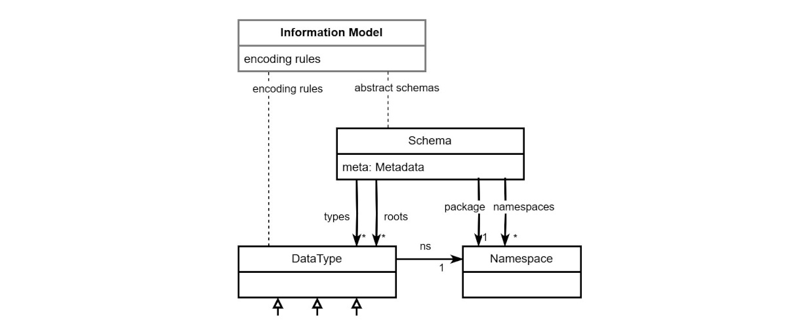
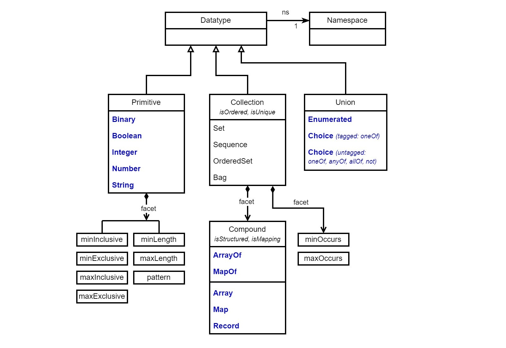
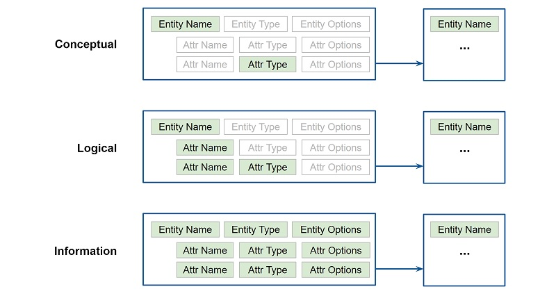
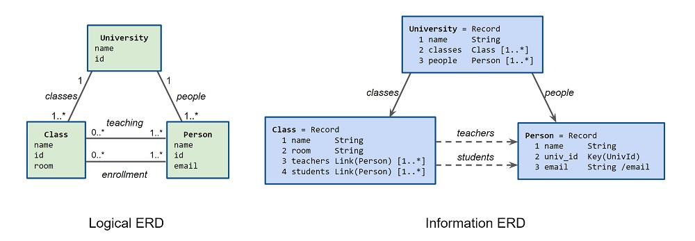

-------

# Specification for JSON Abstract Data Notation (JADN) Version 2.0

## Committee Specification Draft 01

## 20 November 2024

&nbsp;

#### This stage:
https://docs.oasis-open.org/openc2/jadn/v1.0/cs01/jadn-v1.0-cs01.md (Authoritative) \
https://docs.oasis-open.org/openc2/jadn/v1.0/cs01/jadn-v1.0-cs01.html \
https://docs.oasis-open.org/openc2/jadn/v1.0/cs01/jadn-v1.0-cs01.pdf

#### Previous stage:
https://docs.oasis-open.org/openc2/jadn/v1.0/csd02/jadn-v1.0-csd02.md (Authoritative) \
https://docs.oasis-open.org/openc2/jadn/v1.0/csd02/jadn-v1.0-csd02.html \
https://docs.oasis-open.org/openc2/jadn/v1.0/csd02/jadn-v1.0-csd02.pdf

#### Latest stage:
https://docs.oasis-open.org/openc2/jadn/v1.0/jadn-v1.0.md (Authoritative) \
https://docs.oasis-open.org/openc2/jadn/v1.0/jadn-v1.0.html \
https://docs.oasis-open.org/openc2/jadn/v1.0/jadn-v1.0.pdf

#### Technical Committee:
[OASIS Open Command and Control (OpenC2) TC](https://www.oasis-open.org/committees/openc2/)

#### Chair:
Duncan Sparrell (duncan@sfractal.com), [sFractal Consulting LLC](http://www.sfractal.com/)  \
Michael Rosa (mjrosa@nsa.gov), [National Security Agency](https://www.nsa.gov/)

#### Editor:
David Kemp (d.kemp@cyber.nsa.gov), [National Security Agency](https://www.nsa.gov/)

#### Additional artifacts:
This prose specification is one component of a Work Product that also includes:
* JSON schema for JADN documents: https://docs.oasis-open.org/openc2/jadn/v1.0/cs01/schemas/jadn-v1.1.json
* JADN schema for JADN documents: https://docs.oasis-open.org/openc2/jadn/v1.0/cs01/schemas/jadn-v1.1.jadn

#### Abstract:
An Information Model (IM) defines the meaning and essential content of data used in computing independently
of how it is represented for processing, communication or storage.
JSON Abstract Data Notation (JADN) is an information modeling language based on Unified Modeling Language
(UML) logical DataTypes, used to both express the meaning of data items at a conceptual level and
formally define and validate instances of those types.
JADN uses information theory to define logical equivalence, which enables representation of essential
content in a wide range of formats and ensures translation among representations without loss.
This document defines the normative DataTypes and data formats used to construct a JADN IM, and describes
several equivalent non-normative model representations including a textual information definition
language, a table format, and a diagram format. Because a JADN IM is a logical value, it can also
be serialized in the same formats as the data it describes, allowing the model to accompany the data
if desired and facilitating dynamic model updates.

#### Status:
This document was last revised or approved by the OASIS Open Command and Control (OpenC2) TC on the above date.
The level of approval is also listed above. Check the "Latest stage" location noted above for possible later
revisions of this document. Any other numbered Versions and other technical work produced by the Technical Committee
(TC) are listed at https://www.oasis-open.org/committees/tc_home.php?wg_abbrev=openc2#technical.

TC members should send comments on this specification to the TC's email list. Others should send comments to the
TC's public comment list, after subscribing to it by following the instructions at the "Send A Comment" button
on the TC's web page at https://www.oasis-open.org/committees/openc2/.

This specification is provided under the [Non-Assertion](https://www.oasis-open.org/policies-guidelines/ipr#Non-Assertion-Mode)
Mode of the OASIS IPR Policy, the mode chosen when the Technical Committee was established.
For information on whether any patents have been disclosed that may be essential to implementing this specification,
and any offers of patent licensing terms, please refer to the Intellectual Property Rights section of the TC's web page
(https://www.oasis-open.org/committees/openc2/ipr.php).

Note that any machine-readable content 
([Computer Language Definitions](https://www.oasis-open.org/policies-guidelines/tc-process#wpComponentsCompLang))
declared Normative for this Work Product is provided in separate plain text files. In the event of a discrepancy
between any such plain text file and display content in the Work Product's prose narrative document(s), the content
in the separate plain text file prevails.

#### Key words:
The key words "MUST", "MUST NOT", "REQUIRED", "SHALL", "SHALL NOT", "SHOULD", "SHOULD NOT", "RECOMMENDED",
"NOT RECOMMENDED", "MAY", and "OPTIONAL" in this document are to be interpreted as described in BCP 14
[[RFC2119](#rfc2119)] and [[RFC8174](#rfc8174)] when, and only when, they appear in all capitals, as shown here.

#### Citation format:
When referencing this specification the following citation format should be used:

**[JADN-v1.0]**  
_JSON Abstract Data Notation Version 1.0_. Edited by David Kemp. 17 August 2021. 
OASIS Committee Specification 01. https://docs.oasis-open.org/openc2/jadn/v1.0/cs01/jadn-v1.0-cs01.html. 
Latest stage: https://docs.oasis-open.org/openc2/jadn/v1.0/jadn-v1.0.html.

-------

## Notices
Copyright © OASIS Open 2021. All Rights Reserved.

Distributed under the terms of the OASIS [IPR Policy](https://www.oasis-open.org/policies-guidelines/ipr).

The name "OASIS" is a trademark of [OASIS](https://www.oasis-open.org/), the owner and developer of this specification,
and should be used only to refer to the organization and its official outputs.

For complete copyright information please see the Notices section in the Appendix.

-------

# Table of Contents


-------

# 1 Introduction
> *An information model is a representation of concepts, relationships, constraints, rules,
and operations to specify data semantics for a chosen domain of discourse. An information modeling
language is a formal syntax that allows users to capture data semantics and constraints.*

-- [[Information Modeling](#information-modeling)], Y. Tina Lee, NIST

This is the reference specification for the JADN information modeling language.
See [[JADN-CN](#jadn-cn)] for additional detail on the information modeling
process and how to construct and use JADN information models.
While the term information modeling is used broadly and covers a range of applications, a JADN
information model defines the essential content of discrete data items used in computing
independently of how that content is represented for processing, communication or storage.
* **Essential content** (information, meaning) is defined by information theory, where the amount of
information conveyed in a message is not directly related to the size or format of the message.
* **Data items** (messages, documents, function signatures, object state, protocol data units, etc.)
are JADN's scope within a system's domain of discourse.

JADN is based on the **Unified Modeling Language** [[UML](#uml)]:
> *The objective of UML is to provide system architects, software engineers, and software developers
with tools for analysis, design, and implementation of software-based systems as well as for modeling
business and similar processes.*

The UML specification is organized around the concept of classification, and among its
classifiers are DataType and Class. Instances of a DataType are identified only by their value,
and all instances of a DataType with the same value are considered to be equal instances. DataType
instances are immutable because different values are by definition different instances.
A value may be classified as an instance of multiple DataTypes, but value comparison is meaningful
only among instances of the same type.

Instances of a Class are objects. Objects are not identified by value because two objects
instantiated from the same Class, even with the same property values, remain distinct and no two
objects are ever equal. Although objects are not values, DataTypes model object features that
are values, such as public fields and API (getter/setter) views of private state.
Additional differences between DataType and Class include:
* Collection DataTypes specify if value order is significant. Class public fields and API values
do not have an order.
* DataType distinguishes between values and references, Class does not.
For example, software functions cannot persistently modify arguments passed by value but can modify
those passed by reference. Validating a document for correctness or integrity validates the values
it contains but not the values it references. A document DataType can distinguish between local and
external references and validate that local references identify values contained within that instance.
* Misusing Class to model data often results in contradictions such as treating a
one-dimensional Coordinate (e.g., latitude) as a DataType but a two-dimensional Coordinate
(latitude, longitude) as a Class.

The **Resource Description Framework** [[RDF](#rdf)] includes DataTypes:

> *RDF defines an abstract syntax (a data model) which serves to link all RDF-based languages and
specifications. RDF graphs are sets of subject-predicate-object triples, where the elements may be
IRIs, blank nodes, or **datatyped literals**. They are used to express descriptions of resources.*

RDF defines DataType as having a "lexical-to-value (L2V) mapping", and while an RDF graph defines
relationships among physical and digital resources, DataType is the only RDF element that defines
a digital resource in terms of both a literal representation and its representation-independent
logical value.

Defining equivalence is the primary distinction between information modeling and other modeling approaches.
An information model is constructed from DataTypes, not Classes, because its purpose is to compare
literal values for equivalence based on their logical information content, and only DataTypes define
instances that can be compared.

## 1.1 Glossary

### 1.1.1 Definitions of terms
* **Information (essential content)**:
    Informally, essential means that if data can be removed from a message without affecting its meaning,
    then it is not essential.
    Formally, information theory quantifies the entropy (novelty, or news value) of a message in bits,
    excluding data that is insignificant or is redundant with what is known *a priori*.
    The information content of a message can be no greater than the smallest data value that accurately represents it.

* **Information Model**:
    An abstract schema that defines the meaning, structure and value constraints of information used in
    computing systems independently of representation, plus a set of application-independent mappings
    between external data values and internal logical values.

* **Equivalence**:
    The relation between the meaning represented by two data values such that each logically implies the other.
    Two data values are equivalent if and only if they are classified as instances of the same logical type
    and have the same logical value.

* **Logical Type**:
    An abstract DataType that defines the meaning and essential content of a discrete data item used
    in computing independently of how it is represented for processing, communication or storage.
    Logical types are defined by and composed using an information modeling language.

* **Logical Value (information value)**:
    An immutable instance of a logical type used for processing and comparison, specified by
    behavioral effect independently of programming languages and techniques.

* **Data Value (artifact, document, lexical value, literal value, message)**:
    An immutable instance of a logical type used for transmission or storage, consisting of a sequence of
    octets or characters in an external data format.
    Or equivalently, the same sequence as defined by a data model.

* **Data Format**:
    Serialization rules that specify the media type (e.g., XML, JSON, CBOR, Protobuf),
    design goals (human readability, efficiency), and style preferences for data values in that format.

* **Data Model**:
    A concrete schema that defines the structure and value constraints of serialized data.
    A single information model corresponds to multiple equivalent data models; data models are equivalent
    if they define data values representing the same information.

* **Presentation Format**:
    A view of logical values that does not necessarily preserve all essential content, used for display
    or documentation purposes.

* **Well-formed**:
    A data value that is valid according to a structured syntax (e.g., "+json", "+der"),
    if one is specified by the data format.

* **Valid**:
    A logical value is valid if it satisfies the constraints of its logical type.
    A data value is valid if it is well-formed and is classified as an instance of a logical type.

* **Serialization**:
    Serialization, or encoding, converts a logical value into a data value.
    De-serialization, or decoding, classifies a data value and converts it into an instance of a logical type.

* **Description (annotation)**:
    Description fields of an information model are reserved for comments from authors to readers
    or maintainers of the model and are ignored by information processing applications.

### 1.1.2 Acronyms and abbreviations

* **DAG**: Directed Acyclic Graph
* **DM**: Data Model
* **IM**: Information Model

<!--
### 1.1.3 Document conventions

- Naming conventions
- Font colors and styles
- Typographic conventions
-->

-------

# 2 Information Models

A JADN information model defines the essential content of discrete data items used in computing independently
of how that content is represented for processing, communication or storage.
Information values are instances of abstract UML DataTypes, and as shown in Figure 2-1 DataType definitions are
organized into abstract schema packages which are included in an application's information model.


###### Figure 2-1 -- Information Model Organization

* An IM consists of a set of abstract schemas that define information content, and a set of
encoding rules that define the lexical-to-value mapping in a specific data format for each JADN core type.
* Schema is the top level JADN type. It has two fields:
  * "Metadata" containing descriptive and functional information about the schema package as a whole.
  * List of "Type" containing JADN type definitions. Every type definition is a UML DataType
* An instance of the Schema type is identified by a globally-unique package namespace.
Types defined in a package have names qualified by its namespace, and reference types defined in other
packages by their qualified names. An individual Schema instance is called a "package" because it is an
instance, not a Type, and to distinguish it from an "application schema" that is the set of packages
in an information model.
* There is no "information model" type containing or naming a set of schema packages.
Applications load relevant package(s) plus any additional packages needed to resolve type references.

[Section 3](#3-schema-packages) defines schema packages and metadata.  \
[Section 4](#4-jadn-types) defines the JADN core types.  \
[Section 5](#5-extensions) defines shortcuts that make type definitions more convenient without affecting meaning.  \
[Section 6](#6-serialization-and-data-formats) discusses using encoding rules to define concrete data formats.  \
[Section 7](#7-alternate-schema-representations) describes some non-normative alternate JADN schema formats:
* a text-based information definition language (IDL) defined and validated by a language grammar
* property tables used in protocol or document format specifications
* entity-relationship diagrams (ERDs) used for data modeling

The normative format of a Schema package, as defined in Sections 3 and 4, is JSON data that can be validated by a
schema, but a package can also be represented unambiguously in other formats more suited to human understanding.
This specification uses JSON to precisely define the structure of a JADN schema,
but uses the IDL format described in Section 7 where understanding purpose and meaning is the primary goal.
These representations are equivalent, and the JSON definition of all IDL content is included with this specification.

-------

# 3 Schema Packages

An information model's abstract schema is composed of schema packages.
All packages, including the one defining JADN itself, are instances of JADN's `Schema` type.
Schema has two fields: package metadata defined in this section
([Figure 3-1](#figure-3-1----jadn-schema-metadata)), and a list of type definitions defined
in the [next section](#4-jadn-types).

```
       title: "JADN Metaschema"
     package: "http://oasis-open.org/openc2/jadn/v2.0/schema"
 description: "Syntax of a JSON Abstract Data Notation (JADN) package."
     license: "CC-BY-4.0"
       roots: ["Schema"]
      config: {"$FieldName": "^[$A-Za-z][_A-Za-z0-9]{0,63}$"}

Schema = Record                                  // Definition of a JADN package
   1 meta             Metadata optional          // Information about this package
   2 types            Type unique [1..*]         // Types defined in this package

Metadata = Map                                   // Information about this package
   1 package          Namespace                  // Unique name/version of this package
   2 version          String{1..*} optional      // Incrementing version within package
   3 title            String{1..*} optional      // Title
   4 description      String{1..*} optional      // Description
   5 comment          String{1..*} optional      // Comment
   6 copyright        String{1..*} optional      // Copyright notice
   7 license          String{1..*} optional      // SPDX licenseId of this package
   8 namespaces       PrefixNs unique [0..*]     // Referenced packages
   9 roots            TypeName unique [0..*]     // Roots of the type tree(s) in this package
  10 config           Config optional            // Configuration variables
  11 jadn_version     Namespace optional         // JADN Metaschema package

PrefixNs = Array                                 // Prefix corresponding to a namespace IRI
   1  NSID                                       // prefix:: Namespace prefix string
   2  Namespace                                  // namespace:: Namespace IRI

Config = Map{1..*}                               // Config vars override JADN defaults
   1 $MaxBinary       Integer{1..*} optional     // Package max octets, default = 255
   2 $MaxString       Integer{1..*} optional     // Package max characters, default = 255
   3 $MaxElements     Integer{1..*} optional     // Package max items/properties, default = 255
   4 $Sys             String{1..1} optional      // System character for TypeName, default = '.'
   5 $TypeName        String /regex optional     // Default = ^[A-Z][-.A-Za-z0-9]{0,63}$
   6 $FieldName       String /regex optional     // Default = ^[a-z][_A-Za-z0-9]{0,63}$
   7 $NSID            String /regex optional     // Default = ^([A-Za-z][A-Za-z0-9]{0,7})?$

Namespace = String /uri                          // Unique name of a package
NSID = String{pattern="$NSID"}                   // Namespace prefix matching $NSID
TypeName = String{pattern="$TypeName"}           // Name of a logical type
FieldName = String{pattern="$FieldName"}         // Name of a field in a structured type
TypeRef = String                                 // Reference to a type, matching ($NSID ':')? $TypeName
```

###### Figure 3-1 -- JADN Schema: Metadata


### 3.1.1 Descriptive Metadata

These Metadata fields provide information about a package but have no effect on schema processing:

* **title:** A short name for this package.
* **description:** A brief description of purpose or capabilities of this package
* **comment:** Any other information applicable to the package.
* **copyright:** A copyright notice.
* **license:** SPDX licenseId of the contents of this package.

### 3.1.2 Functional Metadata

These Metadata fields affect schema processing:

* **package:** A namespace [[IRI](#iri)] that unambiguously identifies this Schema instance and allows type
definitions in this package to be unambiguously referenced from other packages.
This is a unique identifier but not necessarily a resource locator.
If Metadata is present in a Schema instance it must include the package field; all other fields are optional.

* **version:** Incremental revision of this package, a string that compares lexicographically higher
than previous revisions. A package namespace uniquely identifies both the topic and published version
of a package reference.
This field identifies the latest revision of a package when more than one revision is available.

* **jadn_version:** Package namespace of the JADN metaschema used to validate this package.

* **namespaces:** A set of associations between Namespace IDs (prefixes) and namespace IRIs.
Types defined in this package may reference types from other packages using `PrefixedName` as defined in
[[XML Namespaces](#xml-namespaces)].
Associating a blank prefix with a package namespace indicates that its types are treated as if they
were defined in this package. This requires the referenced package to have non-conflicting type names
and compatible metadata including name formats and namespaces.

* **roots:** List of top-level types defined in this package. This designates a single starting point or
a catalog of library types defined in this package, and allows schema processing tools to flag
unreferenced type definitions.

* **config:** Configuration variables used to tailor schema processing within a package.
Variables not configured in a package have an implementation-defined default value, with recommended
defaults shown below.
  * **Name Formats:** JADN syntax does not restrict the allowed name formats, but establishing
naming conventions using distinct formats for TypeName and FieldName
([Section 4.1](#41-type-definition-structure)) can aid schema readability. These variables define a package's
naming conventions:
    * **$Sys:** A "system" character used in software-generated TypeNames. Default = '.'
    * **$TypeName:** The regex used to validate TypeName. Default begins with an upper-case character:
^[A-Z][-.A-Za-z0-9]{0,63}$
    * **$FieldName:** The regex used to validate FieldName. Default begins with a lower-case character:
^[a-z][_A-Za-z0-9]{0,63}$  \
The JADN Metaschema overrides the default $FieldName pattern to allow config variables beginning
with '$' and core type names beginning with a capital letter.
    * **$NSID:** The regex used to validate an external type reference's prefix string.
Default: ^([A-Za-z][A-Za-z0-9]{0,7})?$  \
External type references (TypeRef in [Figure 4-2](#figure-4-2----jadn-schema-types))
are qualified names that include an NSID.

  * **Size Limits:** These variables define default maximum sizes for variable-sized
Primitive and Compound types ([Section 4](#4-jadn-types)).
Individual type definitions override implementation or package defaults using type options.
    * **$MaxBinary:** Maximum number of octets in a Binary instance (default maxLength = 255)
    * **$MaxString:** Maximum number of characters in a String instance (default maxLength = 255)
    * **$MaxElements:** Maximum number of items in an ArrayOf or MapOf instance (default maxOccurs = 255)

### 3.1.4 Conformance Requirements
* The $TypeName format MUST permit TypeNames containing the $Sys character, which is used
in type names generated by schema processing and translation.
* The $FieldName format MUST NOT permit FieldNames containing the $Sys character, to enable its
use as the separator between path components.
* A TypeRef instance MUST be NSID + ":" + TypeName if its NSID is not blank, else Typename.

-------

# 4 JADN Types

An information modeling language's abstract DataTypes define their meaning and application behavior.
As shown in Figure 3-1, JADN defines twelve core types (bold) in three categories:

* [Section 4.2.1](#421-primitive): **Primitive**: Types whose instances are atomic values not decomposable
into instances of other types.
* [Section 4.2.2](#422-compound-types): **Compound**: Types whose instances are collections of instances of other
types. ArrayOf and MapOf are unstructured; Array, Map, and Record are structured types with named fields.
* [Section 4.2.3](#423-union-types): **Union**: Types whose instances are selected from a set of possible values.


###### Figure 4-1 -- JADN Core DataTypes

## 4.1 Type Definition Structure

All JADN type definitions have the identical structure, designed to be easily describable, easily processed,
stable, and extensible.

```
Type = Array
   1  TypeName                                   // type_name::
   2  Enumerated(Enum[JADN-Type])                // core_type::
   3  Options                                    // type_options::
   4  Description                                // type_description::
   5  JADN-Type(TagId[core_type])                // fields::

JADN-Type = Choice
   1 Binary           Empty
   2 Boolean          Empty
   3 Integer          Empty
   4 Number           Empty
   5 String           Empty
   6 Enumerated       Items
   7 Choice           Fields
   8 Array            Fields
   9 ArrayOf          Empty
  10 Map              Fields
  11 MapOf            Empty
  12 Record           Fields

Empty = Array{0..0}
Items = ArrayOf(Item)
Fields = ArrayOf(Field)

Item = Array
   1  FieldID                                    // item_id::
   2  String                                     // item_value::
   3  Description                                // item_description::

Field = Array
   1  FieldID                                    // field_id::
   2  FieldName                                  // field_name::
   3  TypeRef                                    // field_type::
   4  Options                                    // field_options::
   5  Description                                // field_description::

FieldID = Integer{0..*}
Options = ArrayOf(Option) unique
Option = String{1..*}
Description = String
```

###### Figure 4-2 -- JADN Schema: Types

As shown in [Figure 4-2](#figure-4-2----jadn-schema-types) each type definition has five elements:

1. **TypeName:** the name of the type being defined
2. **CoreType:** the JADN built-in type of the type being defined
3. **TypeOptions:** an array of zero or more **TypeOption** values applicable to **CoreType**
4. **TypeDescription:** a non-normative comment
5. **Fields:** an array of **Item** or **Field** definitions

### 4.1.1 Primitive
If CoreType is a Primitive or unstructured Compound type, the **Fields** array is empty.

JSON Format:
```
    [TypeName, CoreType, [TypeOption, ...], TypeDescription, []]
```
IDL Example:
```
    Username = String {pattern="^[a-z][a-z0-9]{,11}$"}

    Users = ArrayOf(Username)
```
### 4.1.2 Enumerated

If CoreType is the Enumerated Type, each item definition in the **Fields** array has three elements:
1. **ItemID:** the integer identifier of the item
2. **ItemValue:** the string value of the item
3. **ItemDescription:** a non-normative comment

JSON Format:
```
    [TypeName, CoreType, [TypeOption, ...], TypeDescription, [
        [ItemId, ItemValue, ItemDescription],
        ...
    ]]
```
IDL Example:
```
    Color = Enumerated
      1 red
      2 green
      3 blue
```
### 4.1.3 Compound

If CoreType is a structured Compound or Choice type, each field definition in the **Fields** array has five elements:
1. **FieldID:** the integer identifier of the field
2. **FieldName:** the name or label of the field
3. **FieldType:** the type of the field, a **TypeReference**
4. **FieldOptions:** an array of zero or more **FieldOption** or **TypeOption** values applicable to **FieldType**
5. **FieldDescription:** a non-normative comment

JSON Format:
```
    [TypeName, CoreType, [TypeOption, ...], TypeDescription, [
        [FieldID, FieldName, FieldType, [FieldOption, TypeOption, ...], FieldDescription],
        ...
    ]]
```

IDL Example:
```
    Coordinate = Record             // A GPS coordinate
      1 latitude    Latitude        // A Number between -90 and 90 degrees
      2 longitude   Longitude       // A Number between -180 and 180 degrees
```

### 4.1.4 Type and Field Options
Each TypeOption and FieldOption provides a limited piece of information about some aspect of the DataType
to which it applies, similar in effect to an [[XSD](#xsd)] *facet*. Each option has an ID and value,
and is represented in JSON format as a string where the first character's Unicode codepoint is the option's
ID and the remaining characters are its value.

An option may go by different names in different sources: UML calls the minimum cardinality of a
collection "/lower", XSD calls it "minOccurs", and JSON Schema calls it "minItems". JADN defines
the minimum length option ID to be `0x7b` (Left Curly Bracket), so the TypeOption string "{0"
indicates a minimum length of 0 for compound types and for the Binary and String primitive types.
For convenience this specification re-uses XSD names, if any, for TypeOption and FieldOption IDs,
so the minimum length option is referred to as "minLength" or "minOccurs" when used with primitive
or compound CoreTypes respectively.

### 4.1.5 Conformance Requirements

* TypeName MUST NOT be a JADN core type  
* CoreType MUST be a JADN core type
* FieldID and FieldName values MUST be unique within a type definition.
* If CoreType is Array or Record, FieldID MUST be the ordinal position of the field within the type,
numbered consecutively starting at 1.
* If CoreType is Enumerated, Choice, or Map, FieldID MAY be any integer.
* FieldType MUST be a Primitive type, ArrayOf, MapOf, or a model-defined (non-core) type.
* If FieldType is not a core type, FieldOptions MUST NOT contain any TypeOption.
* If the [Derived Enumerations](#53-derived-enumerations) or [Pointers](#55-pointers) extensions are present
in TypeOptions, the Fields array MUST be empty.
* The default value of TypeOptions, Fields and FieldOptions is the empty Array.
* The default value of TypeDescription, ItemDescription and FieldDescription is the empty String.
Description values are reserved for comments from schema authors to readers or maintainers,
MAY be stripped at any time, and MUST have no effect on validation or serialization.

## 4.2 Core Types

*===================================================================*

 *Note: the remainder of this document is being revised. Not for review.*

*===================================================================*

### 4.2.1 Primitive

A primitive core type has no substructure. Its instances are values defined

A primitive type specifies a space of possible values without regard to programming language
constructs or hardware limits. Restrictions such as range, precision, size, patterns and formats
are specified using the type-specific options listed in this section.

#### 4.2.1.1 Primitive Types

##### 4.2.1.1.1 Binary
An instance of Binary is sequence of octets.

Options: minLength, maxLength

##### 4.2.1.1.2 String
An instance of String defines a sequence of characters in a character set.

Options: minLength, maxLength, pattern

##### 4.2.1.1.3 Boolean
An instance of Boolean is one of the predefined values *true* and *false*.

Options: none

##### 4.2.1.1.4 Integer
An instance of Integer is a value in the (infinite) set of integers (…-2, -1, 0, 1, 2…).

Options: minInclusive, maxInclusive, minExclusive, maxExclusive

##### 4.2.1.1.5 Number
An instance of Number is a value in the (infinite) set of real numbers.

Options: minInclusive, maxInclusive, minExclusive, maxExclusive

#### 4.2.1.2 Primitive TypeOptions

Table 4-1 lists the type-specific TypeOptions specific to Primitive core types.

| ID   | Chr | Type    | Name         | Description                                       |
|------|:---:|---------|--------------|---------------------------------------------------|
| 0x25 |  %  | String  | pattern      | Regular expression                                |
| 0x2f |  /  | String  | format       | Semantic validation keyword                       |
| 0x7b |  {  | Integer | minLength    | Minimum octet or character count                  |
| 0x7d |  }  | Integer | maxLength    | Maximum octet or character count                  |
| 0x77 |  w  | *       | minInclusive | Instance is greater than or equal to option value |
| 0x78 |  x  | *       | maxInclusive | Instance is less than or equal to option value    |
| 0x79 |  y  | *       | minExclusive | Instance is greater than option value             |
| 0x7a |  z  | *       | maxExclusive | Instance is less than option value                |

###### Table 4-1. Primitive TypeOptions

* **pattern**: Regular expression
* **format**: Semantic validation keyword
* **minLength**, **maxLength**: 
* **minInclusive**, **maxInclusive**:
* **minExclusive**, **maxExclusive**:

### 4.2.2 Compound Types

A compound type specifies a collection of values, defining both collection semantics and the abstract syntax
of its members.

Collection semantics defines:
* if order is significant when comparing instances (Ordered)
* if duplicate values are allowed when validating an instance (Unique)

Collection abstract syntax defines:
* whether all members have the same type (Type Syntax) or each member's type is specified
individually (Field Syntax).
* whether members are unnamed (Array, ArrayOf) or named (Map, MapOf, Record). Field names 
must be unique and so can exist only for unique collection types.
* whether serialized members are identified by position (Array), name (Map, MapOf),
or either position or name (Record). Positional encoding can be used only with data constructs
that preserve order.

| Type                    | Definition                                                                                                                                                                     |
|:------------------------|:-------------------------------------------------------------------------------------------------------------------------------------------------------------------------------|
| Array                   | An ordered list of labeled fields with positionally-defined types. Each field has a position, label, and type.                                                                 |
| ArrayOf(*vtype*)        | A collection of fields with the same type *vtype*. Ordering and uniqueness are specified by a collection option.                                                               |
| Map                     | A map from a set of specified keys to values with a value type bound to each key. Each key has an id and a name or label.                                                      |
| MapOf(*ktype*, *vtype*) | A map from a set of keys of the same type *ktype* to values with the same type *vtype*.                                                                                        |
| Record                  | A map from a list of keys to values with a value type bound to each key. Each key has a position and a name.                                                                   |

Table 4-2 summarizes the relationship between Compound types and collection behavior.
The notation `X+y` indicates that the definition of type `X` includes type option `y` defined in
[Section 4.2.1](#421-type-options).

###### Table 4-2. Mapping Logical Collections to Compound Types

| Ordered | Unique | Collection<br>Semantics | Type<br>Syntax    | Field<br>Syntax                             |
|---------|--------|-------------------------|-------------------|---------------------------------------------|
| false   | true   | Set                     | ArrayOf+set       | Array+set<br>Map<br>MapOf<br>Record         |
| true    | false  | Sequence                | ArrayOf           | none                                        |
| true    | true   | OrderedSet              | ArrayOf+unique    | Array<br>Map+seq<br>MapOf+seq<br>Record+seq |
| false   | false  | Bag                     | ArrayOf+unordered | none                                        |

* Members of an ArrayOf or Array type are selected by ordinal position.
* Members of a Record type are selected by either position or name depending on data format.
* Field positions are unique and by default Array has OrderedSet, not Sequence (non-unique) semantics.
* Map, MapOf and Record keys are unique and with `seq` option have OrderedSet, not Sequence semantics.
* The members of a Bag collection cannot be selected; accessing a Bag instance returns an arbitrary member.

*maxOccurs: Unlimited = -2, Unspecified = -1*

### 4.2.3 Union Types

A union type specifies a set of alternatives against which instances are matched. See [Section 4.2.2.2](#4222-union-types)

| Type                    | Definition                                                                                                                                                                     |
|:------------------------|:-------------------------------------------------------------------------------------------------------------------------------------------------------------------------------|
| Enumerated              | A vocabulary, a set of item (id/string pair) values. An instance is a single member of the set.                                                                                |
| Choice                  | A tagged or untagged union, a set of types or a logical combination of types. An instance matches the single type designated by the tag or the specified combination of types. |

**Conformance**:

* An application that uses JADN types MUST exhibit the behavior specified in Table 3-1.
Applications MAY use any programming language data types or mechanisms that exhibit the required behavior.
* An instance of a Map, MapOf, or Record type MUST NOT have more than one occurrence of each key.
* An instance of a Map, MapOf, or Record type MUST NOT have a key of the null type.
* An instance of a Map, MapOf, or Record type with a key mapped to a null value MUST compare as equal to an
otherwise identical instance without that key.
* The length of an Array, ArrayOf or Record instance MUST not include null values after the last non-null value.
* Two Array, ArrayOf or Record instances that differ only in the number of trailing nulls MUST compare as equal.


### 4.2.4 General Options
This section defines the mechanism used to support a varied set of information needs within the strictly regular
structure of [Section 4.1](#41-type-definition-structure). New requirements can be accommodated by defining new options
without modifying that structure. Type and Field options are classifiers that, along with the core type,
determine whether data values are instances of the defined type.

Each option is a text string that may be included in TypeOptions or FieldOptions, encoded as follows:
* The first character is the option ID. Its Unicode codepoint is the numeric value (FieldID) shown in
[Section 4.2.1](#421-type-options) and [Section 4.2.2](#422-field-options).
* The remaining characters are the option value. Boolean options have no additional characters;
if the option ID is present the value of that option is True.

### 4.2.1 Type Options
Type options apply to the type definition as a whole. The *id*, *vtype*, *ktype*, *enum*, and *pointer* options
are intrinsic components of the types to which they apply. 
Other options specify value constraints on the type.
```
TypeOption = Choice
   61 id        Boolean    // '=' Items and Fields are denoted by FieldID rather than FieldName (Section 3.2.1.1)
   42 vtype     String     // '*' Value type for ArrayOf and MapOf (Section 3.2.1.2)
   43 ktype     String     // '+' Key type for MapOf (Section 3.2.1.3)
   35 enum      String     // '#' Extension: Enumerated type derived from a specified type (Section 3.3.3)
   62 pointer   String     // '>' Extension: Enumerated type pointers derived from a specified type (Section 3.3.5)
   47 format    String     // '/' Semantic validation keyword (Section 3.2.1.5)
   37 pattern   String     // '%' Regular expression used to validate a String type (Section 3.2.1.6)
  121 minf      Number     // 'y' Minimum real number value (Section 3.2.1.7)
  122 maxf      Number     // 'z' Maximum real number value
  123 minv      Integer    // '{' Minimum integer value, octet or character count, or element count (Section 3.2.1.7)
  125 maxv      Integer    // '}' Maximum integer value, octet or character count, or element count
  113 unique    Boolean    // 'q' ArrayOf instance must not contain duplicate values (Section 3.2.1.8)
  115 set       Boolean    // 's' ArrayOf instance is unordered and unique (Section 3.2.1.9)
   98 unordered Boolean    // 'b' ArrayOf instance is unordered (Section 3.2.1.10)
  111 seq       Boolean    // 'o' Map, MapOf, or Record instance is ordered and unique (Section 3.2.1.11)
   67 combine   String     // 'C' Choice is an untagged union, a logical combination of types (Section 3.2.1.12) 
   88 extend    Boolean    // 'X' Type is extensible; new Items or Fields may be appended (Section 3.2.1.13)
   33 default   String     // '!' Default value (Section 3.2.1.14)
```

* TypeOptions MUST contain zero or one instance of each TypeOption.
* TypeOptions MUST contain only TypeOption instances allowed for CoreType as shown in Table 3-3, plus a default value.
* If CoreType is ArrayOf, TypeOptions MUST include the *vtype* option and MUST NOT include more than one collection option (*set*, *unique*, or *unordered*).
* If CoreType is MapOf, TypeOptions MUST include *ktype* and *vtype* options.

###### Table 4-3. Allowed Options

| CoreType   | Allowed Options                           |
|:-----------|:------------------------------------------|
| Binary     | minv, maxv, format                        |
| Boolean    |                                           |
| Integer    | minv, maxv, format                        |
| Number     | minf, maxf, format                        |
| String     | minv, maxv, format, pattern               |
| Array      | minv, maxv, format, extend                |
| ArrayOf    | vtype, minv, maxv, unique, set, unordered |
| Map        | id, minv, maxv, seq, extend               |
| MapOf      | vtype, ktype, minv, maxv, seq             |
| Record     | minv, maxv, seq, extend                   |
| Enumerated | id, enum, pointer, extend                 |
| Choice     | id, combine, extend                       |

#### 4.2.1.1 Field Identifiers

The *id* option used with Map, Enumerated, and Choice types determines how fields are specified in API instances of these types.
If the *id* option is absent, API instances use the FieldName string and the type is referred to as "named".
If the *id* option is present, API instances use the FieldID tag and the type is referred to as "labeled".
The Record type is always named and has no *id* option; the Array type is its labeled equivalent.
* In named types, FieldName is a defined name that is included in the semantics of the type, must be
populated in the type definition, and may appear in serialized data depending on serialization format.
* In labeled types, FieldName is a suggested label that is not included in the semantics of the type,
may be empty in the type definition, and never appears in serialized data regardless of data format.

For example an Enumerated list of HTTP status codes could include the field [403, "Forbidden"].
If the type definition does not include an *id* option, the API value is "Forbidden" and serialization rules determine
whether FieldID or FieldName is used in serialized data. With the *id* option the API and serialized values are always
the FieldID 403. The label "Forbidden" may be displayed in messages or user interfaces, as could customized labels
such as "NotAllowed", "Verboten", or "Interdit".

#### 4.2.1.2 Value Type
The *vtype* option specifies the type of each field in an ArrayOf or MapOf type. It may be any JADN type or Defined type.
* An ArrayOf or MapOf instance MUST be considered invalid if any of its elements is not an instance of *vtype*.

#### 4.2.1.3 Key Type
The *ktype* option specifies the type of each key in a MapOf type. 
* *ktype* SHOULD be a Defined type, either an enumeration or a type with constraints such as a pattern or semantic valuation keyword that specify a fixed subset of values that belong to a category.
* A MapOf instance MUST be considered invalid if any of its keys is not an instance of *ktype*.

#### 4.2.1.4 Derived Enumeration
The *enum* ([Section 5.3](#53-derived-enumerations)) and *pointer* ([Section 5.5](#55-pointers)) options
are extensions that create an Enumerated type derived from a referenced Array, Choice, Map or Record type.

#### 4.2.1.5 Semantic Validation
The *format* option value is a semantic validation keyword. Each keyword specifies validation requirements for
a fixed subset of values that are accurately described by authoritative resources.  The *format* option may also
affect how values are serialized, see [Section 6](#6-serialization-and-data-formats).

###### Table 4-4. Semantic Validation Keywords
| Keyword             | Type    | Requirement                                                                                    |
|---------------------|---------|------------------------------------------------------------------------------------------------|
| JSON Schema formats | String  | All semantic validation keywords defined in Section 7.3 of [JSON Schema](#jsonschema).         |
| eui                 | Binary  | IEEE Extended Unique Identifier (MAC Address), EUI-48 or EUI-64 as specified in [EUI](#eui)    |
| f16                 | Number  | IEEE 754 Half-Precision Float                                                                  |
| f32                 | Number  | IEEE 754 Single-Precision Float                                                                |
| f64                 | Number  | IEEE 754 Double-Precision Float                                                                |
| ipv4-addr           | Binary  | IPv4 address as specified in [RFC 791](#rfc791) Section 3.1                                    |
| ipv6-addr           | Binary  | IPv6 address as specified in [RFC 8200](#rfc8200)  Section 3                                   |
| ipv4-net            | Array   | Binary IPv4 address and Integer prefix length as specified in [RFC 4632](#rfc4632) Section 3.1 |
| ipv6-net            | Array   | Binary IPv6 address and Integer prefix length as specified in [RFC 4291](#rfc4291) Section 2.3 |
| i8                  | Integer | Signed 8 bit integer, value must be between -128 and 127.                                      |
| i16                 | Integer | Signed 16 bit integer, value must be between -32768 and 32767.                                 |
| i32                 | Integer | Signed 32 bit integer, value must be between -2147483648 and 2147483647.                       |
| u\<*n*\>            | Integer | Unsigned integer or bit field of \<*n*\> bits, value must be between 0 and 2^\<*n*\> - 1.      |

#### 4.2.1.6 Pattern
The *pattern* option specifies a regular expression used to validate a String instance.
* The *pattern* value SHOULD conform to the Pattern grammar of [ECMAScript](#ecmascript) Section 22.2.
* A String instance MUST be considered invalid if it does not match the regular expression specified by *pattern*.

#### 4.2.1.7 Size and Value Constraints
The *minv* and *maxv* options specify size or integer value limits.
The *minf* and *maxf* options specify real number value limits.

* For Binary, String, Array, ArrayOf, Map, MapOf, and Record types:
    * if *minv* is not present, it defaults to zero.
    * if *maxv* is not present or is zero, it defaults to the upper bound specified in [Section 4.2.1](#421-type-options).
    * a Binary instance MUST be considered invalid if its number of bytes is less than *minv* or greater than *maxv*.
    * a String instance MUST be considered invalid if its number of characters is less than *minv* or greater than *maxv*.
    * an Array, ArrayOf, Map, MapOf, or Record instance MUST be considered invalid if its number of elements is less than *minv* or greater than *maxv*.
* For Integer types:
    * if *minv* is present, an instance MUST be considered invalid if its value is less than *minv*.
    * if *maxv* is present, an instance MUST be considered invalid if its value is greater than *maxv*.
* For Number types:
    * if *minf* is present, an instance MUST be considered invalid if its value is less than *minf*.
    * if *maxf* is present, an instance MUST be considered invalid if its value is greater than *maxf*.

#### 4.2.1.8 Unique Values
The *unique* option specifies that values in an array must not be repeated.

* For the ArrayOf type, if *unique* is present an instance MUST be considered invalid if it contains duplicate values.

#### 4.2.1.9 Set
The *set* option specifies that an ArrayOf type is unordered and unique.

* For the ArrayOf type, if *set* is present an instance MUST be considered invalid if it contains duplicate values.

#### 4.2.1.10 Unordered
The *unordered* option specifies that an ArrayOf type may contain duplicate values and that its values have no
defined order.  Because values cannot be selected by value or position, it has the semantics of a "bag" or "urn"
from which elements are picked at random.

#### 4.2.1.11 Seq
The *seq* option specifies that a Map, MapOf or Record instance is an OrderedSet.

#### 4.2.1.12 Combine
The *combine* option specifies that a [Choice](#42222-choice---untagged-union) instance must be valid
against a logical combination of types. The single-character value indicates the combination type:
* A = AND: data must be an instance of `allOf` the Choice types
* O = OR: data must be an instance of `anyOf` the Choice types (at least one, short-circuit evaluated in field order)
* X = XOR: data must be an instance of exactly `oneOf` the Choice types

#### 4.2.1.13 Extension Point
The *extend* option is an assertion that an Enumerated, Choice, Array, Map or Record type MAY be incomplete and that
future versions MAY add new fields that do not change the definitions of existing fields.  This option does not affect
the validity of data with respect to a specific schema, it is an indicator that applications may be able to obtain
a newer version of the same package for which the data is valid. Types without this option assert that
the package identifier will be changed if any field is added, modified, or deleted.

#### 4.2.1.14 Default Value
The *default* option specifies the initial or default value of a field. Applications deserializing
a document MUST initialize an unspecified type with its default value.
Serialization behavior is not defined; applications MAY omit or populate fields whose values equal the default.

### 4.2.2 Field Options
Field options may be specified for each field within a compound type definition.

```
FieldOption = Choice
   91 minc      Integer    // '[' Minimum cardinality, default = 1, 0 = optional (Section 3.2.2.1)
   93 maxc      Integer    // ']' Maximum cardinality, default = 1, 0 = default max, >1 = array
   38 tagid     Enumerated // '&' Field containing an explicit tag for this Choice type (Section 3.2.2.2)
   60 dir       Boolean    // '<' Pointer enumeration treats field as a group of items (Extension: Section 3.3.5)
   75 key       Boolean    // 'K' Field is a primary key for this type (Extension: Section 3.3.6)
   76 link      Boolean    // 'L' Field is a foreign key reference to a type instance (Extension: Section 3.3.6)
```

* FieldOptions MUST NOT include more than one of each option.
* All TypeOption values ([Section 4.2.1](#421-type-options)) included in FieldOptions are extensions. Each TypeOption
MUST apply to FieldType as defined in [Table 4-3](#table-4-3-allowed-options). 

#### 4.2.2.1 Multiplicity
Cardinality is the number of elements in a group, and multiplicity is the range of allowed cardinalities
for that group. The *minc* and *maxc* options specify the minimum and maximum cardinality in a field
of an Array, Choice, Map, or Record type:

| minc | maxc | Multiplicity | Description | Keywords |
| ---: | ---: | -----------: | :---------- | :------- |
|    0 |    1 | 0..1 | No instances or one instance | optional |
|    1 |    1 |    1 | Exactly one instance | required |
|    0 |    0 | 0..* | Zero or more instances | optional, repeated |
|    1 |    0 | 1..* | At least one instance | required, repeated |
|    m |    n | m..n | At least m but no more than n instances | required, repeated |

* if *minc* is not present, it defaults to 1.
* if *maxc* is not present, it defaults to the greater of 1 or *minc*.
* if *maxc* is 0, it defaults to the MaxElements upper bound specified in [Section 4.1.3](#413-upper-bounds).
* if *maxc* is less than *minc*, the field definition MUST be considered invalid.

If *minc* is 0, the field is optional, otherwise it is required.  
If *maxc* is 1 the field is a single element, otherwise it is an array of elements
as described in [Section 4.3.2](#432-field-multiplicity).  

Within a Choice type *minc* values of 0 and 1 are equivalent because all fields are optional and exactly
one must be present. Values greater than 1 specify an array of elements.

#### 4.2.2.2 Union Types
The Enumerated type matches one value (an Item ID or Name) from the set of ID/Name pairs defined by the type.

The Choice type selects one type or a logical combination of types from a set. By default Choice is
a discriminated ([tagged](#taggedunion)) union where data instances contain a tag (FieldName or FieldId)
indicating which FieldType from the Choice to evaluate. If a Choice has a [combine](#42112-combine)
type option it is an [untagged](#union) union where values that match a logical combination of types
are instances of the Choice type.

##### 4.2.2.2.1 Enumerated

##### 4.2.2.2.2 Choice - Untagged Union
The `combine` option specifies the logical function (`anyOf` (OR), `allOf` (AND), or exactly `oneOf` (XOR))
of the Choice's field types apply to the value. The `anyOf` option performs short-circuit evaluation where
the first FieldType to match, in field order, indicates the instance type.
The `allOf` and `oneOf` options always perform the evaluation against all FieldTypes.

##### 4.2.2.2.3 Choice - Tagged Union
The Choice type without a combine option represents a [discriminated union](#union), a Map with exactly
one tag:type pair where the tag indicates the value type. By default the tag is included in the instance
value. But if the *tagid* option is present on a Choice field in an Array or Record container,
a separate field within that container contains the tag separately from the instance value.

* The Tag field MUST be an Enumerated type derived from the Choice.  It MAY contain a subset of fields from the Choice.

**Example:**

    Product = Choice                        // Discriminated union
       1 furniture    Furniture
       2 appliance    Appliance
       3 software     Software
    
    Dept = Enumerated                       // Explicit Tag values derived from the Choice
       1 furniture
       2 appliance
       3 software
    
    Software = String /uri
    
    Stock1 = Record                         // Discriminated union with intrinsic tag
       1 quantity     Integer
       2 product      Product               // Value = Map with one key/value
    
    Stock2 = Record                         // Container with explicitly-tagged discriminated union
       1 dept         Dept                  // Tag = one key from Choice
       2 quantity     Integer
       3 product      Product(TagId[dept])  // Choice specifying an explicit tag field

Example JSON serializations of these types are:

Stock1 - Choice with intrinsic tag:

    {
        "quantity": 395,
        "product": {"software": "http://www.example.com/B902D1P0W37"}
    }

Stock2 - Choice with explicit tag:

    {
        "dept": "software",
        "quantity": 395,
        "product": "http://www.example.com/B902D1P0W37"
    }

**Intrinsic tags:**

When discriminated unions are grouped the distinction between intrinsic and explicit tags becomes
more apparent. A collection with intrinsic tags is simply a Map, which results in what the
[W3C JSON and XML Transformations Workshop](#transform) called "Friendly" encodings.

```
    Hashes = Map{1..*}            // Multiple discriminated unions with intrinsic tag is a Map
       1 md5          Binary{16..16} /x optional
       2 sha1         Binary{20..20} /x optional
       3 sha256       Binary{32..32} /x optional
```

Hashes Example:

```json
{
    "sha256": "C9004978CF5ADA526622ACD4EFED005A980058B7B9972B12F9B3A5D0DA46B7D9",
    "md5": "B64CF5EAF07E86D1697D4EEE96A670B6"
}
```

**Explicit tags:**

A collection with explicit tags is an array of tag-value pairs.  It is more complex to specify, and it
results in "UnFriendly" encodings with repeated tag and value keys. Yet because some specifications are
written in this style, the *tagid* option exists to designate an explicit field to be used to specify
the value type.

```
    Hashes2 = ArrayOf(HashVal)    // Multiple discriminated unions with explicit tags is an Array
    
    HashVal = Record
       1 algorithm    Enumerated(Enum[HashAlg])  // Tag - one key from Choice
       2 value        HashAlg(TagId[algorithm])  // Value selected from Choice by 'algorithm' field
    
    HashAlg = Choice
       1 md5          Binary{16..16} /x
       2 sha1         Binary{20..20} /x
       3 sha256       Binary{32..32} /x
```
Hashes2 Example:
```json
[
  {
    "algorithm": "md5",
    "value": "B64CF5EAF07E86D1697D4EEE96A670B6"
  },{
    "algorithm": "sha256",
    "value": "C9004978CF5ADA526622ACD4EFED005A980058B7B9972B12F9B3A5D0DA46B7D9"
  }
]
```

-------

# 5 Extensions

JADN consists of a set of core definition elements, plus several extensions that make type definitions
more compact or support the [DRY](#dry) software design principle.
Extensions are syntactic sugar that can be replaced by core definitions without changing their meaning.
Unfolding definitions into core format simplifies the code needed to serialize and validate data
and may clarify their meaning, but creates additional definitions that must be kept in sync.

The following extensions can be converted to core definitions:
* Anonymous type definition within a field
* Field multiplicity other than required/optional
* Derived enumeration
* MapOf type with Enumerated key type
* Pointers
* Links

## 5.1 Type Definition Within Fields

A type without fields (Primitive types, ArrayOf, MapOf) may be defined anonymously within a field of a structure definition.
Unfolding converts all anonymous type definitions to explicit named types and excludes all TypeOption values
([Section 4.2.1](#421-type-options)) from FieldOptions.

Example:

    Member = Record
       1 name         String
       2 email        String /email

Unfolding replaces this with:

    Member = Record
       1 name         String
       2 email        Member$email
    
    Member$email = String /email           // Tool-generated type definition.

## 5.2 Field Multiplicity
Fields may be defined to have multiple values of the same type. Unfolding converts each field that can
have more than one value to a separate ArrayOf type. The minimum and maximum cardinality (*minc* and *maxc*)
FieldOptions ([Section 4.2.2](#422-field-options)) are moved from FieldOptions to the minimum and maximum
size (*minv* and *maxv*) TypeOptions of the new ArrayOf type, except that if *minc* is 0
(field is optional), it remains in FieldOptions and the new ArrayOf type defaults to a minimum
size of 1.

Example:

    Roster = Record
       1 org_name     String
       2 members      Member [0..*]         // Optional and repeated: minc=0, maxc=0

Unfolding replaces this with:

    Roster = Record
       1 org_name     String
       2 members      Roster$members optional// Optional: minc=0, maxc=1
    
    Roster$members = ArrayOf(Member){1..*} // Tool-generated array: minv=1, maxv=0

If a list with no elements should be represented as an empty array rather than omitted,
its type definition must include an explicit ArrayOf type rather than using the
field multiplicity extension:

    Roster = Record
       1 org_name     String
       2 members      Members       // members field is required: default minc = 1, maxc = 1
    
    Members = ArrayOf(Member)       // Explicitly-defined array: default minv = 0, maxv = 0

## 5.3 Derived Enumerations
An Enumerated type defined with the *enum* option has fields copied from the type referenced
in the option rather than being listed individually in the definition.
Unfolding removes *enum* from Type Options and adds fields containing
FieldID, FieldName, and FieldDescription from each field of the referenced type.

In JADN-IDL ([Section 5.1](#51-jadn-idl-format)) the *enum* option is represented
as a function string: "Enum(\<referenced-type\>)".
Within ArrayOf and MapOf types, the *ktype* and *vtype* options may contain an enum option.  As an
example the IDL value "ArrayOf(Enum(Pixel))" corresponds to the JADN vtype option "*#Pixel".

Unfolding references an explicit Enumerated type if it exists, otherwise it creates an explicit
Enumerated type. It then replaces the type reference with the name of the explicit Enumerated type.

Example:

    Pixel = Map
       1 red          Integer
       2 green        Integer
       3 blue         Integer
    
    Channel = Enumerated(Enum[Pixel])       // Derived Enumerated type
    
    ChannelMask = ArrayOf(Enum[Pixel])      // ArrayOf(derived enumeration)

Unfolding replaces the Channel and ChannelMask definitions with:

    Channel2 = Enumerated
       1 red
       2 green
       3 blue
    
    ChannelMask2 = ArrayOf(Channel)

## 5.4 MapOf With Enumerated Key
A MapOf type where *ktype* is Enumerated is equivalent to a Map.  Unfolding replaces the MapOf type definition
with a Map type with keys from the Enumerated *ktype*. This is the complementary operation to derived
enumeration. In order to use this extension, each ItemValue of the Enumerated type must be a valid FieldName.

Example:

    Channel3 = Enumerated
       1 red
       2 green
       3 blue
    
    Pixel3 = MapOf(Channel3, Integer)
    
Unfolding replaces the Pixel MapOf with the explicit Pixel Map shown under [Derived Enumerations](#53-derived-enumerations).

## 5.5 Pointers
Applications may need to model both individual types and collections of types, similar to the way filesystems
have files and directories.
The "dir" option ([Section 3.2.2](#322-field-options)) marks a field as a collection of types.
The dir option has no effect on the structure or serialization of information;
its sole purpose is to support pathname generation using the Pointer extension.

A recursive filesystem listing contains pathnames of all files in and under the current directory.  The Pointer extension
([Section 3.2.1](#321-type-options)) generates a list of all type definitions in and under the specified type.  Unfolding
replaces the Pointer extension with an Enumerated type containing a [JSON Pointer](#rfc6901) pathname for each
type. If no fields in the specified type are marked with the "dir" option, the Pointer extension has the same fields
as the [Derived Enumeration](#53-derived-enumerations) extension except that IDs are sequential rather than copied
from the referenced type.

Example:

    Catalog = Record
       1 a            TypeA
       2 b/           TypeB
    
    TypeA = Record
       1 x            Number
       2 y            Number
    
    TypeB = Record
       1 foo          String
       2 bar          Integer
    
    Paths = Enumerated(Pointer[Catalog])

In this example, Catalog field "a" is a single type and field "b" is designated as a collection by the "dir" option (shown
as "b/").
Unfolding replaces Paths with an Enumerated type containing JSON Pointers to all leaf types in and under Catalog:

    Paths2 = Enumerated
       1 a                                  // Item 1
       2 b/foo                              // Item 2
       3 b/bar                              // Item 3

This is useful when an application 1) needs a category of types, e.g., "Items", 2) defines these types
in multiple locations in a hierarchy, and 3) needs identifiers for each type in the category.

It also allows referencing type definitions across specifications. If TypeB is defined in Specification B,
its subtypes can be referenced from Specification A under field name "b".  This facilitates distributed
development of packages regardless of whether the underlying data format has native namespace support.

The structure of a "Catalog" instance is not affected by this extension. Although "a/x" is a valid JSON Pointer
to a specific value (57.9), "Catalog" does not define "a" as a dir so "a/x" is not listed in Paths and its
value is not considered an "Item":

    {
      "a": {"x": 57.9, "y": 4.841},     <-- "a" is Item 1 (TypeA)
      "b": {                            <-- "b" is a dir or namespace mount point, not an Item.
        "foo": "Elephant",              <-- "b/foo" is Item 2 (String)
        "bar": 762                      <-- "b/bar" is Item 3 (TypeC)
      }
    }

Note that the *enum* and *pointer* extensions create shallow dependencies: the referenced
types are needed in order to unfold them but types below the direct references are not.

## 5.6 Links

*Note: move to Types - Key/Link references are semantic*

The container graph of an information model cannot have cycles, meaning that an instance of a type
cannot recursively contain other instances of that type either directly or indirectly through other types.
But a type can contain references to itself or to other types without restriction, as long as the
referenced type contains a primary key that identifies instances of that type.

The link extension supports references: the *key* option designates a field as a primary key,
and the *link* option designates a field as a foreign key that references an instance of the specified type.
The *key* and *link* options do not affect serialization or validation of data, but they MAY
be used by applications to perform relationship-aware operations such as checking referential integrity.

As an example, a Person type might include family, friend, and employment relationships:

    Person = Record
        1 id        Key(Integer)
        2 name      String
        3 mother    Link(Person)
        4 father    Link(Person)
        5 siblings  Link(Person) [0..*]
        6 friends   Link(Person) [0..*]
        7 employer  Link(Organization) optional

    Organization = Record
        1 name      String
        2 ein       Key(String{10..10})

Unfolding creates an explicit type for each key and replaces links with that type. Unfolded types support
syntactic validation of individual instances but do not include an explicit indication of identifier uniqueness
or relationships between instances:

    Person = Record
        1 id        Person$id
        2 name      String
        3 mother    Person$id
        4 father    Person$id
        5 siblings  Person$id [0..*]
        6 friends   Person$id [0..*]
        7 employer  Organization$ein optional

    Organization = Record
        1 name      String
        2 ein       Organization$ein
 
    Person$id = Integer
    Organization$ein = String{10..10}

-------

# 6 Serialization and Data Formats

Applications may use any internal information representation that exhibits the characteristics defined in
[Table 3-1](#table-3-1-jadn-core-types). Serialization rules define how to represent instances of each type using
a specific format. Several serialization formats are defined in this section. In order to be usable with JADN,
serialization formats defined elsewhere must:
* Specify an unambiguous serialized representation for each JADN type
* Specify how each option applicable to a type affects serialized values
* Specify any validation requirements defined for that format

## 6.1 Verbose JSON Serialization
The following serialization rules represent JADN data types in a human-readable JSON format using
name-value encoding for tabular data.

* When using JSON serialization, instances of JADN types without a format option listed in this section MUST be serialized as:

| JADN Type | JSON Serialization Requirement |
| :--- | :--- |
| **Binary** | JSON **string** containing Base64url encoding of the binary value as defined in Section 5 of [RFC 4648](#rfc4648). |
| **Boolean** | JSON **true** or **false** |
| **Integer** | JSON **number** |
| **Number** | JSON **number** |
| **String** | JSON **string** |
| **Enumerated** | JSON **string** ItemValue |
| **Enumerated** with "id" | JSON **integer** ItemID |
| **Choice** | JSON **object** with one property.  Property key is FieldName. |
| **Choice** with "id" | JSON **object** with one property. Property key is FieldID converted to string. |
| **Array** | JSON **array** of values with types specified by FieldType. Omitted optional values are **null** if before the last specified value, otherwise omitted. |
| **ArrayOf** | JSON **array** of values with type *vtype*, or JSON **null** if *vtype* is null. |
| **Map** | JSON **object**. Property keys are FieldNames. |
| **Map** with "id" | JSON **object**. Property keys are FieldIDs converted to strings. |
| **MapOf** | JSON **object** if *ktype* is a String type, JSON **array** if *ktype* is not a String type, or JSON **null** if *vtype* is null. Properties have key type *ktype* and value type *vtype*. MapOf types with non-string keys are serialized as in CBOR: a JSON **array** of keys and cooresponding values [key1, value1, key2, value2, ...]. |
| **Record** | JSON **object**. Property keys are FieldNames. |

**Format options that affect JSON serialization**
* When using JSON serialization, instances of JADN types with one of the following format options MUST be serialized as:

| Option | JADN Type | JSON Serialization Requirement |
| :--- | :--- | :--- |
| **x** | Binary | JSON **string** containing Base16 (hex) encoding of a binary value as defined in [RFC 4648](#rfc4648) Section 8. Note that the Base16 alphabet does not include lower-case letters. |
| **ipv4-addr** | Binary | JSON **string** containing a "dotted-quad" as specified in [RFC 2673](#rfc2673) Section 3.2. |
| **ipv6-addr** | Binary | JSON **string** containing the text representation of an IPv6 address as specified in [RFC 4291](#rfc4291) Section 2.2. |
| **ipv4-net** | Array | JSON **string** containing the text representation of an IPv4 address range as specified in [RFC 4632](#rfc4632) Section 3.1. |
| **ipv6-net** | Array | JSON **string** containing the text representation of an IPv6 address range as specified in [RFC 4291](#rfc4291) Section 2.3. |

Specifications MAY define additional format options for textual representation of Binary, Integer, Number or Array data.

## 6.2 Compact JSON Serialization:
The following serialization rules represent JADN types in a human-readable JSON format using
positional encoding for tabular data.

* When using Compact JSON serialization, instances of JADN types MUST be serialized as in section 4.1 except:

| JADN Type | Concise JSON Serialization Requirement |
| :--- | :--- |
| **Record** | JSON **array** of values with types specified by FieldType. Omitted optional values are **null** if before the last specified value, otherwise omitted. |

## 6.3 Concise JSON Serialization:
Concise JSON serialization rules represent JADN data types in a format optimized for minimum size.
JSON data in this format may be used directly for communication or to visualize the content of CBOR-serialized
data.

* When using Concise JSON serialization, instances of JADN types MUST be serialized as in section 4.1 except:

| JADN Type | Concise JSON Serialization Requirement |
| :--- | :--- |
| **Enumerated** | JSON **integer** ItemID |
| **Choice** | JSON **object** with one property. Property key is the FieldID converted to string. |
| **Map** | JSON **object**. Property keys are FieldIDs converted to strings. |
| **MapOf** | JSON **object** if *ktype* is a String type, JSON **array** if *ktype* is not a String type. Members have key type *ktype* and value type *vtype*. MapOf types with non-string keys are serialized as in CBOR: a JSON **array** of keys and cooresponding values [key1, value1, key2, value2, ...]. |
| **Record** |  JSON **array** of values with types specified by FieldType. Omitted optional values are **null** if before the last specified value, otherwise omitted. |

All formats specifying a textual representation for Binary, Integer, Number, or Array types are ignored when using Concise serialization.

## 6.4 CBOR Serialization
The following serialization rules are used to represent JADN data types in Concise Binary
Object Representation ([CBOR](#rfc8949)) format.
The initial byte of each encoded data item contains both information about the major type (the high-order 3 bits)
and additional information (the low-order 5 bits).
In this section CBOR type #x.y = Major type x, Additional information y.

CBOR type names from Concise Data Definition Language ([CDDL](#rfc8610)) are shown for reference.

* When using CBOR serialization, instances of JADN types without a format option listed in this section MUST
be serialized as:

| JADN Type      | CDDL    | CBOR Serialization Requirement                                                                                                                                 |
|:---------------|---------|:---------------------------------------------------------------------------------------------------------------------------------------------------------------|
| **Binary**     | bstr    | a byte string (#2).                                                                                                                                            |
| **Boolean**    | bool    | a Boolean value (False = #7.20, True = #7.21).                                                                                                                 |
| **Integer**    | int     | an unsigned integer (#0) or negative integer (#1)                                                                                                              |
| **Number**     | float64 | IEEE 754 Double-Precision Float (#7.27).                                                                                                                       |
| **String**     | tstr    | a text string (#3).                                                                                                                                            |
| **Enumerated** | int     | an unsigned integer (#0) or negative integer (#1) ItemID.                                                                                                      |
| **Choice**     | struct  | a map (#5) containing one pair. The first item is a FieldID, the second item has the corresponding FieldType.                                                  |
| **Array**      | record  | an array of values (#4) with types specified by FieldType. Omitted optional values are **null** (#7.22) if before the last specified value, otherwise omitted. |
| **ArrayOf**    | vector  | an array of values (#4) of type *vtype*, or **null** (#7.22) if vtype is null.                                                                                 |
| **Map**        | struct  | a map (#5) of pairs. In each pair the first item is a FieldID, the second item has the corresponding FieldType.                                                |
| **MapOf**      | table   | a map (#5) of pairs, or **null** if *vtype* is null. In each pair the first item has type *ktype*, the second item has type *vtype*.                           |
| **Record**     | record  | same as **Array**.                                                                                                                                             |

**Format options that affect CBOR Serialization**
* When using CBOR serialization, instances of JADN types with one of the following format options MUST be
serialized as:

| Option  | JADN Type | CBOR Serialization Requirement                        |
|:--------|:----------|:------------------------------------------------------|
| **f16** | Number    | **float16**: IEEE 754 Half-Precision Float (#7.25).   |
| **f32** | Number    | **float32**: IEEE 754 Single-Precision Float (#7.26). |
| **f64** | Number    | **float64**: IEEE 754 Double-Precision Float (#7.27). |

<!---
## 6.5 XML Serialization:
*XML serialization rules based on [XSD](#xsd) datatypes will be defined in a future version of this specification.*

* When using XML serialization, instances of JADN types without a format option listed in this section MUST be serialized as:

| JADN Type | XML Serialization Requirement |
| :--- | :--- |
| **Binary**  | <xs:element name="FieldName" type="xs:base64Binary"/> |
| **Boolean** | <xs:attribute name="FieldName" type="xs:boolean"/> |
| **Integer** | <xs:element name="FieldName" type="xs:integer"/> |
| **Number**  | <xs:element name="FieldName" type="xs:decimal"/> |
| **String**  | <xs:element name="FieldName" type="xs:string"/> |
| **Enumerated** | <xs:element name="FieldName" type="xs:string"/> ItemValue of the selected item |
| **Choice**  | <xs:element name="FieldName"/> containing one element with name FieldName of the selected field |
| **Array**   | <xs:element name="FieldName"/> containing elements with name FieldName of each field |
| **ArrayOf** | <xs:element name="FieldName"/> containing elements with the same FieldName for all fields |
| **Map**     | <xs:element name="FieldName"/> containing "MapEntry" elements with "key=" attribute |
| **MapOf**   | <xs:element name="FieldName"/> containing "MapEntry" elements with "key=" attribute |
| **Record**  | same as **Map** |

**Format options that affect XML serialization**
* When using XML serialization, instances of JADN types with one of the following format options MUST be serialized as:

| Option | JADN Type | XML Serialization Requirement |
| :--- | :--- | :--- |
| **x**   | Binary  | <xs:element name="FieldName" type="xs:hexBinary"/> |
| **i8**  | Integer | <xs:element name="FieldName" type="xs:byte"/> |
| **i16** | Integer | <xs:element name="FieldName" type="xs:short"/> |
| **i32** | Integer | <xs:element name="FieldName" type="xs:int"/> |
| **u1..u8**  | Integer | <xs:element name="FieldName" type="xs:unsignedByte"/> |
| **u9..u16** | Integer | <xs:element name="FieldName" type="xs:unsignedShort"/> |
| **u17..u32** | Integer | <xs:element name="FieldName" type="xs:unsignedInt"/> |
| **u33..u*** | Integer | <xs:element name="FieldName" type="xs:nonNegativeInteger"/> |
--->

-------

# 7 Alternate Schema Representations

[Section 3.1](#31-type-definitions) defines the normative JSON format of JADN type definitions.
Although JSON data is unambiguous, it is not ideal as a documentation format. This section suggests
several more readable ways of describing and documenting information models.

*This section is informative*

## 7.1 Information Definition Language

JADN Interface Definition Language (IDL) is a textual representation of JADN type definitions.
It replicates the structure of [Section 3.1](#31-type-definitions) but combines each type
and its options into a single string formatted for readability.
The conversion between JSON and JADN-IDL formats is lossless in both directions, meaning that
the IDL described here is unambiguous and complete.  But it is not intended to be immutable; syntactic
details may be updated to accommodate new use cases or improve usability without affecting the JADN
standard.

The JADN-IDL definition formats are:

Primitive types:
```
    TypeName = TYPESTRING                     // TypeDescription
```

Enumerated type:
```
    TypeName = TYPESTRING                     // TypeDescription
        ItemID ItemValue                      // ItemDescription
        ...
```

Compound types without the *id* option:
```
    TypeName = TYPESTRING                     // TypeDescription
        FieldID FieldName[/] FIELDSTRING      // FieldDescription
        ...
```
If a field includes the [*dir*](#335-pointers) FieldOption, the SOLIDUS character (/)
as specified in [RFC 6901](#rfc6901) is appended to FieldName.

Compound types with the *id* option treat the item/field name as an informative label
(see [Section 3.2.1.1](#3211-field-identifiers)) and display it in the description
followed by a label terminator ("::"):
```
    /* Enumerated.ID */
    TypeName = TYPESTRING                     // TypeDescription
        ItemID                                // ItemValue:: ItemDescription
    
    /* Choice.ID, Map.ID */
    TypeName = TYPESTRING                     // TypeDescription
        FieldID FIELDSTRING                   // FieldName[/]:: FieldDescription
        ...
```

**Type Options:**

TYPESTRING is the value of CoreType or FieldType, followed by string representations of the type options,
if applicable to TYPE as specified in [Table 3-3](#table-3-3-allowed-options).
* TYPEREF is a type name with optional namespace prefix as specified in [Section 3.1.2](#312-name-formats).
* FMTNAME is the name of a semantic validation function as specified in [Section 3.2.1.5](#3215-semantic-validation).
```
    TYPESTRING  = TYPE [ID] [FUNC] [RANGEPAT] [FORMAT] [KW]     ; TYPE is CoreType or FieldType
    ID          = ".ID"
    FUNC        = "(" TYPEREF ["," TYPEREF] ")"         ; if TYPE is MapOf, ArrayOf
                | "(" FUNCNAME "[" TYPEREF "])"         ; if TYPE is Enumerated
    RANGEPAT    = "{" NUM [".." NUM] "}"
                | "{pattern=" DQUOTE 1*STR DQUOTE "}"   ; if TYPE is String. *STR should be a valid regular expression
    FORMAT      = " /" FMTNAME
    FUNCNAME    = "Enum" | "Pointer"
    KW          = "unique" | "set" | "unordered"        ; if TYPE is ArrayOf
    DQUOTE      = %x22                                  ; Double-quote character (")
    STR         = %x20-%x7e                             ; Visible characters plus space
```
**Field Options:**

Type and Field options affect the entire line of a field's IDL text:
```
    FIELDLINE   = INT FIELDSTRING
    FIELDSTRING = [FIELDNAME] [DIR] TYPE [MULT | TAGID] [FIELDDESC]
    INT         = 1*DIGIT
    DIR         = "/"
    TYPE        = TYPESTRING
                | "Key(" TYPESTRING ")"
                | "Link(" TYPESTRING ")"
    MULT        = "[" INT [".." INT] "]"
    TAGID       = "(TagId[" (INT | FIELDNAME) "])"
    FIELDDESC   = "//" [FIELDNAME "::"] STR
```

## 7.2 Property Tables

Some specifications present type definitions in property table form, using varied style conventions.
This specification does not define a normative property table format, but this section shows one example
of how JADN definitions may be displayed as property tables.

This style is structurally similar to JADN-IDL and uses its TYPESTRING syntax, but
breaks out the MULTIPLICITY field options into a separate column:

```
+----------+------------+-----------------+
| TypeName | TYPESTRING | TypeDescription |
+----------+------------+-----------------+
```
followed by (for compound types without the *id* option):
```
+---------+---------------+-------------+--------+------------------+
| FieldID | FieldName[/]  | FIELDSTRING | [m..n] | FieldDescription |
+---------+---------------+-------------+--------+------------------+
```
or (for compound types with the *id* option):
```
+---------+-------------+--------+----------------------------------+
| FieldID | FIELDSTRING | [m..n] | FieldName[/]:: FieldDescription  |
+---------+-------------+--------+----------------------------------+
```
**Example Markdown Table:**

  *Type: Person (Record)*

|  ID  |    Name   |   Type  |   #  | Description |
| ---: | --------- | ------- | ---: | ----------- |
|   1  | **name**  | String  |    1 |             |
|   2  | **id**    | Integer |    1 |             |
|   3  | **email** | String  | 0..1 |             |


## 7.3 Entity Relationship Diagrams

The same type definition structure can be populated with various levels of detail.
At the conceptual level, only TypeName is present, along with FieldType for attributes
that reference other model-defined types. At the logical level FieldName is populated for both
core and reference attribute types. In a full information model, all Type and Options elements are defined: 



Information models extend the Conceptual/Logica/Physical design process. While UML defines a class
diagram format that has been adopted for use in that process, it does not define a datatype
diagram format suitable for representing information models. As noted in the
[introduction](#1-introduction), logical/class models are undirected graphs with semantic
relationships while information/datatype models are directed graphs with two relationship
types: contain and reference. Information models may be represented as entity relationship
diagrams using the following conventions:

1. Solid edges represent container relationships, dashed edges represent references.
2. All edges are directed, from container to contained type or from referencing to referenced type.



###### Figure 7-1: Logical and Information Entity Relationship Diagrams

The edge type and direction show how instances are serialized, in this case using references
from Class to Person.  An alternate information model derived from the same logical model might
use references "teaches" and "enrolled_in" from Person to Class.

Figure 5-2 is a [GraphViz](#graphviz) "dot" file generated from the University information model
showing a conceptual level of detail. Dot diagrams may be viewed at, for example, https://sketchviz.com.
```
# package: http://example.com/uni
# exports: ['University']

digraph G {
  graph [fontname=Times, fontsize=12];
  node [fontname=Arial, fontsize=8, shape=box, style=filled, fillcolor=lightskyblue1];
  edge [fontname=Arial, fontsize=7, arrowsize=0.5, labelangle=45.0, labeldistance=0.9];
  bgcolor="transparent";

  n0 [label="University"]
    n0 -> n1 [label="classes", headlabel="1..*", taillabel="1"]
    n0 -> n2 [label="people", headlabel="1..*", taillabel="1"]
  n1 [label="Class"]
    n1 -> n2 [style="dashed", label="teachers", headlabel="1..*", taillabel="1"]
    n1 -> n2 [style="dashed", label="students", headlabel="1..*", taillabel="1"]
  n2 [label="Person"]
}
```
###### Figure 7-2: GraphViz Source for University Conceptual ERD

Figure 7-3 is an example instance of the University type serialized in
[verbose](#41-verbose-json-serialization) and [compact](#42-compact-json-serialization) JSON data formats:
```json
{
  "name": "Faber College",
  "classes": [
    {
      "name": "ECE1010",
      "room": "DRGN 105",
      "teachers": ["U-004932"],
      "students": ["U-194325", "U-029437"]
    },
    {
      "name": "ECE1750",
      "room": "FLRS 102",
      "teachers": ["U-004932"],
      "students": ["U-127439", "U-194325", "U-029437"]
    }
  ],
  "people": [
    {
      "name": "Damien Braun",
      "univ_id": "U-004932",
      "email": "d.braun@faber.edu"
    },
    {
      "name": "Ellie Osborne",
      "univ_id": "U-194325",
      "email": "ellie.osborne@faber.edu"
    },
    {
      "name": "Pierre Cox",
      "univ_id": "U-029437",
      "email": "pc9000@outlook.com"
    },
    {
      "name": "Alden Cantrel",
      "univ_id": "U-127439",
      "email": "alden.cantrel@faber.edu"
    }
  ]
}
```
```json
[
  "Faber College",
  [
    ["ECE1010", "DRGN 105", ["U-004932"], ["U-194325", "U-029437"]],
    ["ECE1750", "FLRS 102", ["U-004932"], ["U-127439", "U-194325", "U-029437"]]
  ],
  [
    ["Damien Braun", "U-004932", "d.braun@faber.edu"],
    ["Ellie Osborne", "U-194325", "ellie.osborne@faber.edu"],
    ["Pierre Cox", "U-029437", "pc9000@outlook.com"],
    ["Alden Cantrel", "U-127439", "alden.cantrel@faber.edu"]
  ]
]
```
###### Figure 7-3: JSON instance of University

-------

# 8 Conformance

Conformance targets:
This document defines two conformance levels for JADN implementations: Core and Extensions.

This document defines several data formats. Conformance claims are made with respect to a specified data format,
and conforming implementations must support at least one data format.

* Core JADN
    * Validate schema packages according to [Section 3.1](#31-type-definitions), [Section 3.2](#32-options)
    and [section 3](#3-schema-packages)
    * Validate API values against a schema package
    * Encode and decode documents according to serialization rules for data format \<X\> defined in Section [Section 6](#6-serialization-and-data-formats)
* JADN Extensions
    * Satisfy all Core requirements
    * Perform all extension unfolding operations defined in [Section 3.3](#33-jadn-extensions)

This document describes information modeling functions but defines no corresponding conformance requirements:

* JADN Schema Translator
    * Translate JADN packages to and from documentation formats (IDL, table, diagram) described in
      [Section 6](#6-serialization-and-data-formats).
* JADN Concrete Schema Generators
    * Generate format-specific concrete schemas per serialization rules in Section 4.x.
* JADN Extensions
    * Recognize opportunities to fold related types into extensions, i.e., given a core schema package,
     generate syntactic sugar where possible.

-------

# Appendix A. References

This appendix contains the normative and informative references that are used in this document.
Normative references are specific (identified by date of publication and/or edition number or version number)
and Informative references are either specific or non-specific.

While any hyperlinks included in this appendix were valid at the time of publication, OASIS cannot guarantee their long-term validity.

## A.1 Normative References

The following documents are referenced in such a way that some or all of their content constitutes requirements of this document.

###### [ECMASCRIPT]
ECMA International, *"ECMAScript 2023 Language Specification"*, ECMA-262 14th Edition, June 2023, https://www.ecma-international.org/ecma-262 (*or corresponding section(s) in current edition*).
###### [EUI]
IEEE, *"IEEE Registration Authority Guidelines for use of EUI, OUI, and CID"*, August 2017, https://standards.ieee.org/content/dam/ieee-standards/standards/web/documents/tutorials/eui.pdf.
###### [IRI]
Duerst, M., Suignard, M., *"Internationalized Resource Identifiers (IRIs)"*, January 2005, https://datatracker.ietf.org/doc/html/rfc3987
###### [JSONSCHEMA]
Wright, A., Andrews, H., Hutton, B., *"JSON Schema Validation"*, Internet-Draft, 16 June 2022, https://json-schema.org/draft/2020-12/draft-bhutton-json-schema-validation-01.
###### [RFC791]
Postel, J., "Internet Protocol", RFC 791, September 1981, https://datatracker.ietf.org/doc/html/rfc791.
###### [RFC2119]
Bradner, S., "Key words for use in RFCs to Indicate Requirement Levels", BCP 14, RFC 2119, DOI 10.17487/RFC2119, March 1997, https://datatracker.ietf.org/doc/html/rfc2119.
###### [RFC2673]
Crawford, M., *"Binary Labels in the Domain Name System"*, RFC 2673, August 1999, https://datatracker.ietf.org/doc/html/rfc2673.
###### [RFC4291]
Hinden, R., Deering, S., "IP Version 6 Addressing Architecture", RFC 4291, February 2006, https://datatracker.ietf.org/doc/html/rfc4291.
###### [RFC4632]
Fuller, V., Li, T., "Classless Inter-domain Routing (CIDR): The Internet Address Assignment and Aggregation Plan", RFC 4632, August 2006, https://datatracker.ietf.org/doc/html/rfc4632.
###### [RFC4648]
Josefsson, S., "The Base16, Base32, and Base64 Data Encodings", RFC 4648, October 2006, https://datatracker.ietf.org/doc/html/rfc4648.
###### [RFC5234]
Crocker, D., Overell, P., *"Augmented BNF for Syntax Specifications: ABNF"*, RFC 5234, January 2008, https://datatracker.ietf.org/doc/html/rfc5234.
###### [RFC6901]
Bryan, P., Zyp, K., Nottingham, M., "JavaScript Object Notation (JSON) Pointer", RFC 6901, April 2013, https://datatracker.ietf.org/doc/html/rfc6901.
###### [RFC8949]
Bormann, C., Hoffman, P., *"Concise Binary Object Representation (CBOR)"*, RFC 8949, October 2013, https://datatracker.ietf.org/doc/html/rfc8949.
###### [RFC7405]
Kyzivat, P., "Case-Sensitive String Support in ABNF", RFC 7405, December 2014, https://datatracker.ietf.org/doc/html/rfc7405.
###### [RFC8174]
Leiba, B., "Ambiguity of Uppercase vs Lowercase in RFC 2119 Key Words", BCP 14, RFC 8174, DOI 10.17487/RFC8174, May 2017, https://datatracker.ietf.org/doc/html/rfc8174.
###### [RFC8200]
Deering, S., Hinden, R., "Internet Protocol, Version 6 (IPv6) Specification", RFC 8200, July 2017, https://datatracker.ietf.org/doc/html/rfc8200.
###### [RFC8259]
Bray, T., "The JavaScript Object Notation (JSON) Data Interchange Format", STD 90, RFC 8259, December 2017, https://datatracker.ietf.org/doc/html/rfc8259.
###### [XML Namespaces]
W3C, *"Namespaces in XML 1.0"*, December 2009, https://www.w3.org/TR/xml-names/

## A.2 Informative References

###### [AVRO]
Apache Software Foundation, *"Apache Avro Documentation"*, https://avro.apache.org/docs/current/.
###### [BRIDGE]
Thaler, Dave, *"IoT Bridge Taxonomy"*, https://www.iab.org/wp-content/IAB-uploads/2016/03/DThaler-IOTSI.pdf.
###### [DATAMOD]
InfoAdvisors, *"What are Conceptual, Logical, and Physical Data Models?"*, https://www.datamodel.com/index.php/articles/what-are-conceptual-logical-and-physical-data-models.
###### [DIEK]
Dammann, Olaf, *"Data, Information, Evidence, and Knowledge"*, https://www.ncbi.nlm.nih.gov/pmc/articles/PMC6435353/pdf/ojphi-10-e224.pdf.
###### [DRY]
*"Don't Repeat Yourself"*, https://en.wikipedia.org/wiki/Don%27t_repeat_yourself.
###### [FDT]
König, H., *"Protocol Engineering, Chapter 8"*, https://link.springer.com/chapter/10.1007%2F978-3-642-29145-6_8.
###### [FIX]
FIX Trading Community Technical Standards, https://www.fixtrading.org/standards/.
###### [GRAPH]
Rennau, Hans-Juergen, *"Combining graph and tree"*, XML Prague 2018, https://archive.xmlprague.cz/2018/files/xmlprague-2018-proceedings.pdf.
###### [GRAPHVIZ]
*"Graph Visualization Software"*, https://graphviz.gitlab.io/
###### [IEEE754]
*"Floating Point Arithmetic"*, IEEE Std 754-2019, https://ieeexplore.ieee.org/document/8766229, ISO/IEC 60559:2020, https://www.iso.org/obp/ui/en/#iso:std:80985
###### [INFORMATION MODELING]
Lee, Y. Tina, *"Information Modeling: From Design to Implementation"*, IEEE Transactions on Robotics and Automation, 1999, https://tsapps.nist.gov/publication/get_pdf.cfm?pub_id=821265.
###### [JADN-CN]
OASIS, *"Information Modeling with JADN"*, https://docs.oasis-open.org/openc2/imjadn/v1.0/imjadn-v1.0.md
###### [ORDER]
LaFontaine, Robin, *"Element order is always important in XML, except when it isn't"*, Balisage: The Markup Conference, 2021, https://www.balisage.net/Proceedings/vol26/html/LaFontaine01/BalisageVol26-LaFontaine01.html
###### [PROTO]
Google Developers, *"Protocol Buffers"*, https://developers.google.com/protocol-buffers/.
###### [RDF]
W3C, *"RDF 1.2 Concepts and Abstract Syntax"*, https://www.w3.org/TR/rdf12-concepts/.
###### [RELAXNG]
OASIS Technical Committee, *"RELAX NG"*, November 2002, https://www.oasis-open.org/committees/tc_home.php?wg_abbrev=relax-ng.
###### [RFC3444]
Pras, A., Schoenwaelder, J., *"On the Difference between Information Models and Data Models"*, RFC 3444, January 2003, https://datatracker.ietf.org/doc/html/rfc3444.
###### [RFC3552]
Rescorla, E. and B. Korver, "Guidelines for Writing RFC Text on Security Considerations", BCP 72, RFC 3552, DOI 10.17487/RFC3552, July 2003, https://www.rfc-editor.org/info/rfc3552.
###### [RFC7493]
Bray, T., "The I-JSON Message Format", RFC 7493, March 2015, https://datatracker.ietf.org/doc/html/rfc7493.
###### [RFC8340]
Bjorklund, M., Berger, L., *"YANG Tree Diagrams"*, RFC 8340, March 2018, https://datatracker.ietf.org/doc/html/rfc8340.
###### [RFC8477]
Jimenez, J., Tschofenig, H., Thaler, D., *"Report from the Internet of Things (IoT) Semantic Interoperability
(IOTSI) Workshop 2016"*, RFC 8477, October 2018, https://datatracker.ietf.org/doc/html/rfc8477.
###### [RFC8610]
Birkholz, H., Vigano, C., Bormann, C., *"Concise Data Definition Language"*, RFC 8610, June 2019, https://datatracker.ietf.org/doc/html/rfc8610.html.
###### [THRIFT]
Apache Software Foundation, *"Writing a .thrift file"*, https://thrift-tutorial.readthedocs.io/en/latest/thrift-file.html.
###### [TRANSFORM]
Boyer, J., et. al., *"Experiences with JSON and XML Transformations"*, October 2011, https://www.w3.org/2011/10/integration-workshop/s/ExperienceswithJSONandXMLTransformations.v08.pdf.
###### [UML]
*"Unified Modeling Language"*, Version 2.5.1, December 2017, https://www.omg.org/spec/UML/2.5.1/PDF.
###### [UNION]
"Union Type", Wikipedia, https://en.wikipedia.org/wiki/Union_type.
###### [TAGGEDUNION]
"Tagged Union", Wikipedia, https://en.wikipedia.org/wiki/Tagged_union.
###### [XSD]
W3C, "XML Schema Definition Language (XSD) 1.1 Part 1: Structures", 5 April 2012, https://www.w3.org/TR/xmlschema11-1.  \
W3C, "XML Schema Definition Language (XSD) 1.1 Part 2: Datatypes", 5 April 2012, https://www.w3.org/TR/xmlschema11-2.

-------

# Appendix B. Safety, Security and Privacy Considerations

This document presents a language for expressing the information needs of communicating applications, and rules
for generating data structures to satisfy those needs.  As such, it does not inherently introduce security issues,
although protocol specifications based on JADN naturally need security analysis when defined. Such specifications
need to follow the guidelines in [RFC 3552](#rfc3552).

Additional security considerations applicable to JADN-based specifications: 
* The JADN language could cause confusion in a way that results in security issues. Clarity and unambiguity of
this specification could always be improved through operational experience and developer feedback.
* Where a JADN data validator is part of a system, the security of the system benefits from automatic data
validation but depends on both the specificity of the JADN specification and the correctness of the validation
implementation.  Tightening the specification (e.g., by defining upper bounds and other value constraints) and
testing the validator against unreasonable data instances can address both concerns.

Security and bandwidth efficiency are benefits of using an information model. Enumerating strings and map keys
defines the information content of those values, which greatly reduces opportunities for exploitation.
A firewall with a security policy of "Allow specific things I understand plus everything I don't understand"
is less secure than a firewall that allows only things that are understood. The "Must-Ignore" policy of
[RFC 7493](#rfc7493) compromises security by allowing everything that is not understood. Information modeling's
"Must-Understand" approach enhances security and accommodates new protocol elements by adding them to the IM's
enumerated lists of things that are understood. An executable IM format such as JADN provides the agility
required to support evolving protocols.

Writers of JADN specifications are strongly encouraged to value simplicity and transparency of the specification.
Although JADN makes it easier to both define and understand complex specifications, complexity that is not
essential to satisfying operational requirements is itself a security concern.

-------

# Appendix C. Acknowledgments

## C.1 Special Thanks

The following individuals shared their expertise during creation of this specification and are gratefully acknowledged:

| First Name  | Last Name | Company            |
|:------------|:----------|:-------------------|
| Carsten     | Bormann   | Universität Bremen |
| Hans-Jürgen | Rennau    | parsQube GmbH      |

## C.2 Participants

The following individuals have participated in the creation of this specification and are gratefully acknowledged:

| First Name | Last Name | Company                      |
|:-----------|:----------|:-----------------------------|
| Brian      | Berliner  | Symantec                     |
| Joseph     | Brule     | National Security Agency     |
| Toby       | Considine | University of North Carolina |
| Jason      | Romano    | General Dynamics             |
| Duncan     | Sparrell  | sFractal Consulting          |

-------

# Appendix D. Revision History

### Changes from v1.0 to v2.0

* Change "unlimited" maxOccurs sentinel value from 0 to -1.
  *This minor but incompatible change required a new major version.*
* Add Choice untagged unions.
* Add type inheritance.
* Change "namespaces" prefix list from mappings to pairings.
* Rename package "Information" to "Metadata" to avoid conflation with information modeling.
* Rename package "exports" to "roots" to better describe purpose and effect.

### Changes from v1.0 CSD 01 to v1.0

* Added serialization style description to [Section 2.2](#22-information-modeling).
* Removed the Null core type from [Table 3.1](#table-3-1-jadn-core-types).
* Added default values for type definition elements to [Section 3.1.1](#311-requirements)
* Raised the default maximum length for type and field names from 32 to 64 characters
   ([Section 3.1.2](#312-name-formats)).

-------

# Appendix E. Notices

Copyright © OASIS Open 2024. All Rights Reserved.

All capitalized terms in the following text have the meanings assigned to them in the OASIS Intellectual Property
Rights Policy (the "OASIS IPR Policy"). The full [Policy](https://www.oasis-open.org/policies-guidelines/ipr)
may be found at the OASIS website.

This document and translations of it may be copied and furnished to others, and derivative works that comment on or
otherwise explain it or assist in its implementation may be prepared, copied, published, and distributed,
in whole or in part, without restriction of any kind, provided that the above copyright notice and this section
are included on all such copies and derivative works. However, this document itself may not be modified in any way,
including by removing the copyright notice or references to OASIS, except as needed for the purpose of developing
any document or deliverable produced by an OASIS Technical Committee (in which case the rules applicable to copyrights,
as set forth in the OASIS IPR Policy, must be followed) or as required to translate it into languages other than English.

The limited permissions granted above are perpetual and will not be revoked by OASIS or its successors or assigns.

This document and the information contained herein is provided on an "AS IS" basis and OASIS DISCLAIMS ALL WARRANTIES,
EXPRESS OR IMPLIED, INCLUDING BUT NOT LIMITED TO ANY WARRANTY THAT THE USE OF THE INFORMATION HEREIN WILL NOT INFRINGE
ANY OWNERSHIP RIGHTS OR ANY IMPLIED WARRANTIES OF MERCHANTABILITY OR FITNESS FOR A PARTICULAR PURPOSE.

As stated in the OASIS IPR Policy, the following three paragraphs in brackets apply to OASIS Standards Final
Deliverable documents (Committee Specification, Candidate OASIS Standard, OASIS Standard, or Approved Errata).

\[OASIS requests that any OASIS Party or any other party that believes it has patent claims that would necessarily
be infringed by implementations of this OASIS Standards Final Deliverable, to notify OASIS TC Administrator and
provide an indication of its willingness to grant patent licenses to such patent claims in a manner consistent
with the IPR Mode of the OASIS Technical Committee that produced this deliverable.\]

\[OASIS invites any party to contact the OASIS TC Administrator if it is aware of a claim of ownership of any patent
claims that would necessarily be infringed by implementations of this OASIS Standards Final Deliverable by a patent
holder that is not willing to provide a license to such patent claims in a manner consistent with the IPR Mode of
the OASIS Technical Committee that produced this OASIS Standards Final Deliverable. OASIS may include such claims
on its website, but disclaims any obligation to do so.\]

\[OASIS takes no position regarding the validity or scope of any intellectual property or other rights that might
be claimed to pertain to the implementation or use of the technology described in this OASIS Standards Final
Deliverable or the extent to which any license under such rights might or might not be available; neither does
it represent that it has made any effort to identify any such rights. Information on OASIS' procedures with
respect to rights in any document or deliverable produced by an OASIS Technical Committee can be found on the
OASIS website. Copies of claims of rights made available for publication and any assurances of licenses to be
made available, or the result of an attempt made to obtain a general license or permission for the use of such
proprietary rights by implementers or users of this OASIS Standards Final Deliverable, can be obtained from the
OASIS TC Administrator. OASIS makes no representation that any information or list of intellectual property rights
will at any time be complete, or that any claims in such list are, in fact, Essential Claims.\]

The name "OASIS" is a trademark of [OASIS](https://www.oasis-open.org/), the owner and developer of this
specification, and should be used only to refer to the organization and its official outputs. OASIS welcomes
reference to, and implementation and use of, specifications, while reserving the right to enforce its marks
against misleading uses. Please see https://www.oasis-open.org/policies-guidelines/trademark for above guidance.
